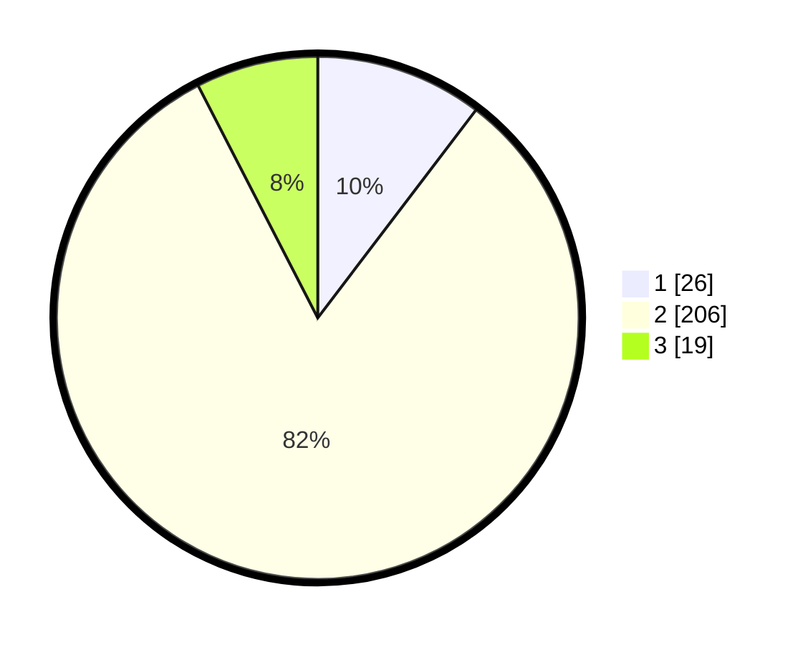

# Hasil

## Grafik

## Tabel

| No. | Nama Paslon    | Suara | Suara (raw) | Persentase |
|:--- |:-------------- | -----:| -----------:| ----------:|
| 1   | ANIES MUHAIMIN | 26    | [26][p-1]   | 10,36      |
| 2   | PRABOWO GIBRAN | 206   | [206][p-2]  | 82,07      |
| 3   | GANJAR MAHFUD  | 19    | [19][p-3]   | 7,57       |

[p-1]: https://github.com/gigit-pemilu/pemilu-2024/blob/main/pilpres/hitung-suara/sub/35-jawa-timur/sub/24-lamongan/sub/25-deket/sub/2002-dlanggu/sub/005-tps/sub/paslon-1.txt
[p-2]: https://github.com/gigit-pemilu/pemilu-2024/blob/main/pilpres/hitung-suara/sub/35-jawa-timur/sub/24-lamongan/sub/25-deket/sub/2002-dlanggu/sub/005-tps/sub/paslon-2.txt
[p-3]: https://github.com/gigit-pemilu/pemilu-2024/blob/main/pilpres/hitung-suara/sub/35-jawa-timur/sub/24-lamongan/sub/25-deket/sub/2002-dlanggu/sub/005-tps/sub/paslon-3.txt

## Foto C Plano

https://sirekap-obj-formc.kpu.go.id/4a51/pemilu/ppwp/35/24/25/20/02/3524252002005-20240220-194823--d400b2f9-3a0f-4893-b671-50622544f003.jpg

https://sirekap-obj-formc.kpu.go.id/4a51/pemilu/ppwp/35/24/25/20/02/3524252002005-20240220-193001--b0454223-9d6b-401a-a6e8-1e80d3e7e386.jpg

https://sirekap-obj-formc.kpu.go.id/4a51/pemilu/ppwp/35/24/25/20/02/3524252002005-20240220-193213--21765f21-3c1a-4799-874a-a079d6608b87.jpg

## Metadata

| Key        | Value               |
| ---------- | ------------------- |
| Time Stamp | 2024-02-24 22:31:28 |

