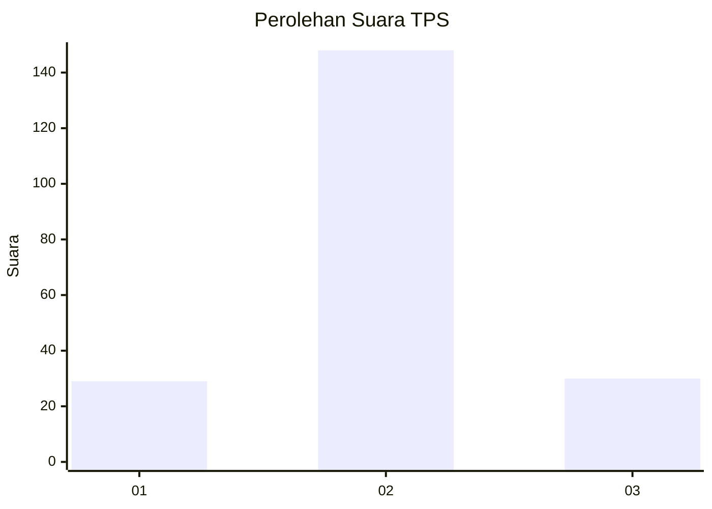

# Hasil

## Grafik

## Tabel

| No. | Nama Paslon    | Suara | Suara (raw) | Persentase |
|:--- |:-------------- | -----:| -----------:| ----------:|
| 1   | ANIES MUHAIMIN | 29    | [29][p-1]   | 14,01      |
| 2   | PRABOWO GIBRAN | 148   | [148][p-2]  | 71,50      |
| 3   | GANJAR MAHFUD  | 30    | [30][p-3]   | 14,49      |

[p-1]: https://github.com/gigit-pemilu/pemilu-2024/blob/main/pilpres/hitung-suara/sub/35-jawa-timur/sub/25-gresik/sub/01-dukun/sub/2001-sawo/sub/001-tps/sub/paslon-1.txt
[p-2]: https://github.com/gigit-pemilu/pemilu-2024/blob/main/pilpres/hitung-suara/sub/35-jawa-timur/sub/25-gresik/sub/01-dukun/sub/2001-sawo/sub/001-tps/sub/paslon-2.txt
[p-3]: https://github.com/gigit-pemilu/pemilu-2024/blob/main/pilpres/hitung-suara/sub/35-jawa-timur/sub/25-gresik/sub/01-dukun/sub/2001-sawo/sub/001-tps/sub/paslon-3.txt

## Foto C Plano

https://sirekap-obj-formc.kpu.go.id/ca6f/pemilu/ppwp/35/25/01/20/01/3525012001001-20240218-133114--f3ed7a1c-ac74-4866-8f4b-a866495bfa1e.jpg

https://sirekap-obj-formc.kpu.go.id/ca6f/pemilu/ppwp/35/25/01/20/01/3525012001001-20240218-133919--4adb0f4c-0f00-42cb-9259-2a28ac51584e.jpg

https://sirekap-obj-formc.kpu.go.id/ca6f/pemilu/ppwp/35/25/01/20/01/3525012001001-20240215-030755--52694338-6759-4dd7-904f-65f6c477b176.jpg

## Metadata

| Key        | Value               |
| ---------- | ------------------- |
| Time Stamp | 2024-02-25 12:00:00 |

