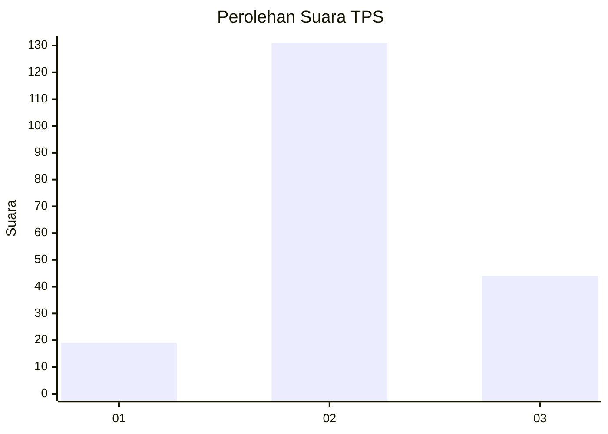
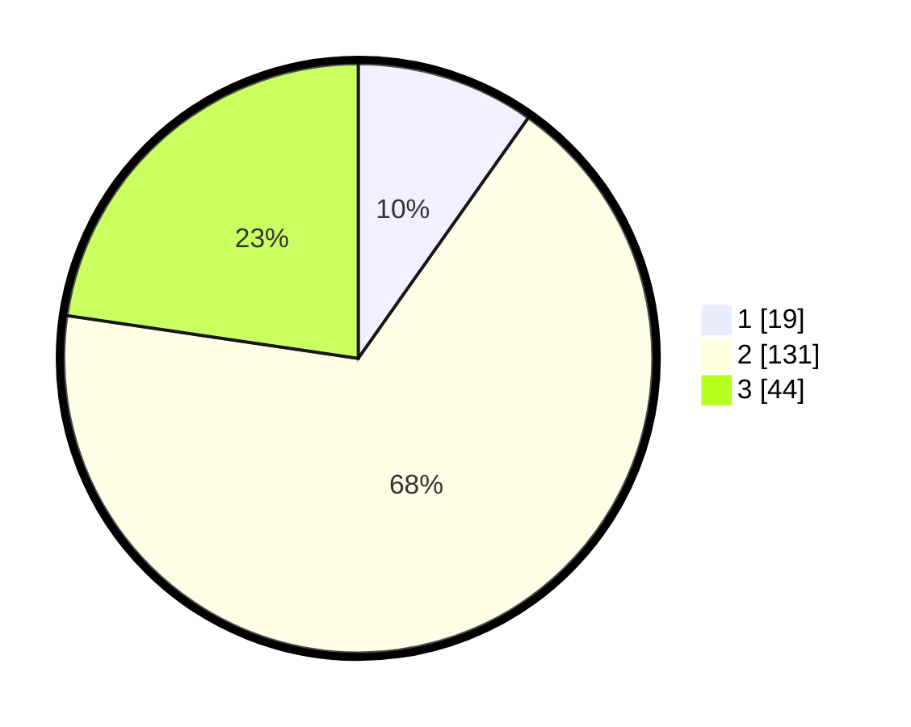

# Hasil

## Grafik

## Tabel

| No. | Nama Paslon    | Suara | Suara (raw) | Persentase |
|:--- |:-------------- | -----:| -----------:| ----------:|
| 1   | ANIES MUHAIMIN | 19    | [19][p-1]   | 9,79       |
| 2   | PRABOWO GIBRAN | 131   | [131][p-2]  | 67,53      |
| 3   | GANJAR MAHFUD  | 44    | [44][p-3]   | 22,68      |

[p-1]: https://github.com/gigit-pemilu/pemilu-2024/blob/main/pilpres/hitung-suara/sub/35-jawa-timur/sub/25-gresik/sub/01-dukun/sub/2001-sawo/sub/002-tps/sub/paslon-1.txt
[p-2]: https://github.com/gigit-pemilu/pemilu-2024/blob/main/pilpres/hitung-suara/sub/35-jawa-timur/sub/25-gresik/sub/01-dukun/sub/2001-sawo/sub/002-tps/sub/paslon-2.txt
[p-3]: https://github.com/gigit-pemilu/pemilu-2024/blob/main/pilpres/hitung-suara/sub/35-jawa-timur/sub/25-gresik/sub/01-dukun/sub/2001-sawo/sub/002-tps/sub/paslon-3.txt

## Foto C Plano

https://sirekap-obj-formc.kpu.go.id/0373/pemilu/ppwp/35/25/01/20/01/3525012001002-20240215-041505--2b6ddc3b-5b2e-4c86-99f8-5ddebea286d6.jpg

https://sirekap-obj-formc.kpu.go.id/0373/pemilu/ppwp/35/25/01/20/01/3525012001002-20240215-041516--683ad1d2-cd66-4b7c-96a5-132557996796.jpg

https://sirekap-obj-formc.kpu.go.id/0373/pemilu/ppwp/35/25/01/20/01/3525012001002-20240215-041523--df8fe7be-e101-4e27-ab15-fd685044d218.jpg

## Metadata

| Key        | Value               |
| ---------- | ------------------- |
| Time Stamp | 2024-02-16 09:30:28 |

