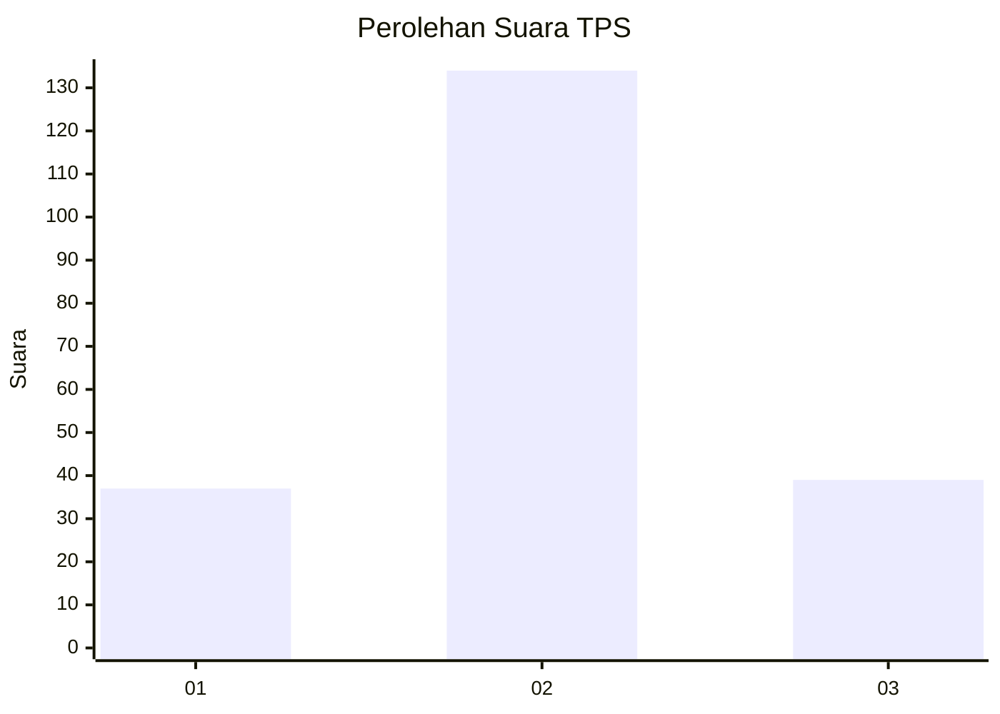
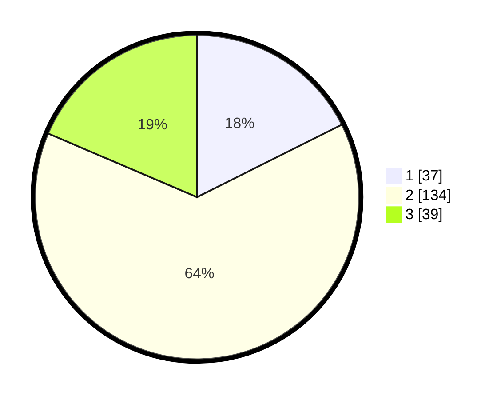

# Hasil

## Grafik

## Tabel

| No. | Nama Paslon    | Suara | Suara (raw) | Persentase |
|:--- |:-------------- | -----:| -----------:| ----------:|
| 1   | ANIES MUHAIMIN | 37    | [37][p-1]   | 17,62      |
| 2   | PRABOWO GIBRAN | 134   | [134][p-2]  | 63,81      |
| 3   | GANJAR MAHFUD  | 39    | [39][p-3]   | 18,57      |

[p-1]: https://github.com/gigit-pemilu/pemilu-2024/blob/main/pilpres/hitung-suara/sub/35-jawa-timur/sub/25-gresik/sub/01-dukun/sub/2001-sawo/sub/003-tps/sub/paslon-1.txt
[p-2]: https://github.com/gigit-pemilu/pemilu-2024/blob/main/pilpres/hitung-suara/sub/35-jawa-timur/sub/25-gresik/sub/01-dukun/sub/2001-sawo/sub/003-tps/sub/paslon-2.txt
[p-3]: https://github.com/gigit-pemilu/pemilu-2024/blob/main/pilpres/hitung-suara/sub/35-jawa-timur/sub/25-gresik/sub/01-dukun/sub/2001-sawo/sub/003-tps/sub/paslon-3.txt

## Foto C Plano

https://sirekap-obj-formc.kpu.go.id/f0a0/pemilu/ppwp/35/25/01/20/01/3525012001003-20240218-140222--7015ca85-4e85-4fa9-a1cc-973bfc72cb87.jpg

https://sirekap-obj-formc.kpu.go.id/f0a0/pemilu/ppwp/35/25/01/20/01/3525012001003-20240218-140345--8015d354-6a86-4217-b7e0-327e8d292eef.jpg

https://sirekap-obj-formc.kpu.go.id/f0a0/pemilu/ppwp/35/25/01/20/01/3525012001003-20240218-140442--cd5d6cd8-5010-4b41-8737-2284b7d8062f.jpg

## Metadata

| Key        | Value               |
| ---------- | ------------------- |
| Time Stamp | 2024-02-25 12:00:00 |

