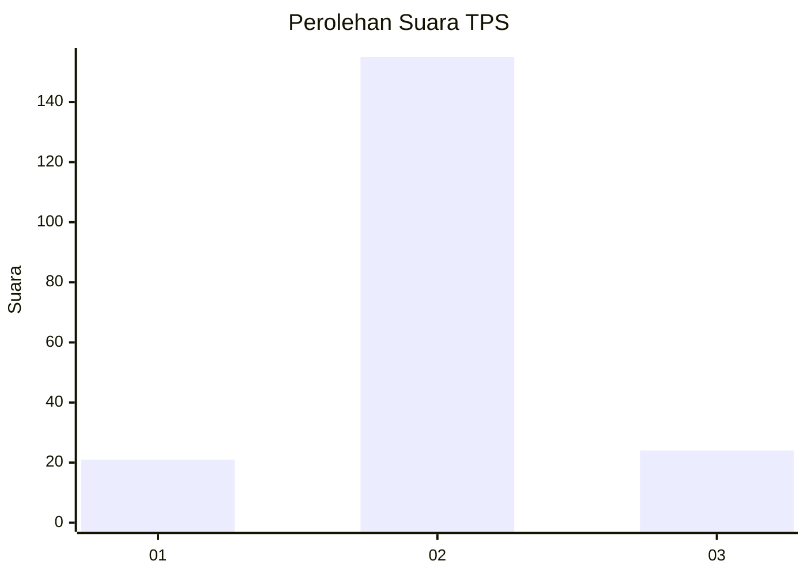
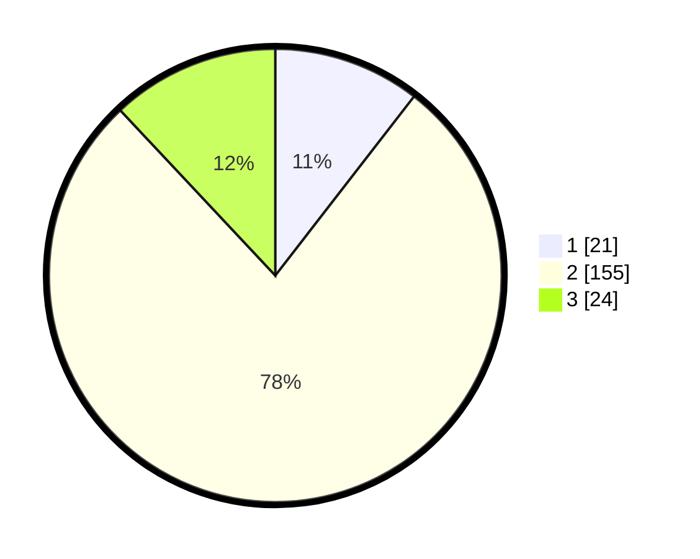

# Hasil

## Grafik

## Tabel

| No. | Nama Paslon    | Suara | Suara (raw) | Persentase |
|:--- |:-------------- | -----:| -----------:| ----------:|
| 1   | ANIES MUHAIMIN | 21    | [21][p-1]   | 10,50      |
| 2   | PRABOWO GIBRAN | 155   | [155][p-2]  | 77,50      |
| 3   | GANJAR MAHFUD  | 24    | [24][p-3]   | 12,00      |

[p-1]: https://github.com/gigit-pemilu/pemilu-2024/blob/main/pilpres/hitung-suara/sub/35-jawa-timur/sub/25-gresik/sub/01-dukun/sub/2001-sawo/sub/005-tps/sub/paslon-1.txt
[p-2]: https://github.com/gigit-pemilu/pemilu-2024/blob/main/pilpres/hitung-suara/sub/35-jawa-timur/sub/25-gresik/sub/01-dukun/sub/2001-sawo/sub/005-tps/sub/paslon-2.txt
[p-3]: https://github.com/gigit-pemilu/pemilu-2024/blob/main/pilpres/hitung-suara/sub/35-jawa-timur/sub/25-gresik/sub/01-dukun/sub/2001-sawo/sub/005-tps/sub/paslon-3.txt

## Foto C Plano

https://sirekap-obj-formc.kpu.go.id/ae27/pemilu/ppwp/35/25/01/20/01/3525012001005-20240215-160308--cb944c4b-773a-4d19-9384-4e557384160a.jpg

https://sirekap-obj-formc.kpu.go.id/ae27/pemilu/ppwp/35/25/01/20/01/3525012001005-20240215-160421--a71f0089-b4e9-44a8-8bde-44b4ad4d75b3.jpg

https://sirekap-obj-formc.kpu.go.id/ae27/pemilu/ppwp/35/25/01/20/01/3525012001005-20240215-154758--4bfd0493-0ae6-42ef-928d-5051bafafceb.jpg

## Metadata

| Key        | Value               |
| ---------- | ------------------- |
| Time Stamp | 2024-02-16 12:51:22 |

