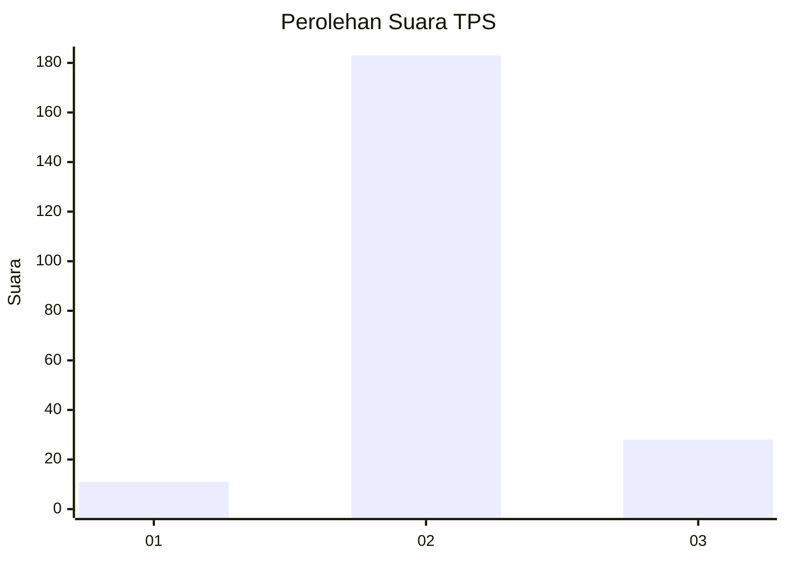
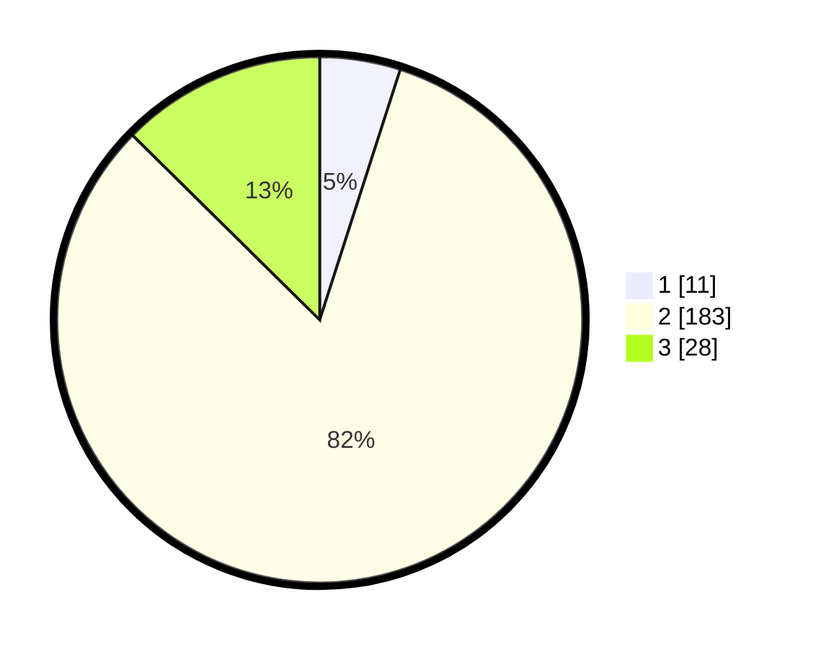

# Hasil

## Grafik

## Tabel

| No. | Nama Paslon    | Suara | Suara (raw) | Persentase |
|:--- |:-------------- | -----:| -----------:| ----------:|
| 1   | ANIES MUHAIMIN | 11    | [11][p-1]   | 4,95       |
| 2   | PRABOWO GIBRAN | 183   | [183][p-2]  | 82,43      |
| 3   | GANJAR MAHFUD  | 28    | [28][p-3]   | 12,61      |

[p-1]: https://github.com/gigit-pemilu/pemilu-2024/blob/main/pilpres/hitung-suara/sub/35-jawa-timur/sub/25-gresik/sub/01-dukun/sub/2001-sawo/sub/007-tps/sub/paslon-1.txt
[p-2]: https://github.com/gigit-pemilu/pemilu-2024/blob/main/pilpres/hitung-suara/sub/35-jawa-timur/sub/25-gresik/sub/01-dukun/sub/2001-sawo/sub/007-tps/sub/paslon-2.txt
[p-3]: https://github.com/gigit-pemilu/pemilu-2024/blob/main/pilpres/hitung-suara/sub/35-jawa-timur/sub/25-gresik/sub/01-dukun/sub/2001-sawo/sub/007-tps/sub/paslon-3.txt

## Foto C Plano

https://sirekap-obj-formc.kpu.go.id/f755/pemilu/ppwp/35/25/01/20/01/3525012001007-20240215-054700--c021a72a-e7a3-4758-9930-d7c4f51f35c7.jpg

https://sirekap-obj-formc.kpu.go.id/f755/pemilu/ppwp/35/25/01/20/01/3525012001007-20240215-054705--3e2bbb0d-6e93-4294-a8e1-ccee25151390.jpg

https://sirekap-obj-formc.kpu.go.id/f755/pemilu/ppwp/35/25/01/20/01/3525012001007-20240215-054710--cef314d2-7aa4-4969-8ae7-9dc52bcf0d43.jpg

## Metadata

| Key        | Value               |
| ---------- | ------------------- |
| Time Stamp | 2024-02-16 14:00:34 |

