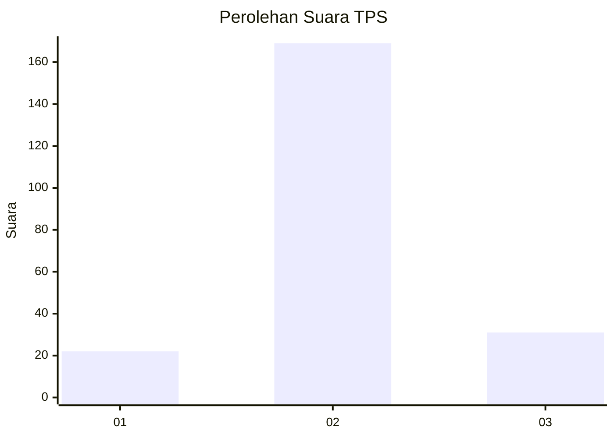
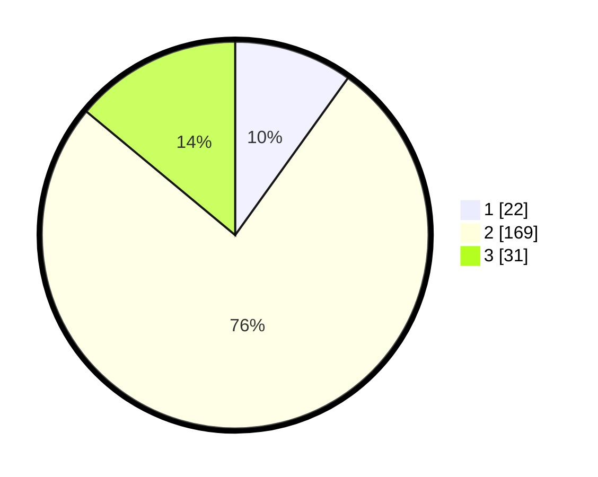

# Hasil

## Grafik

## Tabel

| No. | Nama Paslon    | Suara | Suara (raw) | Persentase |
|:--- |:-------------- | -----:| -----------:| ----------:|
| 1   | ANIES MUHAIMIN | 22    | [22][p-1]   | 9,91       |
| 2   | PRABOWO GIBRAN | 169   | [169][p-2]  | 76,13      |
| 3   | GANJAR MAHFUD  | 31    | [31][p-3]   | 13,96      |

[p-1]: https://github.com/gigit-pemilu/pemilu-2024/blob/main/pilpres/hitung-suara/sub/35-jawa-timur/sub/25-gresik/sub/01-dukun/sub/2003-gedongkedo'an/sub/003-tps/sub/paslon-1.txt
[p-2]: https://github.com/gigit-pemilu/pemilu-2024/blob/main/pilpres/hitung-suara/sub/35-jawa-timur/sub/25-gresik/sub/01-dukun/sub/2003-gedongkedo'an/sub/003-tps/sub/paslon-2.txt
[p-3]: https://github.com/gigit-pemilu/pemilu-2024/blob/main/pilpres/hitung-suara/sub/35-jawa-timur/sub/25-gresik/sub/01-dukun/sub/2003-gedongkedo'an/sub/003-tps/sub/paslon-3.txt

## Foto C Plano

https://sirekap-obj-formc.kpu.go.id/90d3/pemilu/ppwp/35/25/01/20/03/3525012003003-20240215-001805--9815cb28-ff4a-42dc-b02b-11fe3230f7ef.jpg

https://sirekap-obj-formc.kpu.go.id/90d3/pemilu/ppwp/35/25/01/20/03/3525012003003-20240215-001912--491d8b0a-bbe1-453e-86c0-287dc814392c.jpg

https://sirekap-obj-formc.kpu.go.id/90d3/pemilu/ppwp/35/25/01/20/03/3525012003003-20240215-002105--ad1e6e6e-8243-43d0-8e72-ee8e1a05e3ef.jpg

## Metadata

| Key        | Value               |
| ---------- | ------------------- |
| Time Stamp | 2024-02-15 18:00:26 |

