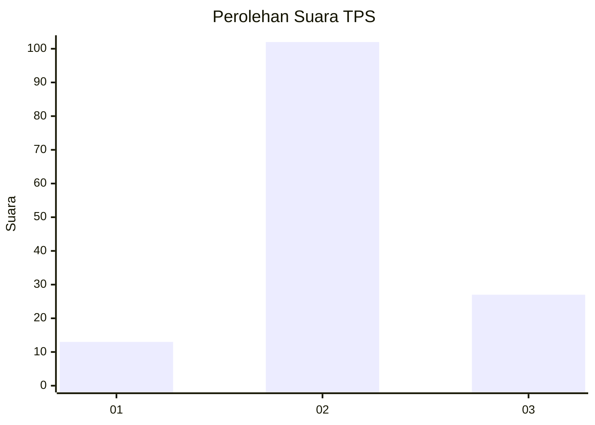
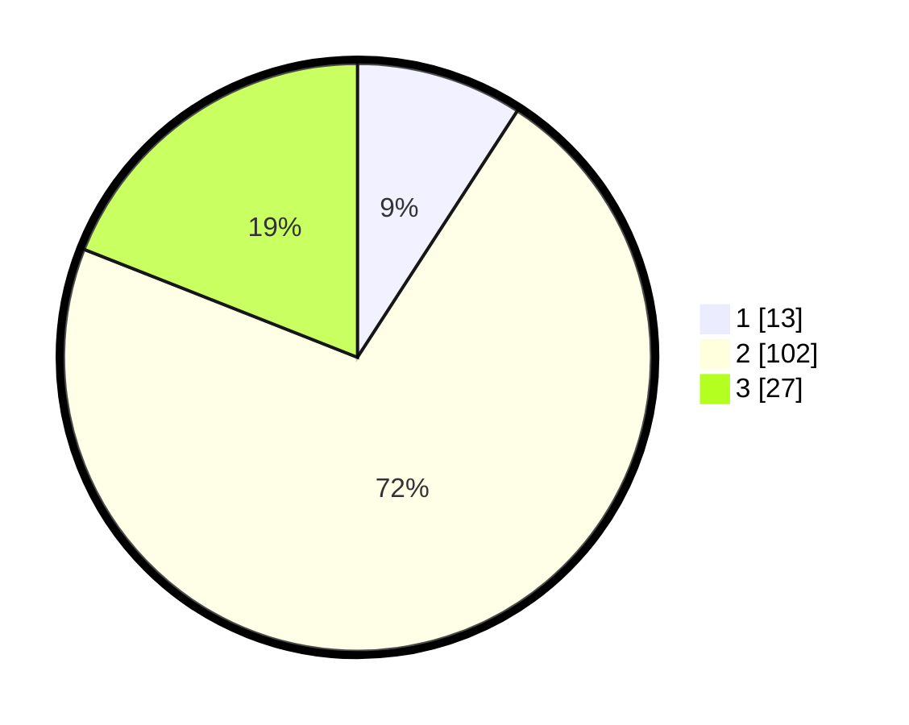

# Hasil

## Grafik

## Tabel

| No. | Nama Paslon    | Suara | Suara (raw) | Persentase |
|:--- |:-------------- | -----:| -----------:| ----------:|
| 1   | ANIES MUHAIMIN | 13    | [13][p-1]   | 9,15       |
| 2   | PRABOWO GIBRAN | 102   | [102][p-2]  | 71,83      |
| 3   | GANJAR MAHFUD  | 27    | [27][p-3]   | 19,01      |

[p-1]: https://github.com/gigit-pemilu/pemilu-2024/blob/main/pilpres/hitung-suara/sub/35-jawa-timur/sub/25-gresik/sub/01-dukun/sub/2003-gedongkedo'an/sub/004-tps/sub/paslon-1.txt
[p-2]: https://github.com/gigit-pemilu/pemilu-2024/blob/main/pilpres/hitung-suara/sub/35-jawa-timur/sub/25-gresik/sub/01-dukun/sub/2003-gedongkedo'an/sub/004-tps/sub/paslon-2.txt
[p-3]: https://github.com/gigit-pemilu/pemilu-2024/blob/main/pilpres/hitung-suara/sub/35-jawa-timur/sub/25-gresik/sub/01-dukun/sub/2003-gedongkedo'an/sub/004-tps/sub/paslon-3.txt

## Foto C Plano

https://sirekap-obj-formc.kpu.go.id/a333/pemilu/ppwp/35/25/01/20/03/3525012003004-20240214-231656--db4ac67d-e85b-46d9-b316-9ef96e288ce2.jpg

https://sirekap-obj-formc.kpu.go.id/a333/pemilu/ppwp/35/25/01/20/03/3525012003004-20240214-231804--85b5d63a-2862-42cc-b7b8-27ef66adf169.jpg

https://sirekap-obj-formc.kpu.go.id/a333/pemilu/ppwp/35/25/01/20/03/3525012003004-20240214-231908--bdc100fe-dcb4-439e-b13e-c142c6f648b2.jpg

## Metadata

| Key        | Value               |
| ---------- | ------------------- |
| Time Stamp | 2024-02-16 14:00:34 |

