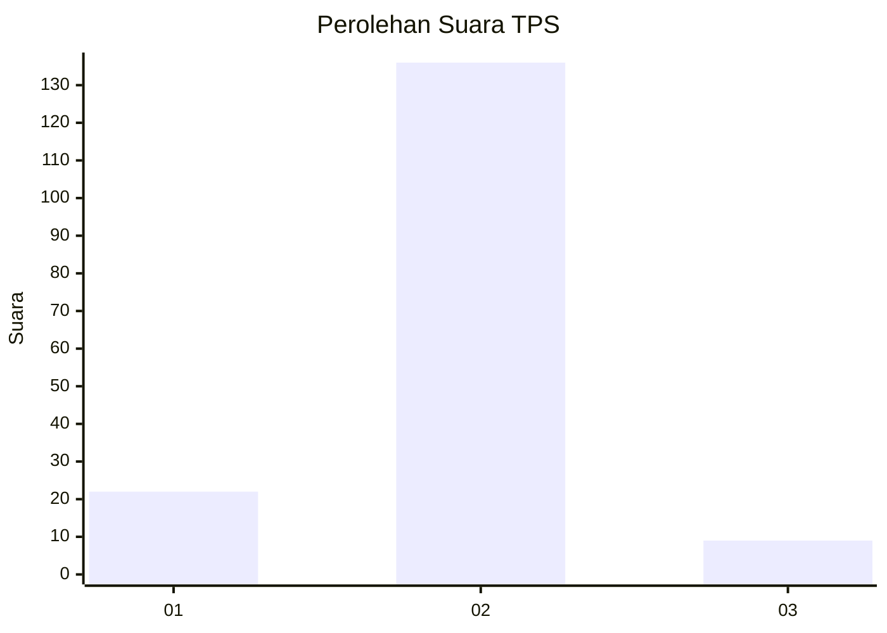
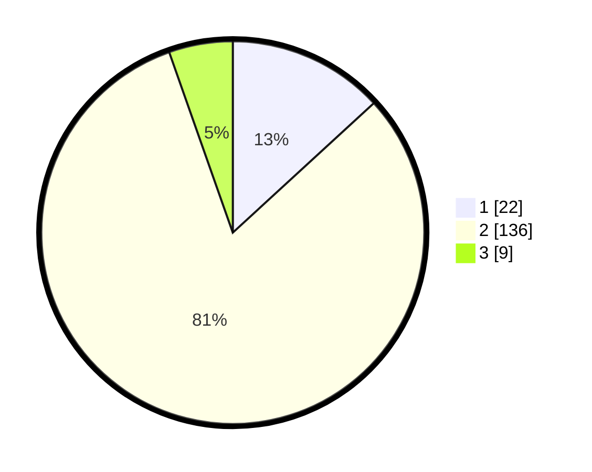

# Hasil

## Grafik

## Tabel

| No. | Nama Paslon    | Suara | Suara (raw) | Persentase |
|:--- |:-------------- | -----:| -----------:| ----------:|
| 1   | ANIES MUHAIMIN | 22    | [22][p-1]   | 13,17      |
| 2   | PRABOWO GIBRAN | 136   | [136][p-2]  | 81,44      |
| 3   | GANJAR MAHFUD  | 9     | [9][p-3]    | 5,39       |

[p-1]: https://github.com/gigit-pemilu/pemilu-2024/blob/main/pilpres/hitung-suara/sub/35-jawa-timur/sub/25-gresik/sub/01-dukun/sub/2006-bangeran/sub/001-tps/sub/paslon-1.txt
[p-2]: https://github.com/gigit-pemilu/pemilu-2024/blob/main/pilpres/hitung-suara/sub/35-jawa-timur/sub/25-gresik/sub/01-dukun/sub/2006-bangeran/sub/001-tps/sub/paslon-2.txt
[p-3]: https://github.com/gigit-pemilu/pemilu-2024/blob/main/pilpres/hitung-suara/sub/35-jawa-timur/sub/25-gresik/sub/01-dukun/sub/2006-bangeran/sub/001-tps/sub/paslon-3.txt

## Foto C Plano

https://sirekap-obj-formc.kpu.go.id/902e/pemilu/ppwp/35/25/01/20/06/3525012006001-20240214-202122--b1e55ba1-8c27-4aed-afbd-1ce2d02a64e9.jpg

https://sirekap-obj-formc.kpu.go.id/902e/pemilu/ppwp/35/25/01/20/06/3525012006001-20240214-202210--57264397-4c62-415b-8a82-775024f712af.jpg

https://sirekap-obj-formc.kpu.go.id/902e/pemilu/ppwp/35/25/01/20/06/3525012006001-20240214-202249--5e969a0d-81a2-4dec-b3d1-e6adf5669dd7.jpg

## Metadata

| Key        | Value               |
| ---------- | ------------------- |
| Time Stamp | 2024-02-16 16:25:10 |

