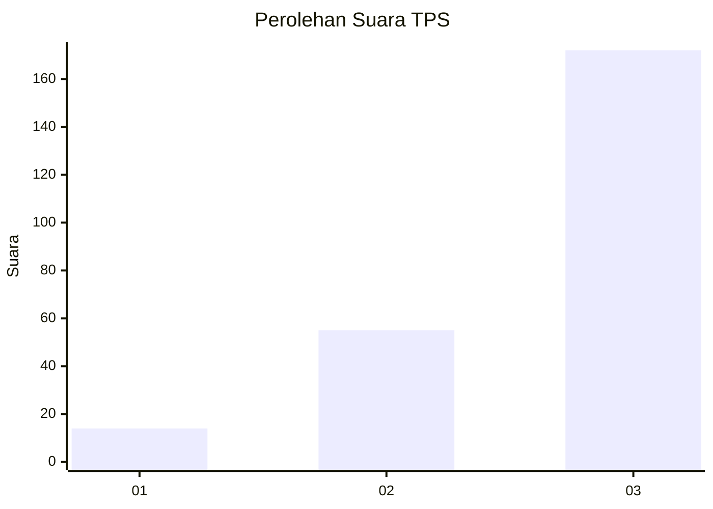
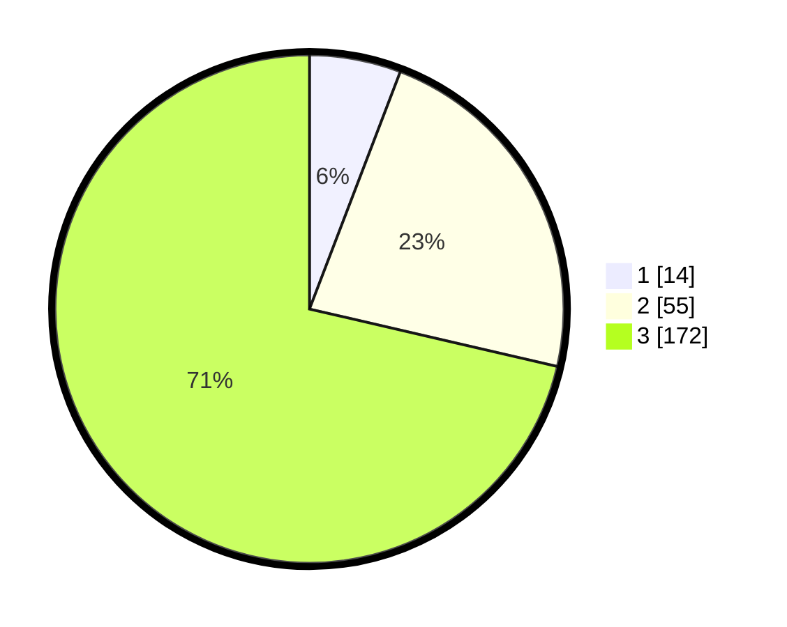

# Hasil

## Grafik

## Tabel

| No. | Nama Paslon    | Suara | Suara (raw) | Persentase |
|:--- |:-------------- | -----:| -----------:| ----------:|
| 1   | ANIES MUHAIMIN | 14    | [14][p-1]   | 5,81       |
| 2   | PRABOWO GIBRAN | 55    | [55][p-2]   | 22,82      |
| 3   | GANJAR MAHFUD  | 172   | [172][p-3]  | 71,37      |

[p-1]: https://github.com/gigit-pemilu/pemilu-2024/blob/main/pilpres/hitung-suara/sub/35-jawa-timur/sub/25-gresik/sub/01-dukun/sub/2007-lowayu/sub/010-tps/sub/paslon-1.txt
[p-2]: https://github.com/gigit-pemilu/pemilu-2024/blob/main/pilpres/hitung-suara/sub/35-jawa-timur/sub/25-gresik/sub/01-dukun/sub/2007-lowayu/sub/010-tps/sub/paslon-2.txt
[p-3]: https://github.com/gigit-pemilu/pemilu-2024/blob/main/pilpres/hitung-suara/sub/35-jawa-timur/sub/25-gresik/sub/01-dukun/sub/2007-lowayu/sub/010-tps/sub/paslon-3.txt

## Foto C Plano

https://sirekap-obj-formc.kpu.go.id/c0c2/pemilu/ppwp/35/25/01/20/07/3525012007010-20240214-210238--5884fd9b-e96c-449a-a747-c3b895802a72.jpg

https://sirekap-obj-formc.kpu.go.id/c0c2/pemilu/ppwp/35/25/01/20/07/3525012007010-20240216-153336--c7a6e8d1-569a-4366-81c8-7224389c1253.jpg

https://sirekap-obj-formc.kpu.go.id/c0c2/pemilu/ppwp/35/25/01/20/07/3525012007010-20240216-152702--14b3a3e8-e95d-43da-b05f-112dd5c40f6c.jpg

## Metadata

| Key        | Value               |
| ---------- | ------------------- |
| Time Stamp | 2024-02-21 15:00:00 |

## DATA PEMILIH TETAP

Jumlah pemilih dalam DPT: **0**.
 * L: **0**.
 * P: **202**.

## DATA PENGGUNA HAK PILIH

Jumlah pengguna hak pilih dalam DPT: **222**.
 * L: **0**.
 * P: **0**.

Jumlah pengguna hak pilih dalam DPTb: **292**.
 * L: **263**.
 * P: **231**.

Jumlah pengguna hak pilih dalam DPK: **256**.
 * L: **50**.
 * P: **308**.

Jumlah pengguna hak pilih: **603**.
 * L: **55**.
 * P: **55**.

## JUMLAH SUARA SAH DAN TIDAK SAH

JUMLAH SELURUH SUARA SAH: **239**.

JUMLAH SUARA TIDAK SAH: **6**.

JUMLAH SELURUH SUARA SAH DAN SUARA TIDAK SAH: **245**.

