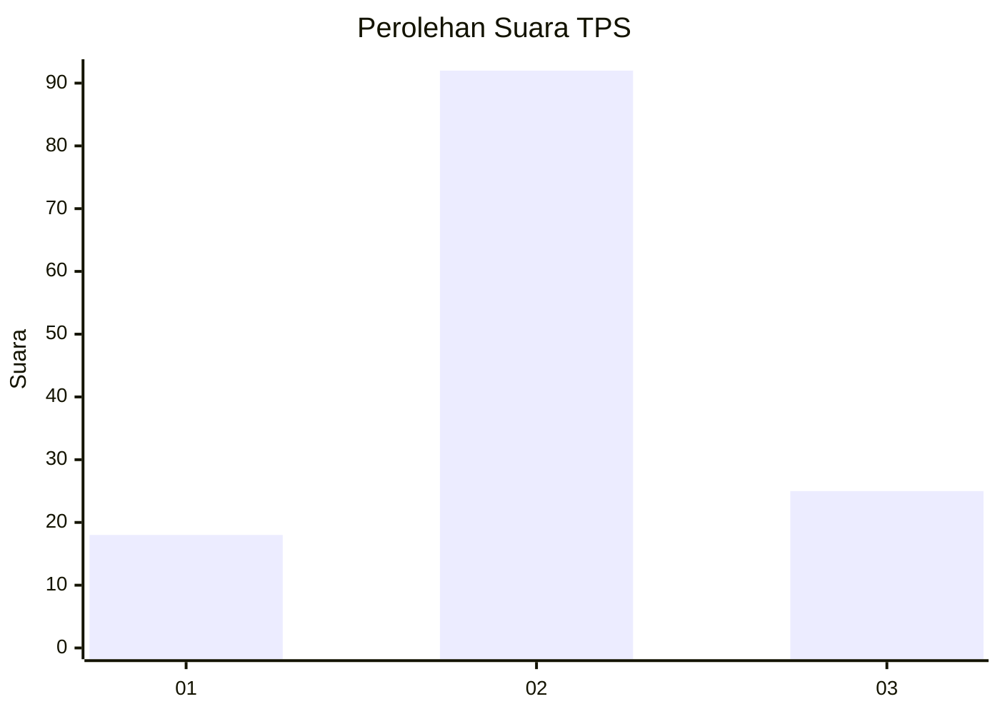
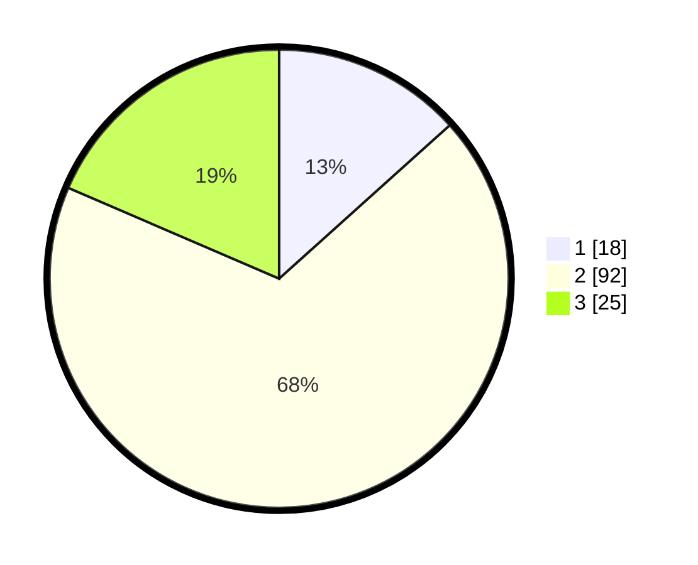

# Hasil

## Grafik

## Tabel

| No. | Nama Paslon    | Suara | Suara (raw) | Persentase |
|:--- |:-------------- | -----:| -----------:| ----------:|
| 1   | ANIES MUHAIMIN | 18    | [18][p-1]   | 13,33      |
| 2   | PRABOWO GIBRAN | 92    | [92][p-2]   | 68,15      |
| 3   | GANJAR MAHFUD  | 25    | [25][p-3]   | 18,52      |

[p-1]: https://github.com/gigit-pemilu/pemilu-2024/blob/main/pilpres/hitung-suara/sub/35-jawa-timur/sub/25-gresik/sub/01-dukun/sub/2008-petiyin-tunggal/sub/002-tps/sub/paslon-1.txt
[p-2]: https://github.com/gigit-pemilu/pemilu-2024/blob/main/pilpres/hitung-suara/sub/35-jawa-timur/sub/25-gresik/sub/01-dukun/sub/2008-petiyin-tunggal/sub/002-tps/sub/paslon-2.txt
[p-3]: https://github.com/gigit-pemilu/pemilu-2024/blob/main/pilpres/hitung-suara/sub/35-jawa-timur/sub/25-gresik/sub/01-dukun/sub/2008-petiyin-tunggal/sub/002-tps/sub/paslon-3.txt

## Foto C Plano

https://sirekap-obj-formc.kpu.go.id/aa45/pemilu/ppwp/35/25/01/20/08/3525012008002-20240220-155804--2c72ba6a-30ce-4221-9f96-f60c9f7a75c3.jpg

https://sirekap-obj-formc.kpu.go.id/aa45/pemilu/ppwp/35/25/01/20/08/3525012008002-20240220-155824--e1118eaa-2285-4741-b628-30533b05a64a.jpg

https://sirekap-obj-formc.kpu.go.id/aa45/pemilu/ppwp/35/25/01/20/08/3525012008002-20240220-151411--25593682-4cf9-499d-a69c-be9ea6ff2833.jpg

## Metadata

| Key        | Value               |
| ---------- | ------------------- |
| Time Stamp | 2024-02-24 22:31:28 |

