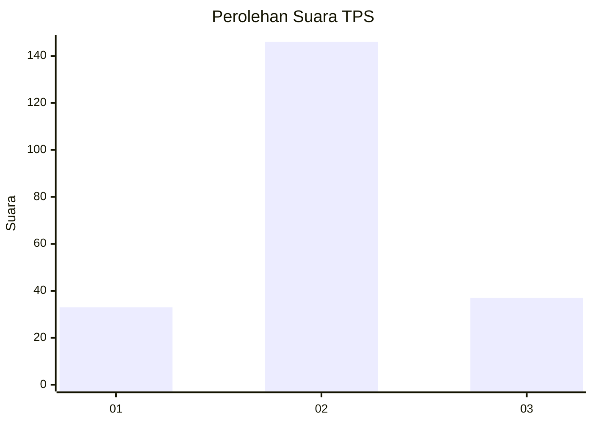
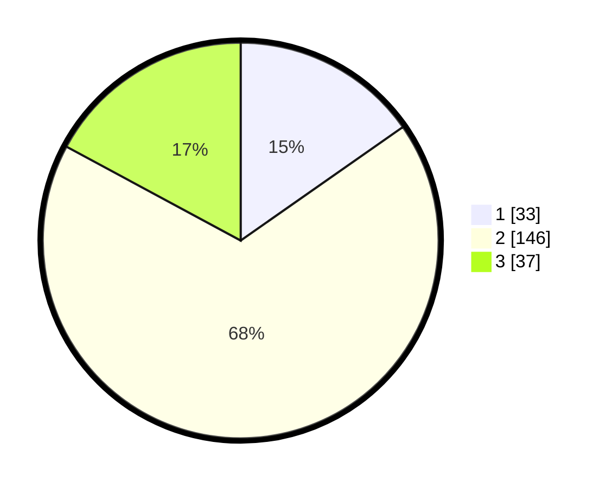

# Hasil

## Grafik

## Tabel

| No. | Nama Paslon    | Suara | Suara (raw) | Persentase |
|:--- |:-------------- | -----:| -----------:| ----------:|
| 1   | ANIES MUHAIMIN | 33    | [33][p-1]   | 15,28      |
| 2   | PRABOWO GIBRAN | 146   | [146][p-2]  | 67,59      |
| 3   | GANJAR MAHFUD  | 37    | [37][p-3]   | 17,13      |

[p-1]: https://github.com/gigit-pemilu/pemilu-2024/blob/main/pilpres/hitung-suara/sub/35-jawa-timur/sub/25-gresik/sub/01-dukun/sub/2008-petiyin-tunggal/sub/004-tps/sub/paslon-1.txt
[p-2]: https://github.com/gigit-pemilu/pemilu-2024/blob/main/pilpres/hitung-suara/sub/35-jawa-timur/sub/25-gresik/sub/01-dukun/sub/2008-petiyin-tunggal/sub/004-tps/sub/paslon-2.txt
[p-3]: https://github.com/gigit-pemilu/pemilu-2024/blob/main/pilpres/hitung-suara/sub/35-jawa-timur/sub/25-gresik/sub/01-dukun/sub/2008-petiyin-tunggal/sub/004-tps/sub/paslon-3.txt

## Foto C Plano

https://sirekap-obj-formc.kpu.go.id/5868/pemilu/ppwp/35/25/01/20/08/3525012008004-20240220-155131--f21d0788-e30e-43a0-8513-a04178ffe02b.jpg

https://sirekap-obj-formc.kpu.go.id/5868/pemilu/ppwp/35/25/01/20/08/3525012008004-20240220-155353--c0ae4f03-3083-434d-b393-2025eaee805c.jpg

https://sirekap-obj-formc.kpu.go.id/5868/pemilu/ppwp/35/25/01/20/08/3525012008004-20240220-155256--8e1fba13-f45d-4c6e-88cb-b5a14c2f2530.jpg

## Metadata

| Key        | Value               |
| ---------- | ------------------- |
| Time Stamp | 2024-02-25 21:00:00 |

