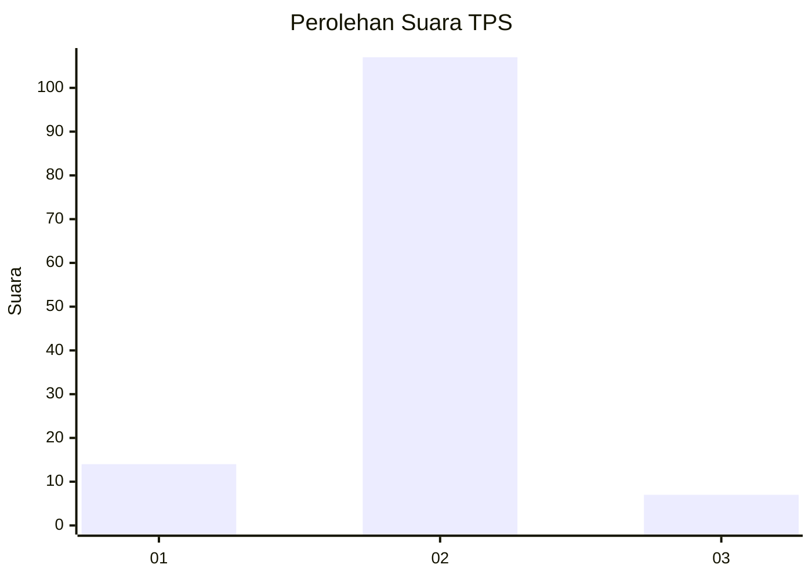
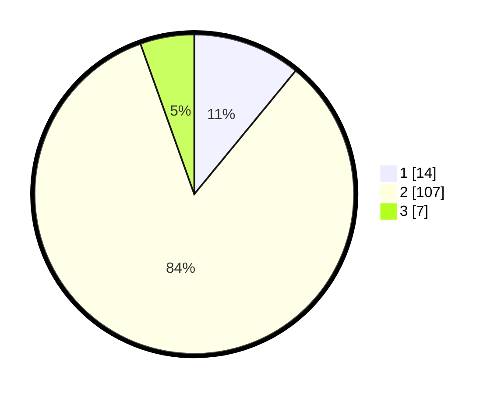

# Hasil

## Grafik

## Tabel

| No. | Nama Paslon    | Suara | Suara (raw) | Persentase |
|:--- |:-------------- | -----:| -----------:| ----------:|
| 1   | ANIES MUHAIMIN | 14    | [14][p-1]   | 10,94      |
| 2   | PRABOWO GIBRAN | 107   | [107][p-2]  | 83,59      |
| 3   | GANJAR MAHFUD  | 7     | [7][p-3]    | 5,47       |

[p-1]: https://github.com/gigit-pemilu/pemilu-2024/blob/main/pilpres/hitung-suara/sub/35-jawa-timur/sub/25-gresik/sub/01-dukun/sub/2009-tirem-enggal/sub/006-tps/sub/paslon-1.txt
[p-2]: https://github.com/gigit-pemilu/pemilu-2024/blob/main/pilpres/hitung-suara/sub/35-jawa-timur/sub/25-gresik/sub/01-dukun/sub/2009-tirem-enggal/sub/006-tps/sub/paslon-2.txt
[p-3]: https://github.com/gigit-pemilu/pemilu-2024/blob/main/pilpres/hitung-suara/sub/35-jawa-timur/sub/25-gresik/sub/01-dukun/sub/2009-tirem-enggal/sub/006-tps/sub/paslon-3.txt

## Foto C Plano

https://sirekap-obj-formc.kpu.go.id/982d/pemilu/ppwp/35/25/01/20/09/3525012009006-20240215-001037--1eab88b6-32b2-4504-a482-b310e2a81e7b.jpg

https://sirekap-obj-formc.kpu.go.id/982d/pemilu/ppwp/35/25/01/20/09/3525012009006-20240215-001204--e6f8ba79-d982-4bdf-9523-4cd699aa8e35.jpg

https://sirekap-obj-formc.kpu.go.id/982d/pemilu/ppwp/35/25/01/20/09/3525012009006-20240214-221035--4056481c-cf19-4fee-abd9-79e742831643.jpg

## Metadata

| Key        | Value               |
| ---------- | ------------------- |
| Time Stamp | 2024-02-25 12:00:00 |

