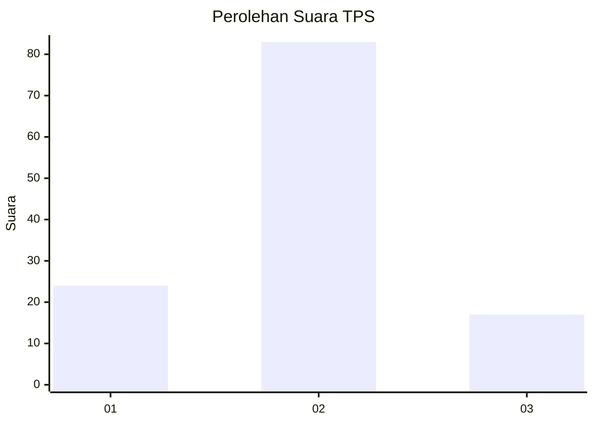
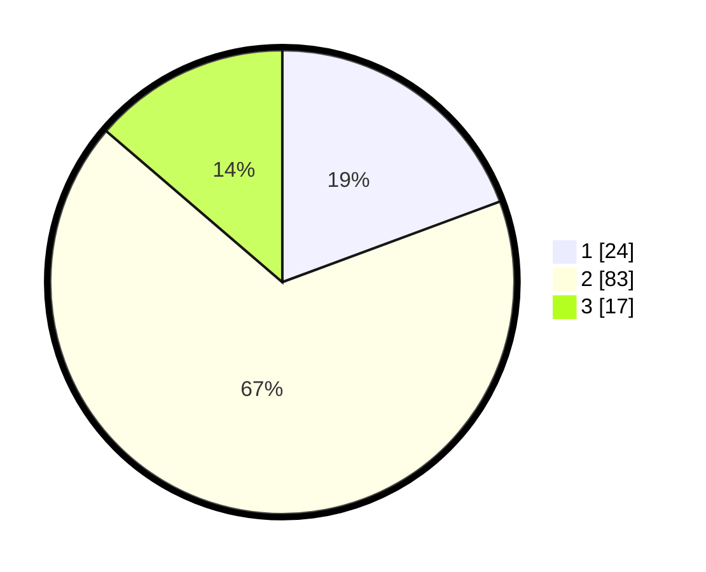

# Hasil

## Grafik

## Tabel

| No. | Nama Paslon    | Suara | Suara (raw) | Persentase |
|:--- |:-------------- | -----:| -----------:| ----------:|
| 1   | ANIES MUHAIMIN | 24    | [24][p-1]   | 19,35      |
| 2   | PRABOWO GIBRAN | 83    | [83][p-2]   | 66,94      |
| 3   | GANJAR MAHFUD  | 17    | [17][p-3]   | 13,71      |

[p-1]: https://github.com/gigit-pemilu/pemilu-2024-35-jawa-timur/blob/main/pilpres/hitung-suara/sub/35-jawa-timur/sub/25-gresik/sub/01-dukun/sub/2009-tirem-enggal/sub/007-tps/sub/paslon-1.txt
[p-2]: https://github.com/gigit-pemilu/pemilu-2024-35-jawa-timur/blob/main/pilpres/hitung-suara/sub/35-jawa-timur/sub/25-gresik/sub/01-dukun/sub/2009-tirem-enggal/sub/007-tps/sub/paslon-2.txt
[p-3]: https://github.com/gigit-pemilu/pemilu-2024-35-jawa-timur/blob/main/pilpres/hitung-suara/sub/35-jawa-timur/sub/25-gresik/sub/01-dukun/sub/2009-tirem-enggal/sub/007-tps/sub/paslon-3.txt

## Foto C Plano

https://sirekap-obj-formc.kpu.go.id/6d3d/pemilu/ppwp/35/25/01/20/09/3525012009007-20240214-192840--2943984e-4fa5-4ef3-ad57-263be96db79d.jpg

https://sirekap-obj-formc.kpu.go.id/6d3d/pemilu/ppwp/35/25/01/20/09/3525012009007-20240214-192129--0a3e5d76-80b7-4026-a360-685f7f3e06a8.jpg

https://sirekap-obj-formc.kpu.go.id/6d3d/pemilu/ppwp/35/25/01/20/09/3525012009007-20240214-192546--55c719e0-e421-47a7-b001-43151c0c334b.jpg

## Metadata

| Key        | Value               |
| ---------- | ------------------- |
| Time Stamp | 2024-02-16 21:01:00 |

