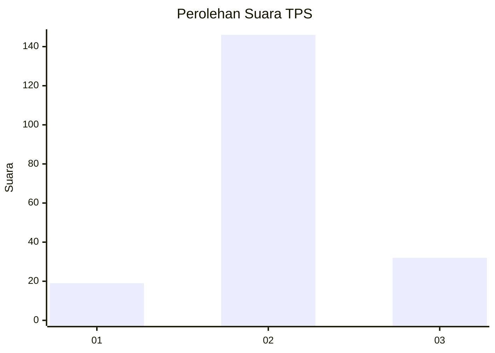
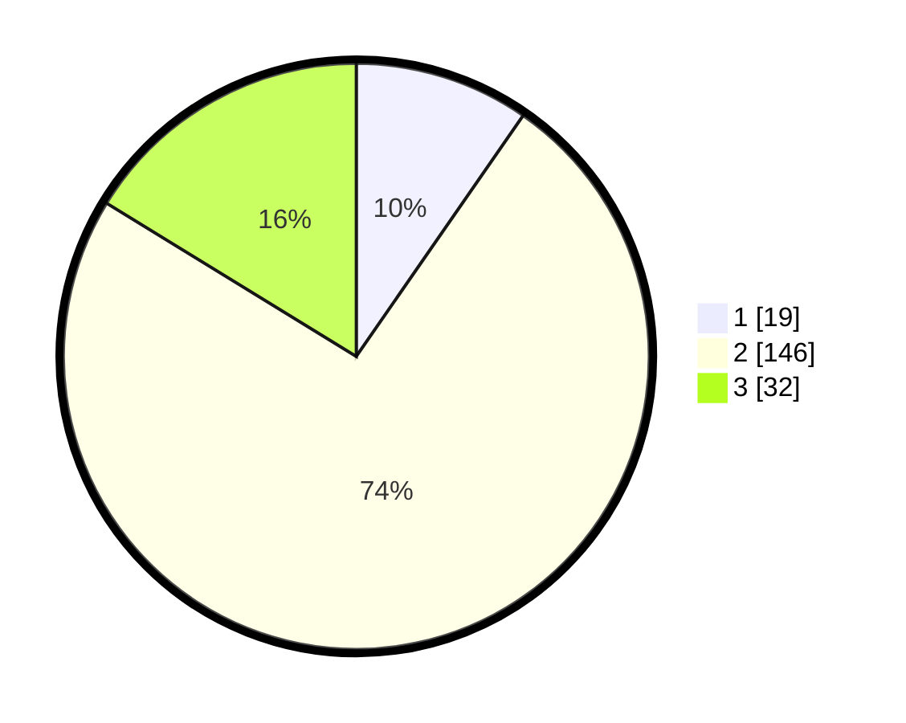

# Hasil

## Grafik

## Tabel

| No. | Nama Paslon    | Suara | Suara (raw) | Persentase |
|:--- |:-------------- | -----:| -----------:| ----------:|
| 1   | ANIES MUHAIMIN | 19    | [19][p-1]   | 9,64       |
| 2   | PRABOWO GIBRAN | 146   | [146][p-2]  | 74,11      |
| 3   | GANJAR MAHFUD  | 32    | [32][p-3]   | 16,24      |

[p-1]: https://github.com/gigit-pemilu/pemilu-2024/blob/main/pilpres/hitung-suara/sub/35-jawa-timur/sub/25-gresik/sub/01-dukun/sub/2010-tebuwung/sub/002-tps/sub/paslon-1.txt
[p-2]: https://github.com/gigit-pemilu/pemilu-2024/blob/main/pilpres/hitung-suara/sub/35-jawa-timur/sub/25-gresik/sub/01-dukun/sub/2010-tebuwung/sub/002-tps/sub/paslon-2.txt
[p-3]: https://github.com/gigit-pemilu/pemilu-2024/blob/main/pilpres/hitung-suara/sub/35-jawa-timur/sub/25-gresik/sub/01-dukun/sub/2010-tebuwung/sub/002-tps/sub/paslon-3.txt

## Foto C Plano

https://sirekap-obj-formc.kpu.go.id/cdd8/pemilu/ppwp/35/25/01/20/10/3525012010002-20240214-204919--b417d65b-35f7-4764-a378-b8ad503a88e3.jpg

https://sirekap-obj-formc.kpu.go.id/cdd8/pemilu/ppwp/35/25/01/20/10/3525012010002-20240214-202205--fe3b4ff1-4bfd-4545-b808-dd16c41406e4.jpg

https://sirekap-obj-formc.kpu.go.id/cdd8/pemilu/ppwp/35/25/01/20/10/3525012010002-20240214-202945--eb5e7a77-464a-4326-840e-33756bc9e20c.jpg

## Metadata

| Key        | Value               |
| ---------- | ------------------- |
| Time Stamp | 2024-02-16 21:01:00 |

