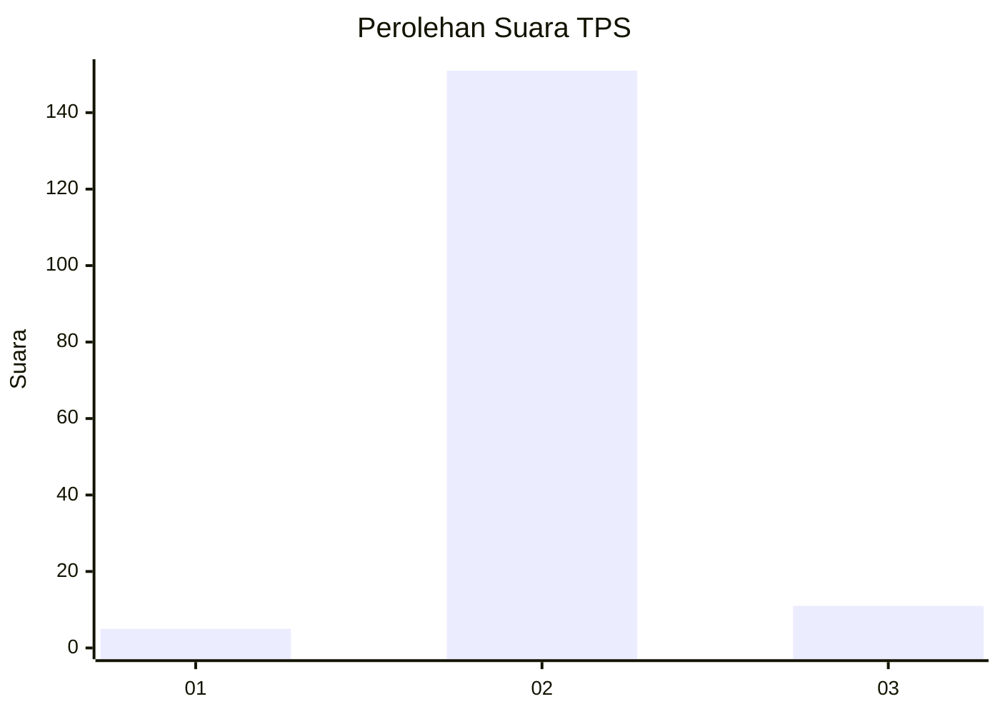
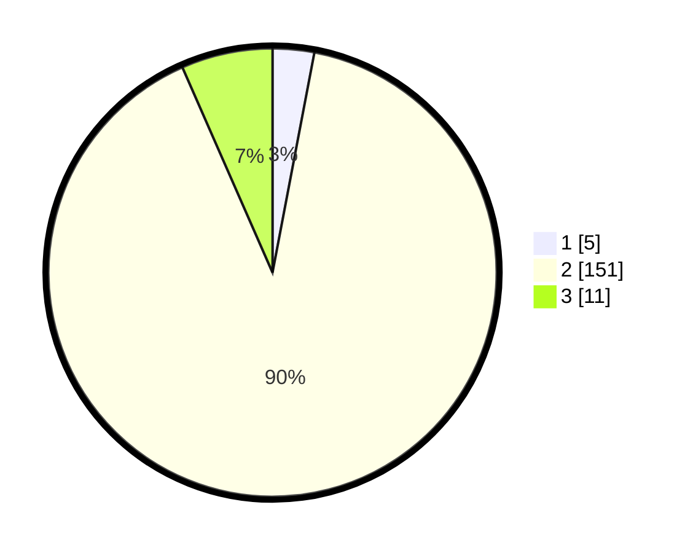

# Hasil

## Grafik

## Tabel

| No. | Nama Paslon    | Suara | Suara (raw) | Persentase |
|:--- |:-------------- | -----:| -----------:| ----------:|
| 1   | ANIES MUHAIMIN | 5     | [5][p-1]    | 2,99       |
| 2   | PRABOWO GIBRAN | 151   | [151][p-2]  | 90,42      |
| 3   | GANJAR MAHFUD  | 11    | [11][p-3]   | 6,59       |

[p-1]: https://github.com/gigit-pemilu/pemilu-2024-35-jawa-timur/blob/main/pilpres/hitung-suara/sub/35-jawa-timur/sub/25-gresik/sub/01-dukun/sub/2015-jrebeng/sub/003-tps/sub/paslon-1.txt
[p-2]: https://github.com/gigit-pemilu/pemilu-2024-35-jawa-timur/blob/main/pilpres/hitung-suara/sub/35-jawa-timur/sub/25-gresik/sub/01-dukun/sub/2015-jrebeng/sub/003-tps/sub/paslon-2.txt
[p-3]: https://github.com/gigit-pemilu/pemilu-2024-35-jawa-timur/blob/main/pilpres/hitung-suara/sub/35-jawa-timur/sub/25-gresik/sub/01-dukun/sub/2015-jrebeng/sub/003-tps/sub/paslon-3.txt

## Foto C Plano

https://sirekap-obj-formc.kpu.go.id/728f/pemilu/ppwp/35/25/01/20/15/3525012015003-20240214-235814--2ecdb689-9265-4628-8c3a-94314bf95e39.jpg

https://sirekap-obj-formc.kpu.go.id/728f/pemilu/ppwp/35/25/01/20/15/3525012015003-20240215-000030--2a58abad-8bf5-4a26-aa9d-a66d4cf61c6b.jpg

https://sirekap-obj-formc.kpu.go.id/728f/pemilu/ppwp/35/25/01/20/15/3525012015003-20240215-000331--8eb10ab9-3fe4-406a-bd34-22510931121c.jpg

## Metadata

| Key        | Value               |
| ---------- | ------------------- |
| Time Stamp | 2024-02-15 12:00:28 |

