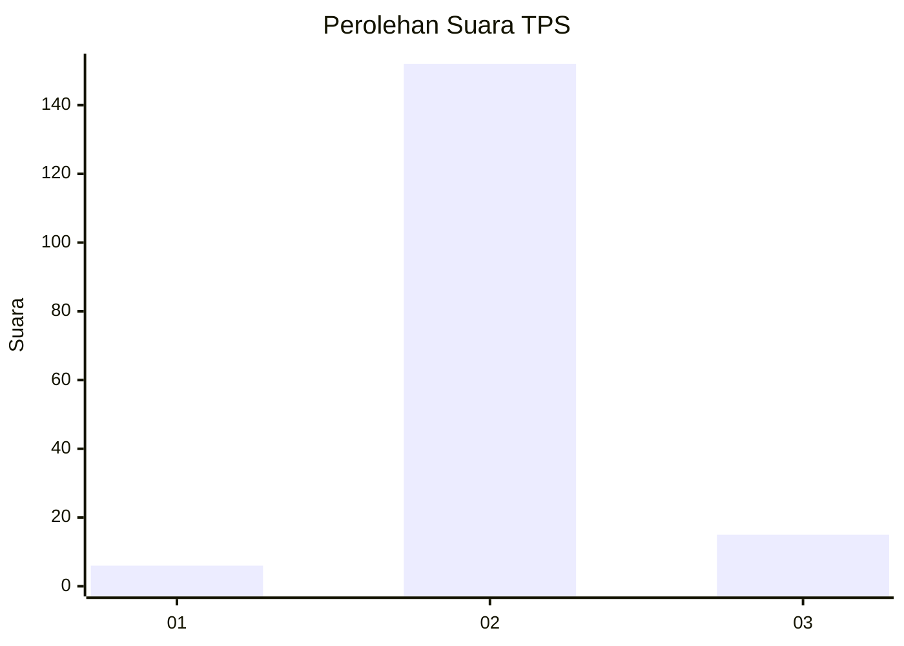
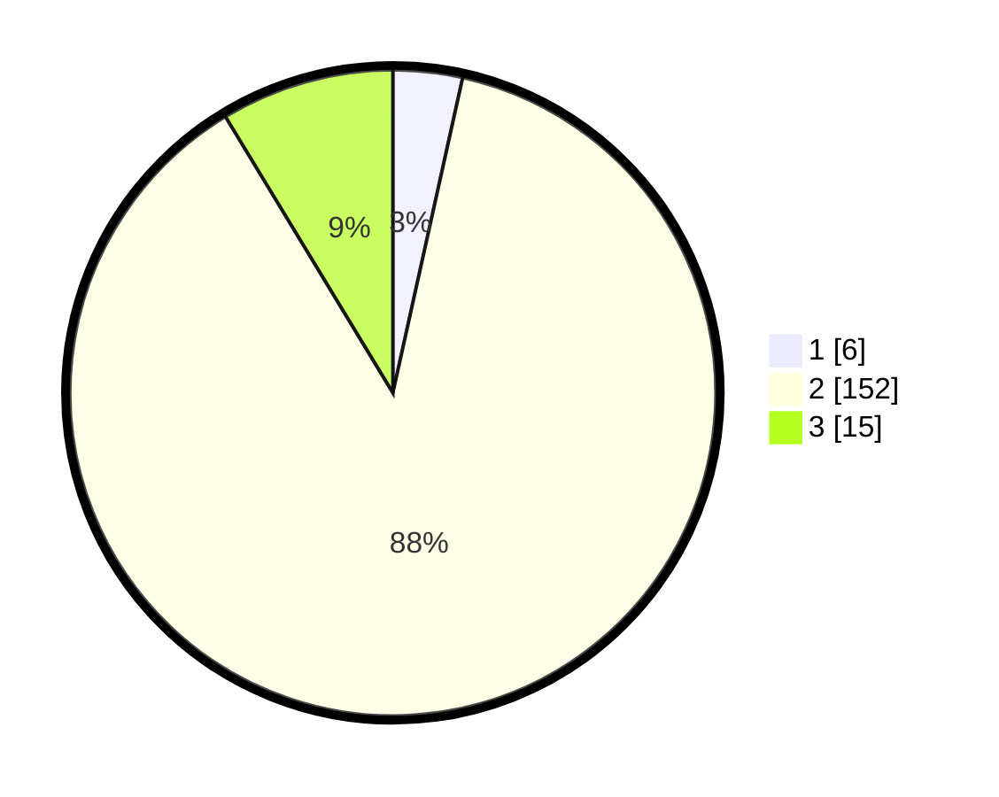

# Hasil

## Grafik

## Tabel

| No. | Nama Paslon    | Suara | Suara (raw) | Persentase |
|:--- |:-------------- | -----:| -----------:| ----------:|
| 1   | ANIES MUHAIMIN | 6     | [6][p-1]    | 3,47       |
| 2   | PRABOWO GIBRAN | 152   | [152][p-2]  | 87,86      |
| 3   | GANJAR MAHFUD  | 15    | [15][p-3]   | 8,67       |

[p-1]: https://github.com/gigit-pemilu/pemilu-2024/blob/main/pilpres/hitung-suara/sub/35-jawa-timur/sub/25-gresik/sub/01-dukun/sub/2015-jrebeng/sub/004-tps/sub/paslon-1.txt
[p-2]: https://github.com/gigit-pemilu/pemilu-2024/blob/main/pilpres/hitung-suara/sub/35-jawa-timur/sub/25-gresik/sub/01-dukun/sub/2015-jrebeng/sub/004-tps/sub/paslon-2.txt
[p-3]: https://github.com/gigit-pemilu/pemilu-2024/blob/main/pilpres/hitung-suara/sub/35-jawa-timur/sub/25-gresik/sub/01-dukun/sub/2015-jrebeng/sub/004-tps/sub/paslon-3.txt

## Foto C Plano

https://sirekap-obj-formc.kpu.go.id/f549/pemilu/ppwp/35/25/01/20/15/3525012015004-20240214-201151--1becb413-cfc7-41d2-9e80-de41762238b7.jpg

https://sirekap-obj-formc.kpu.go.id/f549/pemilu/ppwp/35/25/01/20/15/3525012015004-20240214-200757--9df5b8c6-dfb6-408e-a502-67ed9f95ea58.jpg

https://sirekap-obj-formc.kpu.go.id/f549/pemilu/ppwp/35/25/01/20/15/3525012015004-20240214-234611--7fb17b00-ffb3-4482-a361-33cca62804e2.jpg

## Metadata

| Key        | Value               |
| ---------- | ------------------- |
| Time Stamp | 2024-02-15 09:00:24 |

