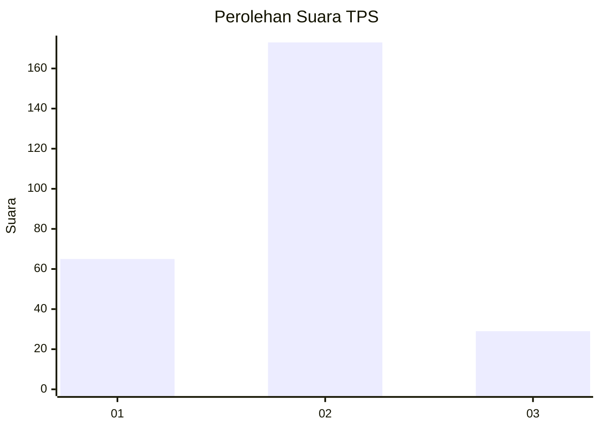
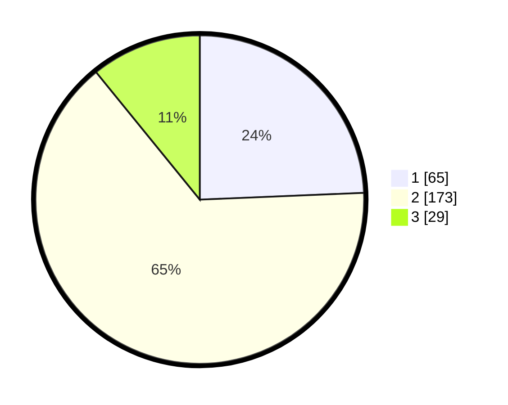

# Hasil

## Grafik

## Tabel

| No. | Nama Paslon    | Suara | Suara (raw) | Persentase |
|:--- |:-------------- | -----:| -----------:| ----------:|
| 1   | ANIES MUHAIMIN | 65    | [65][p-1]   | 24,34      |
| 2   | PRABOWO GIBRAN | 173   | [173][p-2]  | 64,79      |
| 3   | GANJAR MAHFUD  | 29    | [29][p-3]   | 10,86      |

[p-1]: https://github.com/gigit-pemilu/pemilu-2024/blob/main/pilpres/hitung-suara/sub/35-jawa-timur/sub/25-gresik/sub/01-dukun/sub/2017-sekargadung/sub/001-tps/sub/paslon-1.txt
[p-2]: https://github.com/gigit-pemilu/pemilu-2024/blob/main/pilpres/hitung-suara/sub/35-jawa-timur/sub/25-gresik/sub/01-dukun/sub/2017-sekargadung/sub/001-tps/sub/paslon-2.txt
[p-3]: https://github.com/gigit-pemilu/pemilu-2024/blob/main/pilpres/hitung-suara/sub/35-jawa-timur/sub/25-gresik/sub/01-dukun/sub/2017-sekargadung/sub/001-tps/sub/paslon-3.txt

## Foto C Plano

https://sirekap-obj-formc.kpu.go.id/aaa9/pemilu/ppwp/35/25/01/20/17/3525012017001-20240215-031909--5737d902-6e75-4066-8c05-25f2c9b07f22.jpg

https://sirekap-obj-formc.kpu.go.id/aaa9/pemilu/ppwp/35/25/01/20/17/3525012017001-20240215-032253--58166e62-be2c-461a-9742-1c3113394e31.jpg

https://sirekap-obj-formc.kpu.go.id/aaa9/pemilu/ppwp/35/25/01/20/17/3525012017001-20240215-032345--74a4dd8e-9ad2-4a9c-8ca0-5eb4e8069432.jpg

## Metadata

| Key        | Value               |
| ---------- | ------------------- |
| Time Stamp | 2024-02-16 16:25:10 |

