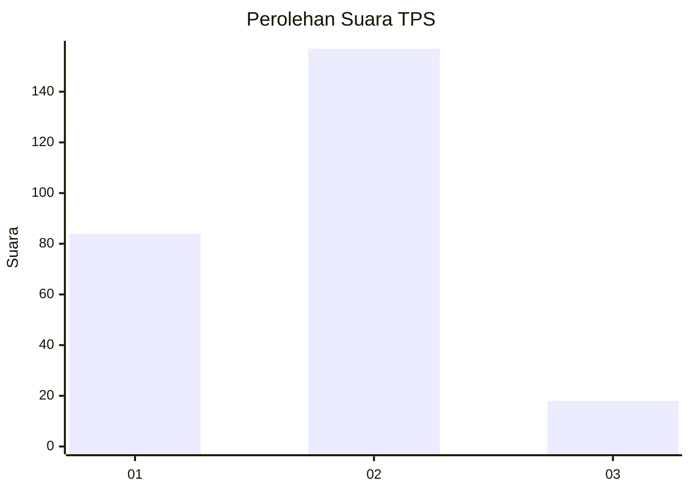
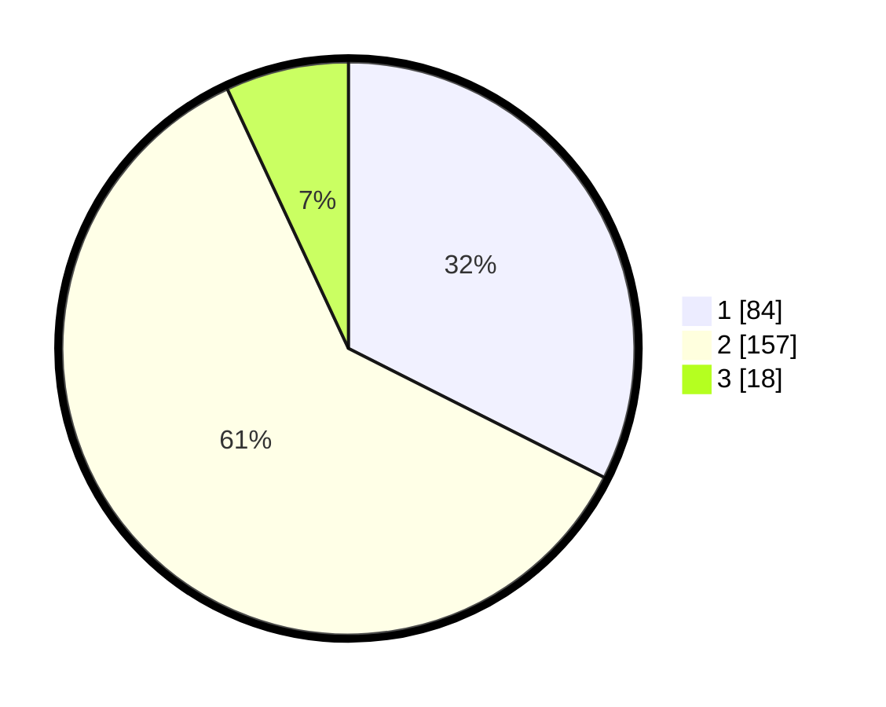

# Hasil

## Grafik

## Tabel

| No. | Nama Paslon    | Suara | Suara (raw) | Persentase |
|:--- |:-------------- | -----:| -----------:| ----------:|
| 1   | ANIES MUHAIMIN | 84    | [84][p-1]   | 32,43      |
| 2   | PRABOWO GIBRAN | 157   | [157][p-2]  | 60,62      |
| 3   | GANJAR MAHFUD  | 18    | [18][p-3]   | 6,95       |

[p-1]: https://github.com/gigit-pemilu/pemilu-2024/blob/main/pilpres/hitung-suara/sub/35-jawa-timur/sub/25-gresik/sub/01-dukun/sub/2017-sekargadung/sub/002-tps/sub/paslon-1.txt
[p-2]: https://github.com/gigit-pemilu/pemilu-2024/blob/main/pilpres/hitung-suara/sub/35-jawa-timur/sub/25-gresik/sub/01-dukun/sub/2017-sekargadung/sub/002-tps/sub/paslon-2.txt
[p-3]: https://github.com/gigit-pemilu/pemilu-2024/blob/main/pilpres/hitung-suara/sub/35-jawa-timur/sub/25-gresik/sub/01-dukun/sub/2017-sekargadung/sub/002-tps/sub/paslon-3.txt

## Foto C Plano

https://sirekap-obj-formc.kpu.go.id/bca7/pemilu/ppwp/35/25/01/20/17/3525012017002-20240214-211913--f9e33828-4273-45f5-b6b8-8b064f3cdbcf.jpg

https://sirekap-obj-formc.kpu.go.id/bca7/pemilu/ppwp/35/25/01/20/17/3525012017002-20240214-211916--72403443-f338-44e0-9893-012876179ff1.jpg

https://sirekap-obj-formc.kpu.go.id/bca7/pemilu/ppwp/35/25/01/20/17/3525012017002-20240214-211918--3bf3b628-6c92-4c8f-abfa-f2b4aeea22e8.jpg

## Metadata

| Key        | Value               |
| ---------- | ------------------- |
| Time Stamp | 2024-02-16 21:01:00 |

