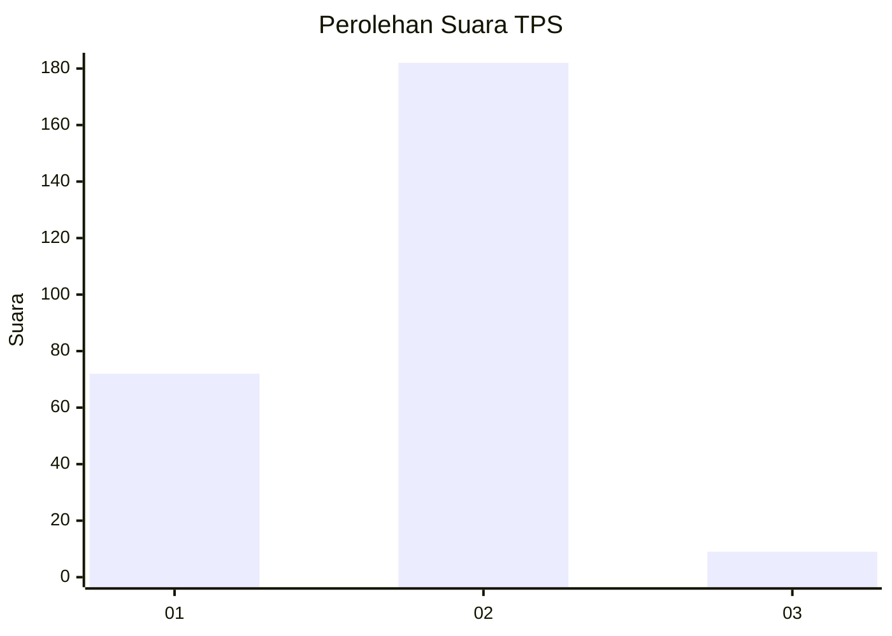
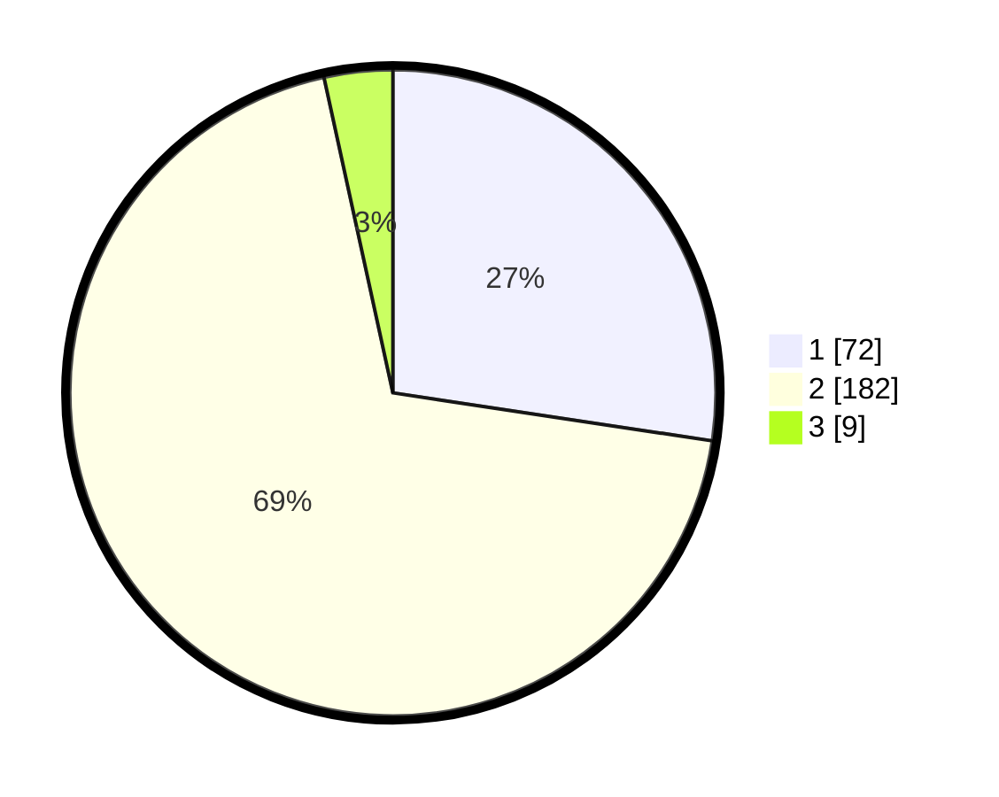

# Hasil

## Grafik

## Tabel

| No. | Nama Paslon    | Suara | Suara (raw) | Persentase |
|:--- |:-------------- | -----:| -----------:| ----------:|
| 1   | ANIES MUHAIMIN | 72    | [72][p-1]   | 27,38      |
| 2   | PRABOWO GIBRAN | 182   | [182][p-2]  | 69,20      |
| 3   | GANJAR MAHFUD  | 9     | [9][p-3]    | 3,42       |

[p-1]: https://github.com/gigit-pemilu/pemilu-2024-35-jawa-timur/blob/main/pilpres/hitung-suara/sub/35-jawa-timur/sub/25-gresik/sub/01-dukun/sub/2017-sekargadung/sub/003-tps/sub/paslon-1.txt
[p-2]: https://github.com/gigit-pemilu/pemilu-2024-35-jawa-timur/blob/main/pilpres/hitung-suara/sub/35-jawa-timur/sub/25-gresik/sub/01-dukun/sub/2017-sekargadung/sub/003-tps/sub/paslon-2.txt
[p-3]: https://github.com/gigit-pemilu/pemilu-2024-35-jawa-timur/blob/main/pilpres/hitung-suara/sub/35-jawa-timur/sub/25-gresik/sub/01-dukun/sub/2017-sekargadung/sub/003-tps/sub/paslon-3.txt

## Foto C Plano

https://sirekap-obj-formc.kpu.go.id/ae27/pemilu/ppwp/35/25/01/20/17/3525012017003-20240215-033648--747f9035-e0d9-4d28-a448-8afd96d019cc.jpg

https://sirekap-obj-formc.kpu.go.id/ae27/pemilu/ppwp/35/25/01/20/17/3525012017003-20240215-033742--6308ec9b-9d3a-448a-84c7-fb0ec222757b.jpg

https://sirekap-obj-formc.kpu.go.id/ae27/pemilu/ppwp/35/25/01/20/17/3525012017003-20240215-033834--5a18562e-dd45-4e1a-97dc-154d326e0251.jpg

## Metadata

| Key        | Value               |
| ---------- | ------------------- |
| Time Stamp | 2024-02-16 16:25:10 |

