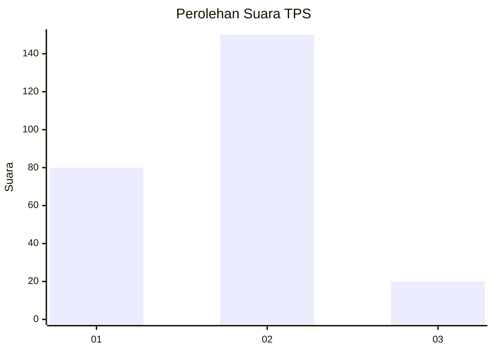
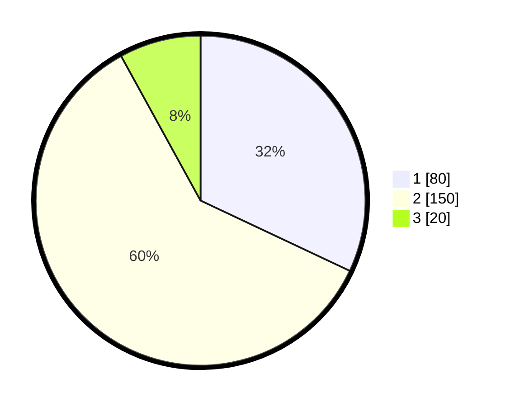

# Hasil

## Grafik

## Tabel

| No. | Nama Paslon    | Suara | Suara (raw) | Persentase |
|:--- |:-------------- | -----:| -----------:| ----------:|
| 1   | ANIES MUHAIMIN | 80    | [80][p-1]   | 32,00      |
| 2   | PRABOWO GIBRAN | 150   | [150][p-2]  | 60,00      |
| 3   | GANJAR MAHFUD  | 20    | [20][p-3]   | 8,00       |

[p-1]: https://github.com/gigit-pemilu/pemilu-2024-35-jawa-timur/blob/main/pilpres/hitung-suara/sub/35-jawa-timur/sub/25-gresik/sub/01-dukun/sub/2017-sekargadung/sub/005-tps/sub/paslon-1.txt
[p-2]: https://github.com/gigit-pemilu/pemilu-2024-35-jawa-timur/blob/main/pilpres/hitung-suara/sub/35-jawa-timur/sub/25-gresik/sub/01-dukun/sub/2017-sekargadung/sub/005-tps/sub/paslon-2.txt
[p-3]: https://github.com/gigit-pemilu/pemilu-2024-35-jawa-timur/blob/main/pilpres/hitung-suara/sub/35-jawa-timur/sub/25-gresik/sub/01-dukun/sub/2017-sekargadung/sub/005-tps/sub/paslon-3.txt

## Foto C Plano

https://sirekap-obj-formc.kpu.go.id/07ea/pemilu/ppwp/35/25/01/20/17/3525012017005-20240215-012121--3427a029-f651-48e3-933d-49edeb098a31.jpg

https://sirekap-obj-formc.kpu.go.id/07ea/pemilu/ppwp/35/25/01/20/17/3525012017005-20240215-012130--d3fa5ee2-aac3-4926-9f3e-2afa627fb60e.jpg

https://sirekap-obj-formc.kpu.go.id/07ea/pemilu/ppwp/35/25/01/20/17/3525012017005-20240215-012149--cadfbc90-91b4-4763-9b76-9116eaa21469.jpg

## Metadata

| Key        | Value               |
| ---------- | ------------------- |
| Time Stamp | 2024-02-16 16:25:10 |

