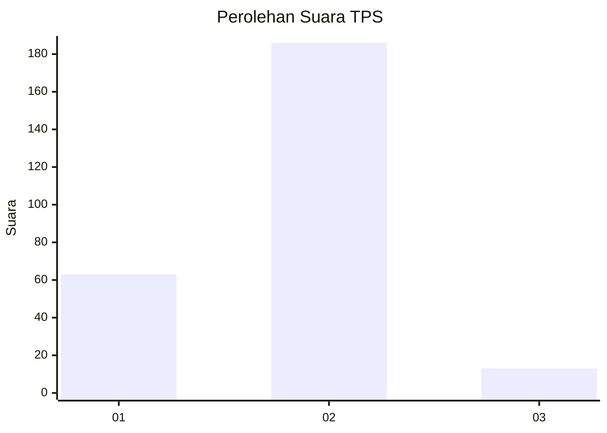
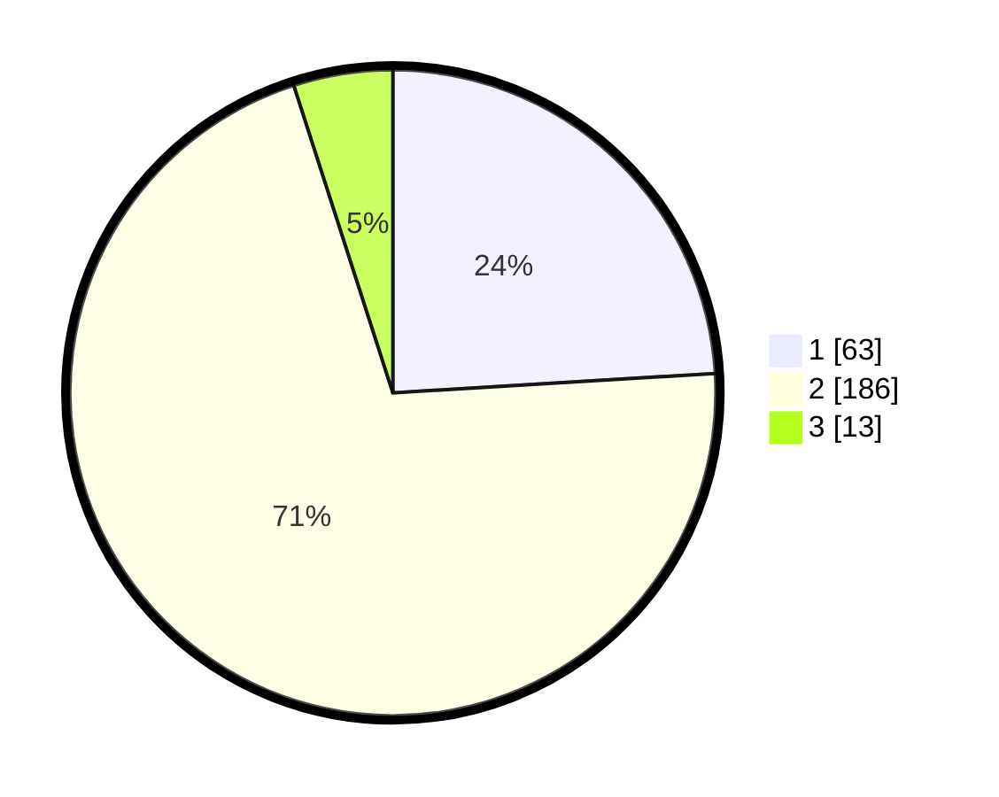

# Hasil

## Grafik

## Tabel

| No. | Nama Paslon    | Suara | Suara (raw) | Persentase |
|:--- |:-------------- | -----:| -----------:| ----------:|
| 1   | ANIES MUHAIMIN | 63    | [63][p-1]   | 24,05      |
| 2   | PRABOWO GIBRAN | 186   | [186][p-2]  | 70,99      |
| 3   | GANJAR MAHFUD  | 13    | [13][p-3]   | 4,96       |

[p-1]: https://github.com/gigit-pemilu/pemilu-2024/blob/main/pilpres/hitung-suara/sub/35-jawa-timur/sub/25-gresik/sub/01-dukun/sub/2017-sekargadung/sub/006-tps/sub/paslon-1.txt
[p-2]: https://github.com/gigit-pemilu/pemilu-2024/blob/main/pilpres/hitung-suara/sub/35-jawa-timur/sub/25-gresik/sub/01-dukun/sub/2017-sekargadung/sub/006-tps/sub/paslon-2.txt
[p-3]: https://github.com/gigit-pemilu/pemilu-2024/blob/main/pilpres/hitung-suara/sub/35-jawa-timur/sub/25-gresik/sub/01-dukun/sub/2017-sekargadung/sub/006-tps/sub/paslon-3.txt

## Foto C Plano

https://sirekap-obj-formc.kpu.go.id/a0c7/pemilu/ppwp/35/25/01/20/17/3525012017006-20240215-051026--3cdf1f06-0508-43b3-a1fd-c73584beaede.jpg

https://sirekap-obj-formc.kpu.go.id/a0c7/pemilu/ppwp/35/25/01/20/17/3525012017006-20240215-051228--83bacebc-447f-454d-a67b-307dea813635.jpg

https://sirekap-obj-formc.kpu.go.id/a0c7/pemilu/ppwp/35/25/01/20/17/3525012017006-20240215-051420--4f2cda9e-8565-4337-ba13-b4990efe07dd.jpg

## Metadata

| Key        | Value               |
| ---------- | ------------------- |
| Time Stamp | 2024-02-16 16:25:10 |

