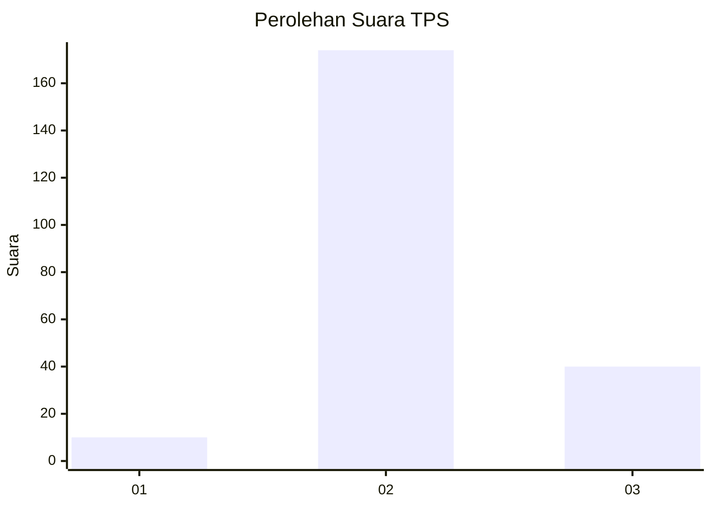

# Hasil

## Grafik

## Tabel

| No. | Nama Paslon    | Suara | Suara (raw) | Persentase |
|:--- |:-------------- | -----:| -----------:| ----------:|
| 1   | ANIES MUHAIMIN | 10    | [10][p-1]   | 4,46       |
| 2   | PRABOWO GIBRAN | 174   | [174][p-2]  | 77,68      |
| 3   | GANJAR MAHFUD  | 40    | [40][p-3]   | 17,86      |

[p-1]: https://github.com/gigit-pemilu/pemilu-2024/blob/main/pilpres/hitung-suara/sub/35-jawa-timur/sub/25-gresik/sub/01-dukun/sub/2018-ima'an/sub/001-tps/sub/paslon-1.txt
[p-2]: https://github.com/gigit-pemilu/pemilu-2024/blob/main/pilpres/hitung-suara/sub/35-jawa-timur/sub/25-gresik/sub/01-dukun/sub/2018-ima'an/sub/001-tps/sub/paslon-2.txt
[p-3]: https://github.com/gigit-pemilu/pemilu-2024/blob/main/pilpres/hitung-suara/sub/35-jawa-timur/sub/25-gresik/sub/01-dukun/sub/2018-ima'an/sub/001-tps/sub/paslon-3.txt

## Foto C Plano

https://sirekap-obj-formc.kpu.go.id/3467/pemilu/ppwp/35/25/01/20/18/3525012018001-20240215-083603--6c75f569-445e-4c9a-a01f-d148ef169571.jpg

https://sirekap-obj-formc.kpu.go.id/3467/pemilu/ppwp/35/25/01/20/18/3525012018001-20240215-083419--2d3d8e34-2724-463b-8ddd-bc2bbe7d4750.jpg

https://sirekap-obj-formc.kpu.go.id/3467/pemilu/ppwp/35/25/01/20/18/3525012018001-20240214-215021--6c04aa1d-fcbe-4437-b914-8f83f245e98a.jpg

## Metadata

| Key        | Value               |
| ---------- | ------------------- |
| Time Stamp | 2024-02-16 21:01:00 |

