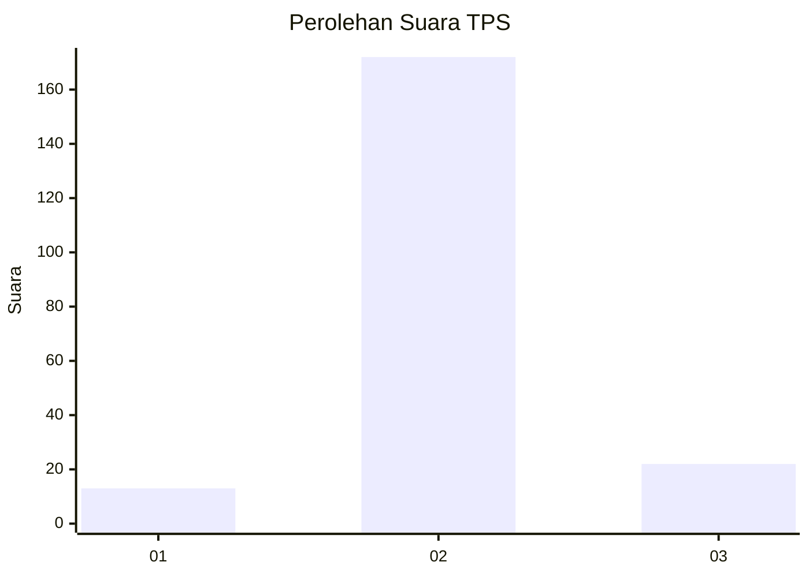
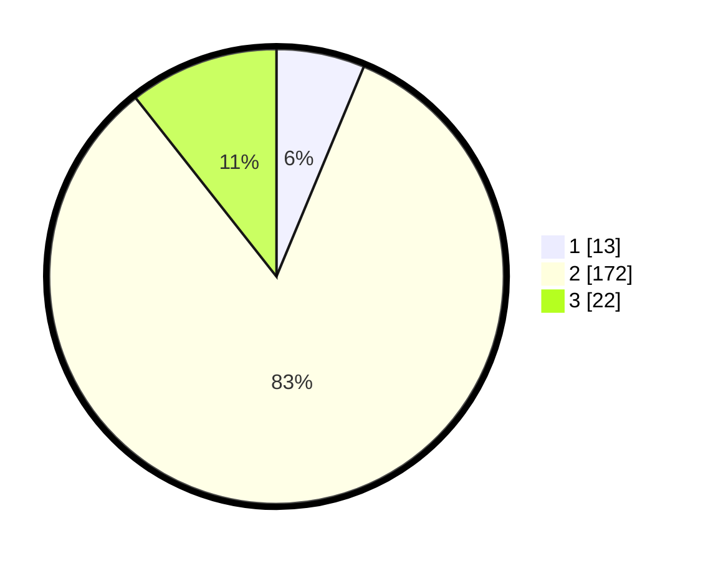

# Hasil

## Grafik

## Tabel

| No. | Nama Paslon    | Suara | Suara (raw) | Persentase |
|:--- |:-------------- | -----:| -----------:| ----------:|
| 1   | ANIES MUHAIMIN | 13    | [13][p-1]   | 6,28       |
| 2   | PRABOWO GIBRAN | 172   | [172][p-2]  | 83,09      |
| 3   | GANJAR MAHFUD  | 22    | [22][p-3]   | 10,63      |

[p-1]: https://github.com/gigit-pemilu/pemilu-2024/blob/main/pilpres/hitung-suara/sub/35-jawa-timur/sub/25-gresik/sub/01-dukun/sub/2018-ima'an/sub/002-tps/sub/paslon-1.txt
[p-2]: https://github.com/gigit-pemilu/pemilu-2024/blob/main/pilpres/hitung-suara/sub/35-jawa-timur/sub/25-gresik/sub/01-dukun/sub/2018-ima'an/sub/002-tps/sub/paslon-2.txt
[p-3]: https://github.com/gigit-pemilu/pemilu-2024/blob/main/pilpres/hitung-suara/sub/35-jawa-timur/sub/25-gresik/sub/01-dukun/sub/2018-ima'an/sub/002-tps/sub/paslon-3.txt

## Foto C Plano

https://sirekap-obj-formc.kpu.go.id/c8e8/pemilu/ppwp/35/25/01/20/18/3525012018002-20240215-084853--71942692-8802-494d-99b1-32f0ac2464d5.jpg

https://sirekap-obj-formc.kpu.go.id/c8e8/pemilu/ppwp/35/25/01/20/18/3525012018002-20240215-085333--28a349ec-0903-49f8-9208-aa3aaee47e0a.jpg

https://sirekap-obj-formc.kpu.go.id/c8e8/pemilu/ppwp/35/25/01/20/18/3525012018002-20240215-090024--0d884802-f8f9-4622-a05d-a91b51ae1b0d.jpg

## Metadata

| Key        | Value               |
| ---------- | ------------------- |
| Time Stamp | 2024-02-16 21:01:00 |

