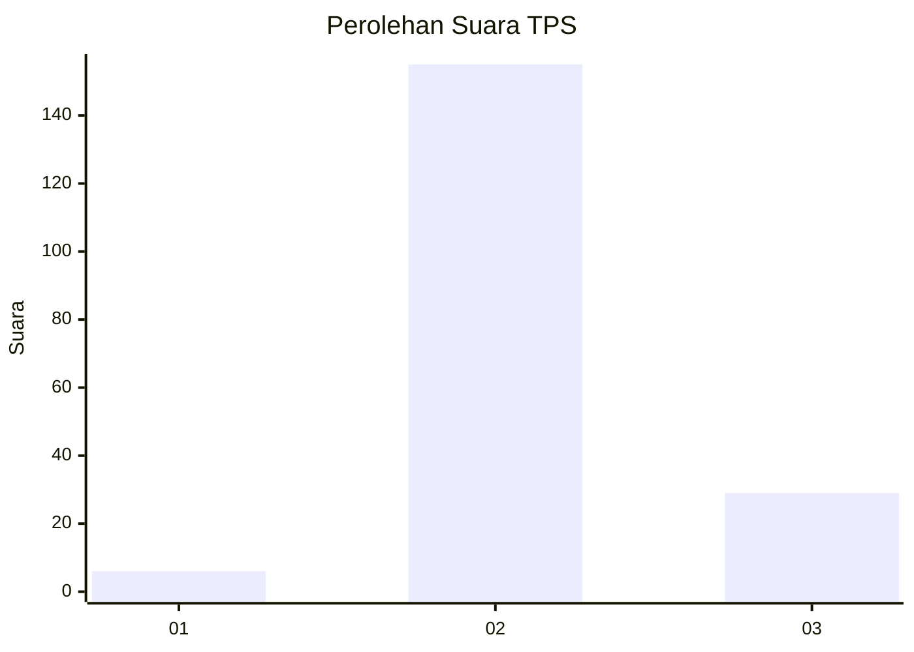
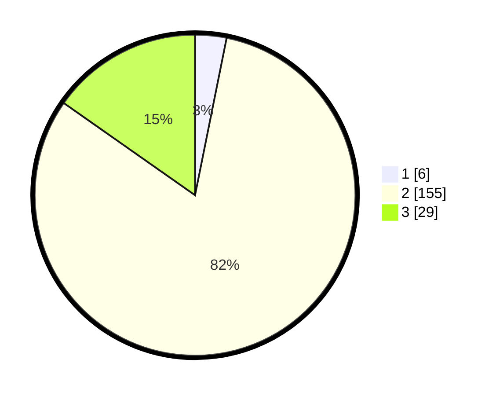

# Hasil

## Grafik

## Tabel

| No. | Nama Paslon    | Suara | Suara (raw) | Persentase |
|:--- |:-------------- | -----:| -----------:| ----------:|
| 1   | ANIES MUHAIMIN | 6     | [6][p-1]    | 3,16       |
| 2   | PRABOWO GIBRAN | 155   | [155][p-2]  | 81,58      |
| 3   | GANJAR MAHFUD  | 29    | [29][p-3]   | 15,26      |

[p-1]: https://github.com/gigit-pemilu/pemilu-2024/blob/main/pilpres/hitung-suara/sub/35-jawa-timur/sub/25-gresik/sub/01-dukun/sub/2018-ima'an/sub/003-tps/sub/paslon-1.txt
[p-2]: https://github.com/gigit-pemilu/pemilu-2024/blob/main/pilpres/hitung-suara/sub/35-jawa-timur/sub/25-gresik/sub/01-dukun/sub/2018-ima'an/sub/003-tps/sub/paslon-2.txt
[p-3]: https://github.com/gigit-pemilu/pemilu-2024/blob/main/pilpres/hitung-suara/sub/35-jawa-timur/sub/25-gresik/sub/01-dukun/sub/2018-ima'an/sub/003-tps/sub/paslon-3.txt

## Foto C Plano

https://sirekap-obj-formc.kpu.go.id/e909/pemilu/ppwp/35/25/01/20/18/3525012018003-20240214-215822--60c2fcff-7fdf-4041-9014-dda6534f0bb7.jpg

https://sirekap-obj-formc.kpu.go.id/e909/pemilu/ppwp/35/25/01/20/18/3525012018003-20240214-220128--2b6769d3-be5b-41be-a15a-1043696f11ec.jpg

https://sirekap-obj-formc.kpu.go.id/e909/pemilu/ppwp/35/25/01/20/18/3525012018003-20240214-220417--c8d8c2a1-2de6-400a-97be-5ec8e1b60c58.jpg

## Metadata

| Key        | Value               |
| ---------- | ------------------- |
| Time Stamp | 2024-02-16 21:01:00 |

