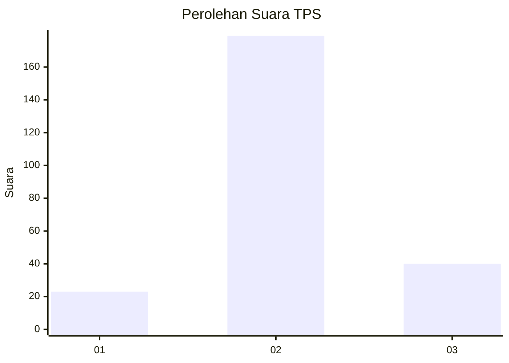
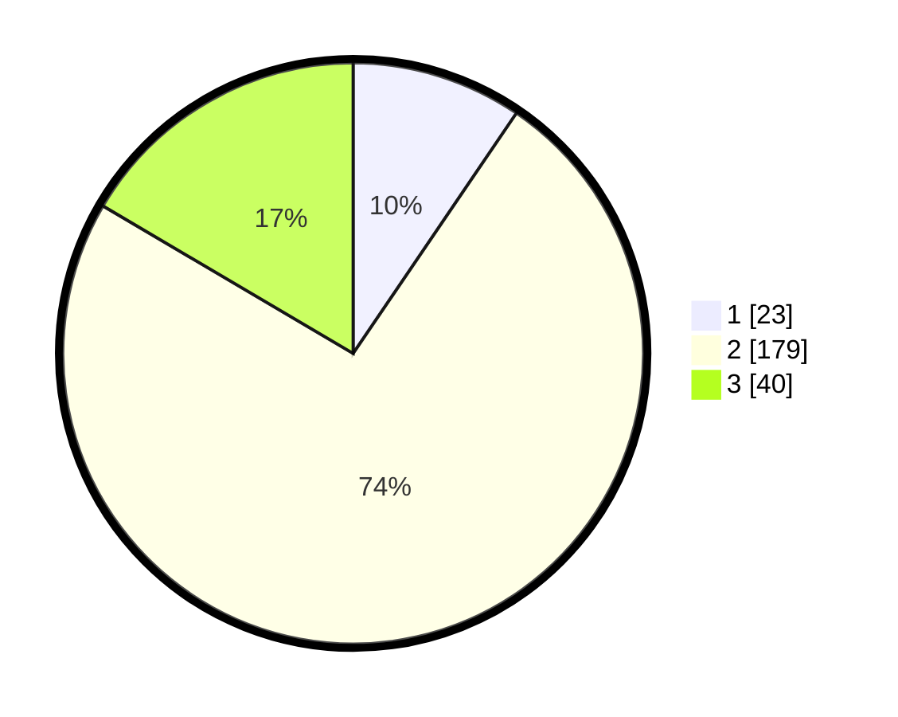

# Hasil

## Grafik

## Tabel

| No. | Nama Paslon    | Suara | Suara (raw) | Persentase |
|:--- |:-------------- | -----:| -----------:| ----------:|
| 1   | ANIES MUHAIMIN | 23    | [23][p-1]   | 9,50       |
| 2   | PRABOWO GIBRAN | 179   | [179][p-2]  | 73,97      |
| 3   | GANJAR MAHFUD  | 40    | [40][p-3]   | 16,53      |

[p-1]: https://github.com/gigit-pemilu/pemilu-2024/blob/main/pilpres/hitung-suara/sub/35-jawa-timur/sub/25-gresik/sub/01-dukun/sub/2019-babakbawo/sub/001-tps/sub/paslon-1.txt
[p-2]: https://github.com/gigit-pemilu/pemilu-2024/blob/main/pilpres/hitung-suara/sub/35-jawa-timur/sub/25-gresik/sub/01-dukun/sub/2019-babakbawo/sub/001-tps/sub/paslon-2.txt
[p-3]: https://github.com/gigit-pemilu/pemilu-2024/blob/main/pilpres/hitung-suara/sub/35-jawa-timur/sub/25-gresik/sub/01-dukun/sub/2019-babakbawo/sub/001-tps/sub/paslon-3.txt

## Foto C Plano

https://sirekap-obj-formc.kpu.go.id/3bbb/pemilu/ppwp/35/25/01/20/19/3525012019001-20240215-024613--e171e990-00e1-486b-8ab1-e929fb886719.jpg

https://sirekap-obj-formc.kpu.go.id/3bbb/pemilu/ppwp/35/25/01/20/19/3525012019001-20240214-223115--06ae88c5-49c4-48e3-bbd7-67db5d16b6f0.jpg

https://sirekap-obj-formc.kpu.go.id/3bbb/pemilu/ppwp/35/25/01/20/19/3525012019001-20240214-223122--1d05a29c-3914-4fa3-8f5e-fa81bb5c9923.jpg

## Metadata

| Key        | Value               |
| ---------- | ------------------- |
| Time Stamp | 2024-02-16 16:25:10 |

