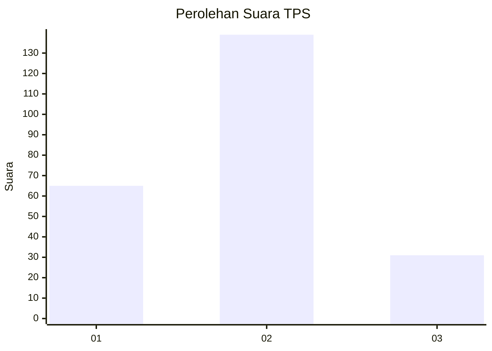
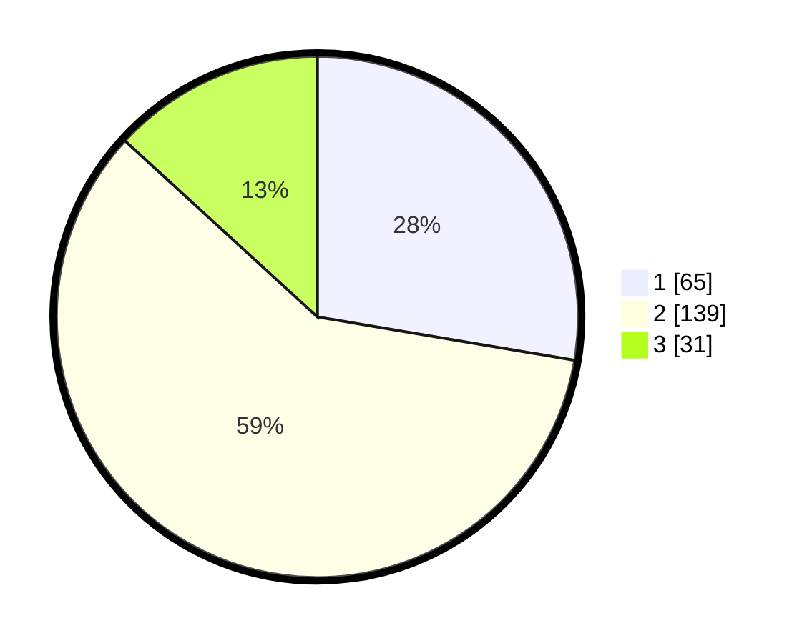

# Hasil

## Grafik

## Tabel

| No. | Nama Paslon    | Suara | Suara (raw) | Persentase |
|:--- |:-------------- | -----:| -----------:| ----------:|
| 1   | ANIES MUHAIMIN | 65    | [65][p-1]   | 27,66      |
| 2   | PRABOWO GIBRAN | 139   | [139][p-2]  | 59,15      |
| 3   | GANJAR MAHFUD  | 31    | [31][p-3]   | 13,19      |

[p-1]: https://github.com/gigit-pemilu/pemilu-2024/blob/main/pilpres/hitung-suara/sub/35-jawa-timur/sub/25-gresik/sub/01-dukun/sub/2021-sambogunung/sub/003-tps/sub/paslon-1.txt
[p-2]: https://github.com/gigit-pemilu/pemilu-2024/blob/main/pilpres/hitung-suara/sub/35-jawa-timur/sub/25-gresik/sub/01-dukun/sub/2021-sambogunung/sub/003-tps/sub/paslon-2.txt
[p-3]: https://github.com/gigit-pemilu/pemilu-2024/blob/main/pilpres/hitung-suara/sub/35-jawa-timur/sub/25-gresik/sub/01-dukun/sub/2021-sambogunung/sub/003-tps/sub/paslon-3.txt

## Foto C Plano

https://sirekap-obj-formc.kpu.go.id/e3b8/pemilu/ppwp/35/25/01/20/21/3525012021003-20240214-192814--fcfbc793-b84c-46a3-ab3c-279cfe2615c4.jpg

https://sirekap-obj-formc.kpu.go.id/e3b8/pemilu/ppwp/35/25/01/20/21/3525012021003-20240214-192820--deebaebe-24eb-4a1c-89a5-539c62ac5d41.jpg

https://sirekap-obj-formc.kpu.go.id/e3b8/pemilu/ppwp/35/25/01/20/21/3525012021003-20240214-192826--09548967-253b-4b87-ba57-4c903e9416d3.jpg

## Metadata

| Key        | Value               |
| ---------- | ------------------- |
| Time Stamp | 2024-02-16 21:01:00 |

