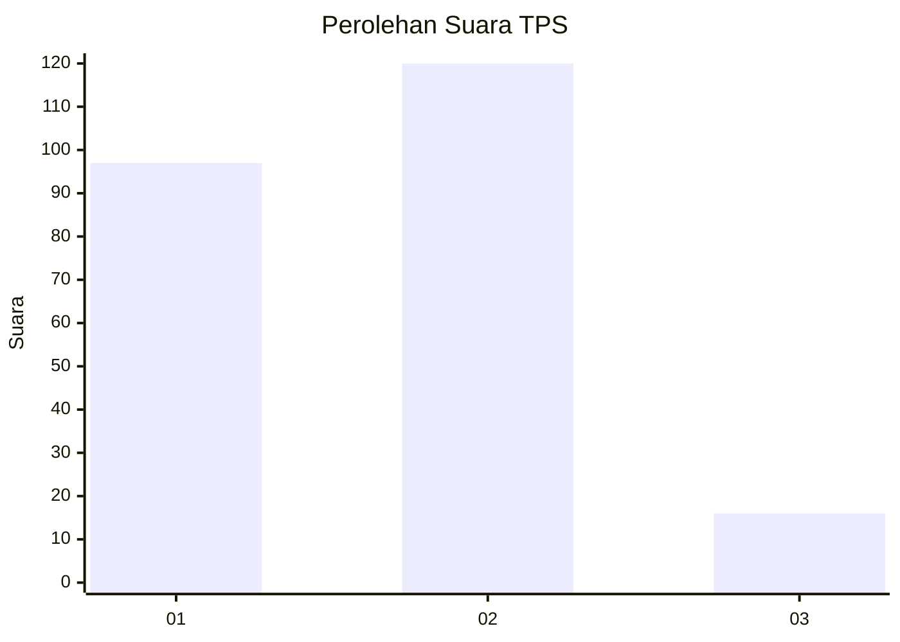

# Hasil

## Grafik

## Tabel

| No. | Nama Paslon    | Suara | Suara (raw) | Persentase |
|:--- |:-------------- | -----:| -----------:| ----------:|
| 1   | ANIES MUHAIMIN | 97    | [97][p-1]   | 41,63      |
| 2   | PRABOWO GIBRAN | 120   | [120][p-2]  | 51,50      |
| 3   | GANJAR MAHFUD  | 16    | [16][p-3]   | 6,87       |

[p-1]: https://github.com/gigit-pemilu/pemilu-2024/blob/main/pilpres/hitung-suara/sub/35-jawa-timur/sub/25-gresik/sub/01-dukun/sub/2021-sambogunung/sub/005-tps/sub/paslon-1.txt
[p-2]: https://github.com/gigit-pemilu/pemilu-2024/blob/main/pilpres/hitung-suara/sub/35-jawa-timur/sub/25-gresik/sub/01-dukun/sub/2021-sambogunung/sub/005-tps/sub/paslon-2.txt
[p-3]: https://github.com/gigit-pemilu/pemilu-2024/blob/main/pilpres/hitung-suara/sub/35-jawa-timur/sub/25-gresik/sub/01-dukun/sub/2021-sambogunung/sub/005-tps/sub/paslon-3.txt

## Foto C Plano

https://sirekap-obj-formc.kpu.go.id/941d/pemilu/ppwp/35/25/01/20/21/3525012021005-20240215-000356--504b0939-6ead-46f5-b3d6-b25d84d5ef03.jpg

https://sirekap-obj-formc.kpu.go.id/941d/pemilu/ppwp/35/25/01/20/21/3525012021005-20240215-000619--521494fe-2e5a-4a59-9ff5-197e07d161b0.jpg

https://sirekap-obj-formc.kpu.go.id/941d/pemilu/ppwp/35/25/01/20/21/3525012021005-20240215-000731--23763b9c-2875-47e2-9e5a-43094dc27b06.jpg

## Metadata

| Key        | Value               |
| ---------- | ------------------- |
| Time Stamp | 2024-02-16 16:25:10 |

