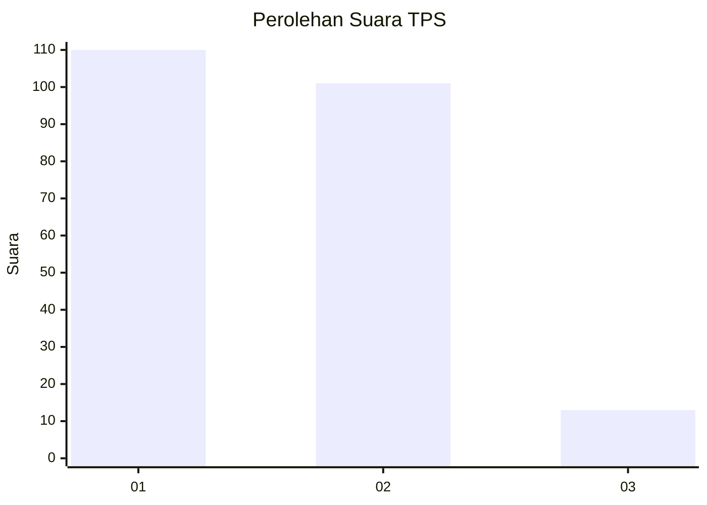
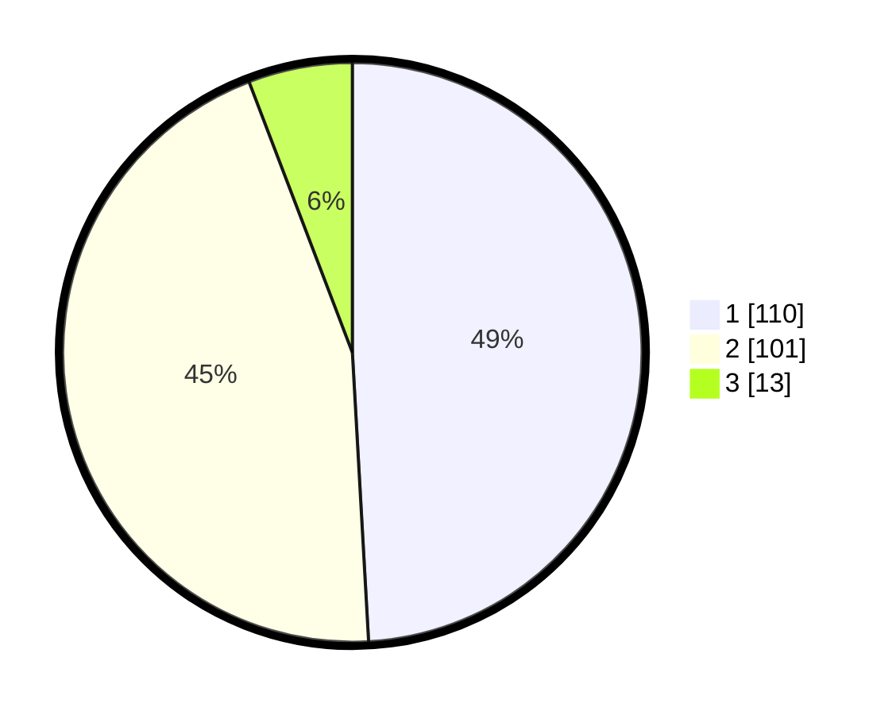

# Hasil

## Grafik

## Tabel

| No. | Nama Paslon    | Suara | Suara (raw) | Persentase |
|:--- |:-------------- | -----:| -----------:| ----------:|
| 1   | ANIES MUHAIMIN | 110   | [110][p-1]  | 49,11      |
| 2   | PRABOWO GIBRAN | 101   | [101][p-2]  | 45,09      |
| 3   | GANJAR MAHFUD  | 13    | [13][p-3]   | 5,80       |

[p-1]: https://github.com/gigit-pemilu/pemilu-2024/blob/main/pilpres/hitung-suara/sub/35-jawa-timur/sub/25-gresik/sub/01-dukun/sub/2022-sembungan-kidul/sub/004-tps/sub/paslon-1.txt
[p-2]: https://github.com/gigit-pemilu/pemilu-2024/blob/main/pilpres/hitung-suara/sub/35-jawa-timur/sub/25-gresik/sub/01-dukun/sub/2022-sembungan-kidul/sub/004-tps/sub/paslon-2.txt
[p-3]: https://github.com/gigit-pemilu/pemilu-2024/blob/main/pilpres/hitung-suara/sub/35-jawa-timur/sub/25-gresik/sub/01-dukun/sub/2022-sembungan-kidul/sub/004-tps/sub/paslon-3.txt

## Foto C Plano

https://sirekap-obj-formc.kpu.go.id/e672/pemilu/ppwp/35/25/01/20/22/3525012022004-20240215-004832--7dc06bbe-21a6-4e84-9140-6b1ff84c95fa.jpg

https://sirekap-obj-formc.kpu.go.id/e672/pemilu/ppwp/35/25/01/20/22/3525012022004-20240214-155421--e9080dee-7c87-4f24-b6c2-5592b544a733.jpg

https://sirekap-obj-formc.kpu.go.id/e672/pemilu/ppwp/35/25/01/20/22/3525012022004-20240214-155457--844d660c-3e65-44c3-ad3d-df373395d32a.jpg

## Metadata

| Key        | Value               |
| ---------- | ------------------- |
| Time Stamp | 2024-02-16 21:01:00 |

