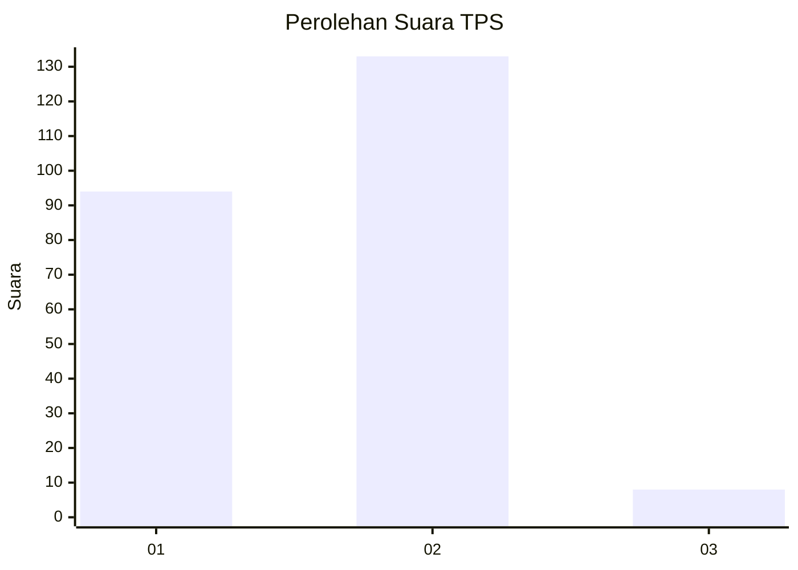
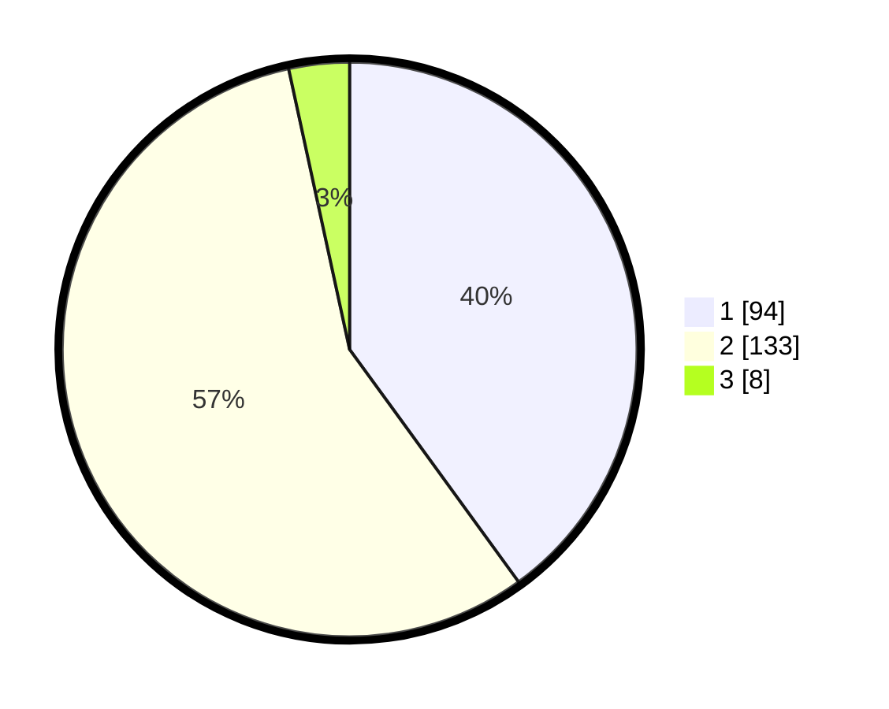

# Hasil

## Grafik

## Tabel

| No. | Nama Paslon    | Suara | Suara (raw) | Persentase |
|:--- |:-------------- | -----:| -----------:| ----------:|
| 1   | ANIES MUHAIMIN | 94    | [94][p-1]   | 40,00      |
| 2   | PRABOWO GIBRAN | 133   | [133][p-2]  | 56,60      |
| 3   | GANJAR MAHFUD  | 8     | [8][p-3]    | 3,40       |

[p-1]: https://github.com/gigit-pemilu/pemilu-2024/blob/main/pilpres/hitung-suara/sub/35-jawa-timur/sub/25-gresik/sub/01-dukun/sub/2025-padang-bandung/sub/004-tps/sub/paslon-1.txt
[p-2]: https://github.com/gigit-pemilu/pemilu-2024/blob/main/pilpres/hitung-suara/sub/35-jawa-timur/sub/25-gresik/sub/01-dukun/sub/2025-padang-bandung/sub/004-tps/sub/paslon-2.txt
[p-3]: https://github.com/gigit-pemilu/pemilu-2024/blob/main/pilpres/hitung-suara/sub/35-jawa-timur/sub/25-gresik/sub/01-dukun/sub/2025-padang-bandung/sub/004-tps/sub/paslon-3.txt

## Foto C Plano

https://sirekap-obj-formc.kpu.go.id/3b4a/pemilu/ppwp/35/25/01/20/25/3525012025004-20240215-000140--fd1ab8fe-85da-472a-b420-71739c02c1d8.jpg

https://sirekap-obj-formc.kpu.go.id/3b4a/pemilu/ppwp/35/25/01/20/25/3525012025004-20240215-000323--9f65382c-1d10-4278-88f1-1615863dbb9b.jpg

https://sirekap-obj-formc.kpu.go.id/3b4a/pemilu/ppwp/35/25/01/20/25/3525012025004-20240215-000537--01e3be41-e0fb-417d-a00c-42ebb170df87.jpg

## Metadata

| Key        | Value               |
| ---------- | ------------------- |
| Time Stamp | 2024-02-16 16:25:10 |

