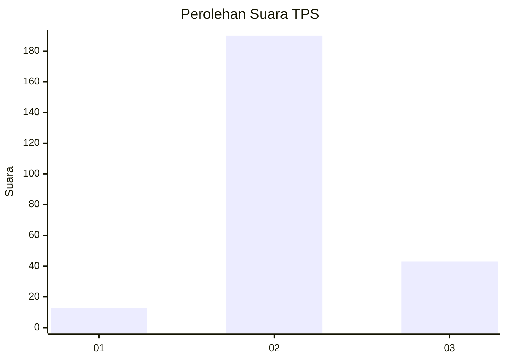

# Hasil

## Grafik

## Tabel

| No. | Nama Paslon    | Suara | Suara (raw) | Persentase |
|:--- |:-------------- | -----:| -----------:| ----------:|
| 1   | ANIES MUHAIMIN | 13    | [13][p-1]   | 5,28       |
| 2   | PRABOWO GIBRAN | 190   | [190][p-2]  | 77,24      |
| 3   | GANJAR MAHFUD  | 43    | [43][p-3]   | 17,48      |

[p-1]: https://github.com/gigit-pemilu/pemilu-2024-35-jawa-timur/blob/main/pilpres/hitung-suara/sub/35-jawa-timur/sub/25-gresik/sub/02-balongpanggang/sub/2002-brangkal/sub/001-tps/sub/paslon-1.txt
[p-2]: https://github.com/gigit-pemilu/pemilu-2024-35-jawa-timur/blob/main/pilpres/hitung-suara/sub/35-jawa-timur/sub/25-gresik/sub/02-balongpanggang/sub/2002-brangkal/sub/001-tps/sub/paslon-2.txt
[p-3]: https://github.com/gigit-pemilu/pemilu-2024-35-jawa-timur/blob/main/pilpres/hitung-suara/sub/35-jawa-timur/sub/25-gresik/sub/02-balongpanggang/sub/2002-brangkal/sub/001-tps/sub/paslon-3.txt

## Foto C Plano

https://sirekap-obj-formc.kpu.go.id/39c0/pemilu/ppwp/35/25/02/20/02/3525022002001-20240215-012029--1e72c6ef-2a67-4efa-b1dd-d93741a376f8.jpg

https://sirekap-obj-formc.kpu.go.id/39c0/pemilu/ppwp/35/25/02/20/02/3525022002001-20240215-012219--c52b678c-eb9c-48d8-8ebb-3a484f7f30d8.jpg

https://sirekap-obj-formc.kpu.go.id/39c0/pemilu/ppwp/35/25/02/20/02/3525022002001-20240214-220123--6a4fce78-4e8b-4063-9e68-a411252fd969.jpg

## Metadata

| Key        | Value               |
| ---------- | ------------------- |
| Time Stamp | 2024-02-15 15:00:29 |

