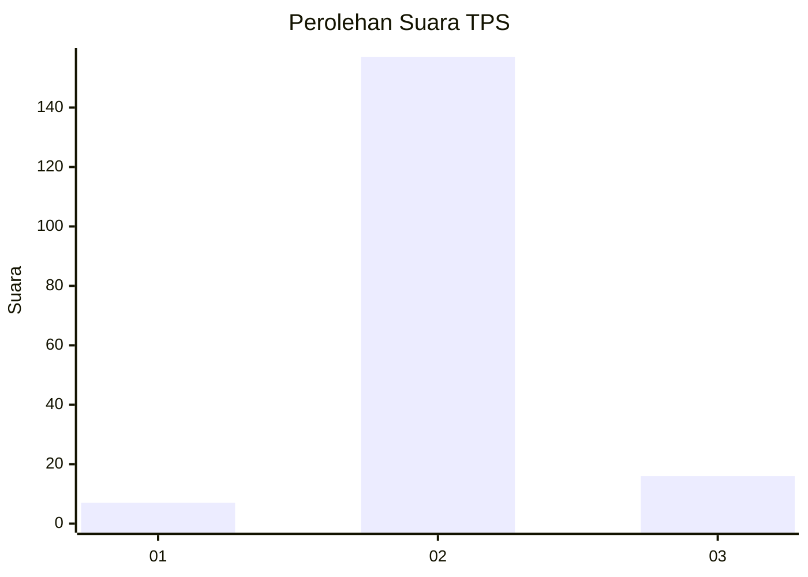
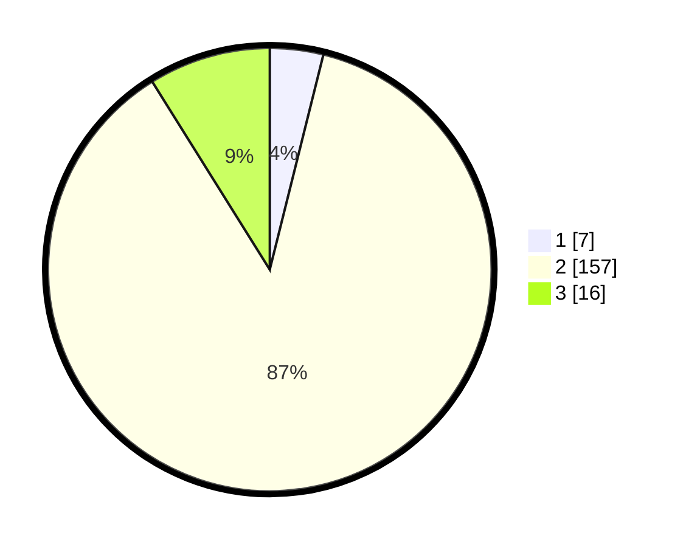

# Hasil

## Grafik

## Tabel

| No. | Nama Paslon    | Suara | Suara (raw) | Persentase |
|:--- |:-------------- | -----:| -----------:| ----------:|
| 1   | ANIES MUHAIMIN | 7     | [7][p-1]    | 3,89       |
| 2   | PRABOWO GIBRAN | 157   | [157][p-2]  | 87,22      |
| 3   | GANJAR MAHFUD  | 16    | [16][p-3]   | 8,89       |

[p-1]: https://github.com/gigit-pemilu/pemilu-2024-35-jawa-timur/blob/main/pilpres/hitung-suara/sub/35-jawa-timur/sub/25-gresik/sub/02-balongpanggang/sub/2012-tenggor/sub/005-tps/sub/paslon-1.txt
[p-2]: https://github.com/gigit-pemilu/pemilu-2024-35-jawa-timur/blob/main/pilpres/hitung-suara/sub/35-jawa-timur/sub/25-gresik/sub/02-balongpanggang/sub/2012-tenggor/sub/005-tps/sub/paslon-2.txt
[p-3]: https://github.com/gigit-pemilu/pemilu-2024-35-jawa-timur/blob/main/pilpres/hitung-suara/sub/35-jawa-timur/sub/25-gresik/sub/02-balongpanggang/sub/2012-tenggor/sub/005-tps/sub/paslon-3.txt

## Foto C Plano

https://sirekap-obj-formc.kpu.go.id/dfba/pemilu/ppwp/35/25/02/20/12/3525022012005-20240214-141415--8f097f13-f5d7-4034-9394-14433154a43f.jpg

https://sirekap-obj-formc.kpu.go.id/dfba/pemilu/ppwp/35/25/02/20/12/3525022012005-20240214-141600--ab685f74-eba7-499a-aaef-ea240fc4a3e5.jpg

https://sirekap-obj-formc.kpu.go.id/dfba/pemilu/ppwp/35/25/02/20/12/3525022012005-20240215-032324--e0934245-ffef-4fa7-9dac-611b4ad86996.jpg

## Metadata

| Key        | Value               |
| ---------- | ------------------- |
| Time Stamp | 2024-02-15 21:30:27 |

