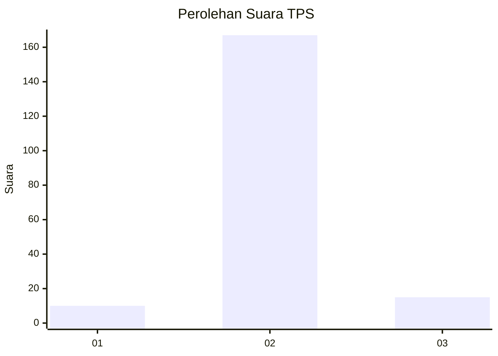
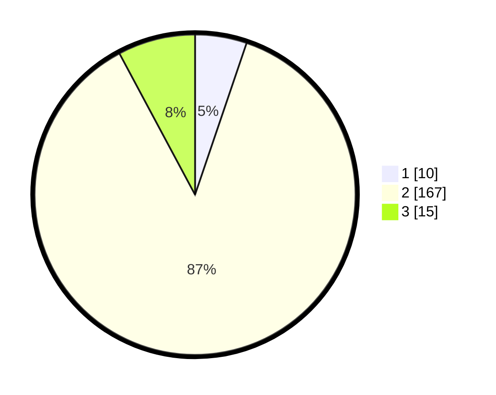

# Hasil

## Grafik

## Tabel

| No. | Nama Paslon    | Suara | Suara (raw) | Persentase |
|:--- |:-------------- | -----:| -----------:| ----------:|
| 1   | ANIES MUHAIMIN | 10    | [10][p-1]   | 5,21       |
| 2   | PRABOWO GIBRAN | 167   | [167][p-2]  | 86,98      |
| 3   | GANJAR MAHFUD  | 15    | [15][p-3]   | 7,81       |

[p-1]: https://github.com/gigit-pemilu/pemilu-2024-35-jawa-timur/blob/main/pilpres/hitung-suara/sub/35-jawa-timur/sub/25-gresik/sub/02-balongpanggang/sub/2014-kedungpring/sub/001-tps/sub/paslon-1.txt
[p-2]: https://github.com/gigit-pemilu/pemilu-2024-35-jawa-timur/blob/main/pilpres/hitung-suara/sub/35-jawa-timur/sub/25-gresik/sub/02-balongpanggang/sub/2014-kedungpring/sub/001-tps/sub/paslon-2.txt
[p-3]: https://github.com/gigit-pemilu/pemilu-2024-35-jawa-timur/blob/main/pilpres/hitung-suara/sub/35-jawa-timur/sub/25-gresik/sub/02-balongpanggang/sub/2014-kedungpring/sub/001-tps/sub/paslon-3.txt

## Foto C Plano

https://sirekap-obj-formc.kpu.go.id/9b33/pemilu/ppwp/35/25/02/20/14/3525022014001-20240215-031900--002b45cd-c8bc-450c-b2ea-e5a58c2f06bf.jpg

https://sirekap-obj-formc.kpu.go.id/9b33/pemilu/ppwp/35/25/02/20/14/3525022014001-20240215-032010--b82ac311-a747-4ca3-b7c7-38f6457ca88b.jpg

https://sirekap-obj-formc.kpu.go.id/9b33/pemilu/ppwp/35/25/02/20/14/3525022014001-20240215-032053--daf669e7-b369-4d96-8ee4-c08fe028de1d.jpg

## Metadata

| Key        | Value               |
| ---------- | ------------------- |
| Time Stamp | 2024-02-25 17:00:00 |

