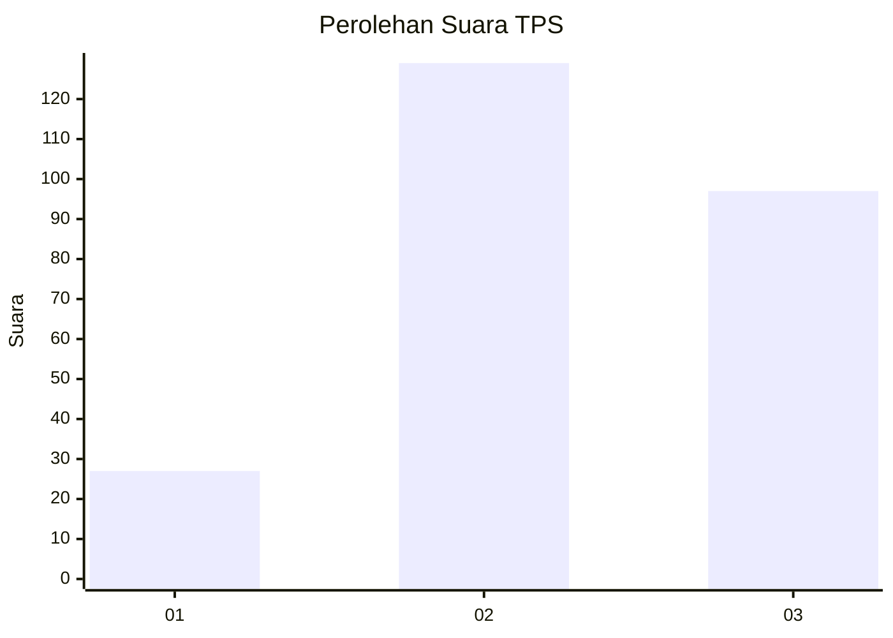
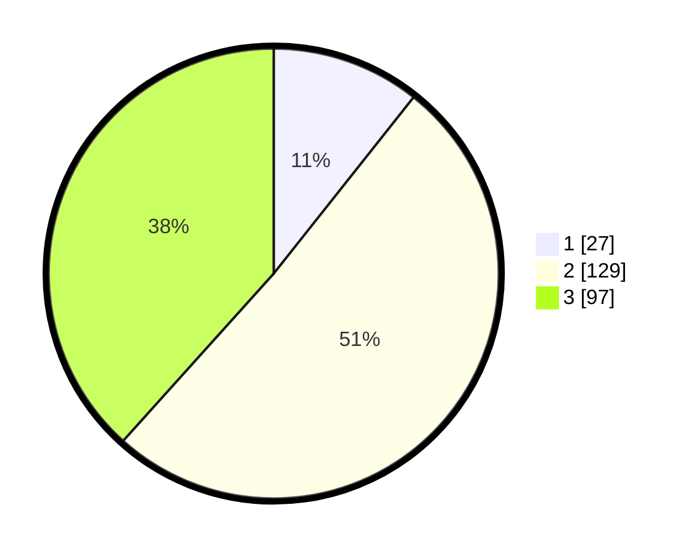

# Hasil

## Grafik

## Tabel

| No. | Nama Paslon    | Suara | Suara (raw) | Persentase |
|:--- |:-------------- | -----:| -----------:| ----------:|
| 1   | ANIES MUHAIMIN | 27    | [27][p-1]   | 10,67      |
| 2   | PRABOWO GIBRAN | 129   | [129][p-2]  | 50,99      |
| 3   | GANJAR MAHFUD  | 97    | [97][p-3]   | 38,34      |

[p-1]: https://github.com/gigit-pemilu/pemilu-2024-35-jawa-timur/blob/main/pilpres/hitung-suara/sub/35-jawa-timur/sub/25-gresik/sub/02-balongpanggang/sub/2017-karangsemanding/sub/004-tps/sub/paslon-1.txt
[p-2]: https://github.com/gigit-pemilu/pemilu-2024-35-jawa-timur/blob/main/pilpres/hitung-suara/sub/35-jawa-timur/sub/25-gresik/sub/02-balongpanggang/sub/2017-karangsemanding/sub/004-tps/sub/paslon-2.txt
[p-3]: https://github.com/gigit-pemilu/pemilu-2024-35-jawa-timur/blob/main/pilpres/hitung-suara/sub/35-jawa-timur/sub/25-gresik/sub/02-balongpanggang/sub/2017-karangsemanding/sub/004-tps/sub/paslon-3.txt

## Foto C Plano

https://sirekap-obj-formc.kpu.go.id/de40/pemilu/ppwp/35/25/02/20/17/3525022017004-20240215-171001--cf3536f7-f280-46f1-8b32-457bbbd2e76a.jpg

https://sirekap-obj-formc.kpu.go.id/de40/pemilu/ppwp/35/25/02/20/17/3525022017004-20240215-004300--9d9706af-4d8c-4ed9-95dc-47766eba0927.jpg

https://sirekap-obj-formc.kpu.go.id/de40/pemilu/ppwp/35/25/02/20/17/3525022017004-20240215-171615--25607c1a-d21c-426a-9cf1-e63ff31fe186.jpg

## Metadata

| Key        | Value               |
| ---------- | ------------------- |
| Time Stamp | 2024-02-15 19:00:26 |

