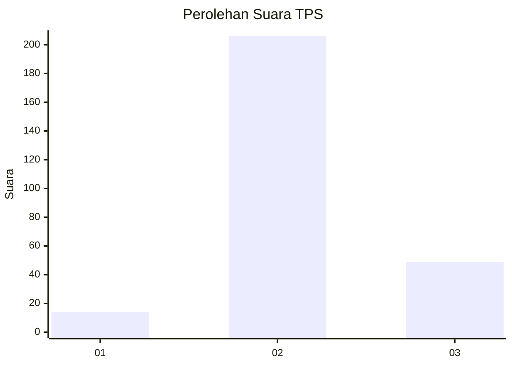

# Hasil

## Grafik

## Tabel

| No. | Nama Paslon    | Suara | Suara (raw) | Persentase |
|:--- |:-------------- | -----:| -----------:| ----------:|
| 1   | ANIES MUHAIMIN | 14    | [14][p-1]   | 5,20       |
| 2   | PRABOWO GIBRAN | 206   | [206][p-2]  | 76,58      |
| 3   | GANJAR MAHFUD  | 49    | [49][p-3]   | 18,22      |

[p-1]: https://github.com/gigit-pemilu/pemilu-2024-35-jawa-timur/blob/main/pilpres/hitung-suara/sub/35-jawa-timur/sub/25-gresik/sub/02-balongpanggang/sub/2020-wotansari/sub/003-tps/sub/paslon-1.txt
[p-2]: https://github.com/gigit-pemilu/pemilu-2024-35-jawa-timur/blob/main/pilpres/hitung-suara/sub/35-jawa-timur/sub/25-gresik/sub/02-balongpanggang/sub/2020-wotansari/sub/003-tps/sub/paslon-2.txt
[p-3]: https://github.com/gigit-pemilu/pemilu-2024-35-jawa-timur/blob/main/pilpres/hitung-suara/sub/35-jawa-timur/sub/25-gresik/sub/02-balongpanggang/sub/2020-wotansari/sub/003-tps/sub/paslon-3.txt

## Foto C Plano

https://sirekap-obj-formc.kpu.go.id/704c/pemilu/ppwp/35/25/02/20/20/3525022020003-20240217-163315--f21a56d8-facc-4413-b5ca-9eb9fc3cf6e7.jpg

https://sirekap-obj-formc.kpu.go.id/704c/pemilu/ppwp/35/25/02/20/20/3525022020003-20240217-163445--ef483e47-0094-4696-86a5-038f576a75a5.jpg

https://sirekap-obj-formc.kpu.go.id/704c/pemilu/ppwp/35/25/02/20/20/3525022020003-20240215-040958--ace5f764-0cab-491c-8010-814164e6d7b3.jpg

## Metadata

| Key        | Value               |
| ---------- | ------------------- |
| Time Stamp | 2024-02-24 22:31:28 |

