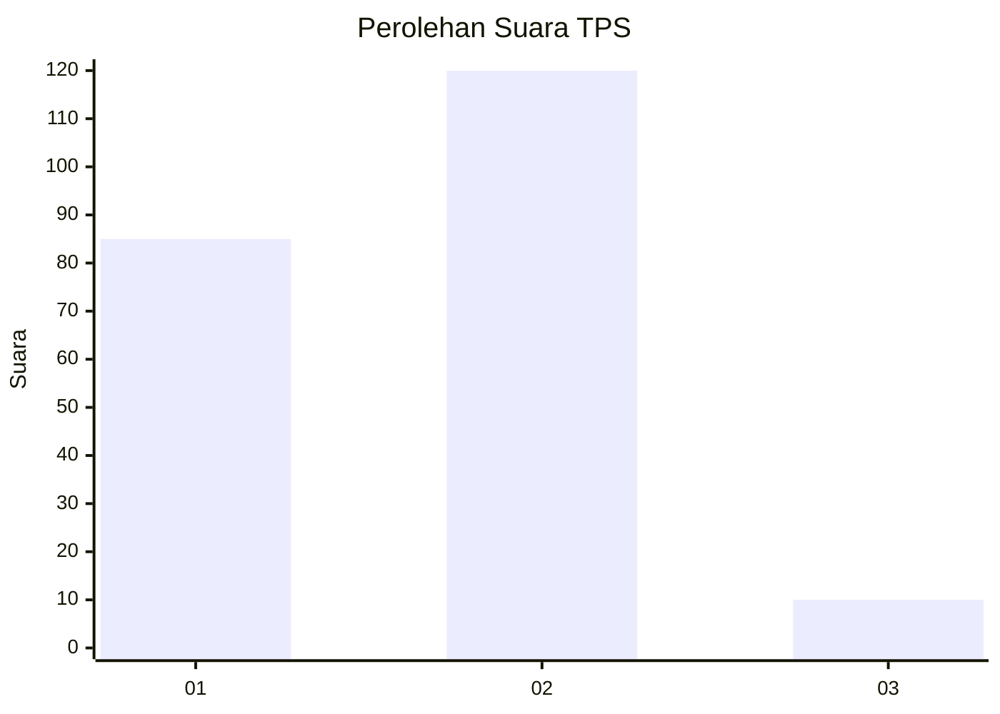
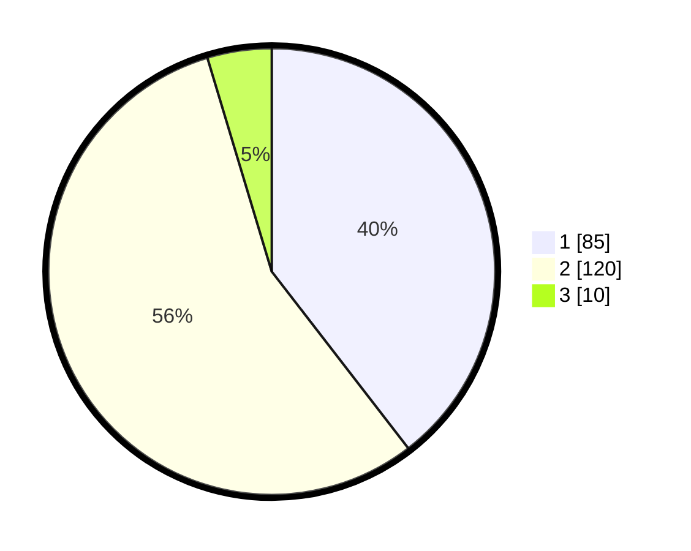

# Hasil

## Grafik

## Tabel

| No. | Nama Paslon    | Suara | Suara (raw) | Persentase |
|:--- |:-------------- | -----:| -----------:| ----------:|
| 1   | ANIES MUHAIMIN | 85    | [85][p-1]   | 39,53      |
| 2   | PRABOWO GIBRAN | 120   | [120][p-2]  | 55,81      |
| 3   | GANJAR MAHFUD  | 10    | [10][p-3]   | 4,65       |

[p-1]: https://github.com/gigit-pemilu/pemilu-2024/blob/main/pilpres/hitung-suara/sub/35-jawa-timur/sub/25-gresik/sub/03-panceng/sub/2001-pantenan/sub/003-tps/sub/paslon-1.txt
[p-2]: https://github.com/gigit-pemilu/pemilu-2024/blob/main/pilpres/hitung-suara/sub/35-jawa-timur/sub/25-gresik/sub/03-panceng/sub/2001-pantenan/sub/003-tps/sub/paslon-2.txt
[p-3]: https://github.com/gigit-pemilu/pemilu-2024/blob/main/pilpres/hitung-suara/sub/35-jawa-timur/sub/25-gresik/sub/03-panceng/sub/2001-pantenan/sub/003-tps/sub/paslon-3.txt

## Foto C Plano

https://sirekap-obj-formc.kpu.go.id/50ac/pemilu/ppwp/35/25/03/20/01/3525032001003-20240215-084052--33ac14ba-b683-4c77-bcdc-a029ed026328.jpg

https://sirekap-obj-formc.kpu.go.id/50ac/pemilu/ppwp/35/25/03/20/01/3525032001003-20240215-084142--b33060a7-0faf-44b9-aed1-31c26c9e8708.jpg

https://sirekap-obj-formc.kpu.go.id/50ac/pemilu/ppwp/35/25/03/20/01/3525032001003-20240215-084239--e3e95aed-d757-4fdd-878b-72cb4931ce7f.jpg

## Metadata

| Key        | Value               |
| ---------- | ------------------- |
| Time Stamp | 2024-02-21 00:00:00 |

