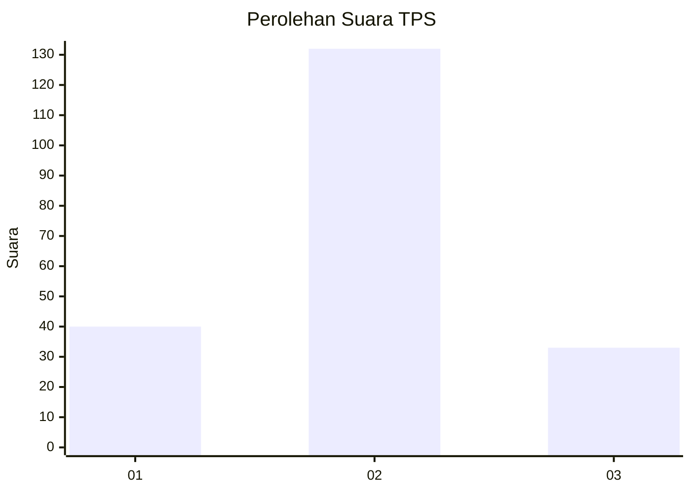
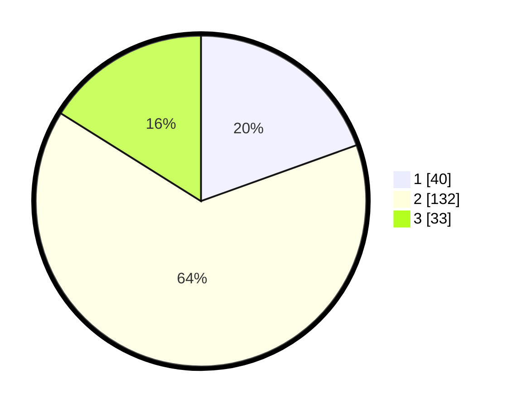

# Hasil

## Grafik

## Tabel

| No. | Nama Paslon    | Suara | Suara (raw) | Persentase |
|:--- |:-------------- | -----:| -----------:| ----------:|
| 1   | ANIES MUHAIMIN | 40    | [40][p-1]   | 19,51      |
| 2   | PRABOWO GIBRAN | 132   | [132][p-2]  | 64,39      |
| 3   | GANJAR MAHFUD  | 33    | [33][p-3]   | 16,10      |

[p-1]: https://github.com/gigit-pemilu/pemilu-2024/blob/main/pilpres/hitung-suara/sub/35-jawa-timur/sub/25-gresik/sub/03-panceng/sub/2005-banyutengah/sub/001-tps/sub/paslon-1.txt
[p-2]: https://github.com/gigit-pemilu/pemilu-2024/blob/main/pilpres/hitung-suara/sub/35-jawa-timur/sub/25-gresik/sub/03-panceng/sub/2005-banyutengah/sub/001-tps/sub/paslon-2.txt
[p-3]: https://github.com/gigit-pemilu/pemilu-2024/blob/main/pilpres/hitung-suara/sub/35-jawa-timur/sub/25-gresik/sub/03-panceng/sub/2005-banyutengah/sub/001-tps/sub/paslon-3.txt

## Foto C Plano

https://sirekap-obj-formc.kpu.go.id/af00/pemilu/ppwp/35/25/03/20/05/3525032005001-20240214-141606--b4de7fde-1ef7-45e7-bd4f-d6da5641f35f.jpg

https://sirekap-obj-formc.kpu.go.id/af00/pemilu/ppwp/35/25/03/20/05/3525032005001-20240214-141655--80a92a16-f3fe-4ebf-8fa3-2d51a7b84e0c.jpg

https://sirekap-obj-formc.kpu.go.id/af00/pemilu/ppwp/35/25/03/20/05/3525032005001-20240214-141737--2560792e-f002-4f14-a83d-ec2f7daa570f.jpg

## Metadata

| Key        | Value               |
| ---------- | ------------------- |
| Time Stamp | 2024-02-14 21:46:01 |

