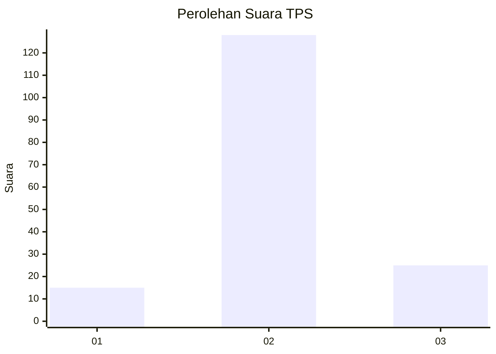

# Hasil

## Grafik

## Tabel

| No. | Nama Paslon    | Suara | Suara (raw) | Persentase |
|:--- |:-------------- | -----:| -----------:| ----------:|
| 1   | ANIES MUHAIMIN | 15    | [15][p-1]   | 8,93       |
| 2   | PRABOWO GIBRAN | 128   | [128][p-2]  | 76,19      |
| 3   | GANJAR MAHFUD  | 25    | [25][p-3]   | 14,88      |

[p-1]: https://github.com/gigit-pemilu/pemilu-2024/blob/main/pilpres/hitung-suara/sub/35-jawa-timur/sub/25-gresik/sub/03-panceng/sub/2006-serah/sub/001-tps/sub/paslon-1.txt
[p-2]: https://github.com/gigit-pemilu/pemilu-2024/blob/main/pilpres/hitung-suara/sub/35-jawa-timur/sub/25-gresik/sub/03-panceng/sub/2006-serah/sub/001-tps/sub/paslon-2.txt
[p-3]: https://github.com/gigit-pemilu/pemilu-2024/blob/main/pilpres/hitung-suara/sub/35-jawa-timur/sub/25-gresik/sub/03-panceng/sub/2006-serah/sub/001-tps/sub/paslon-3.txt

## Foto C Plano

https://sirekap-obj-formc.kpu.go.id/5c94/pemilu/ppwp/35/25/03/20/06/3525032006001-20240215-030942--ab1a4f6b-d6d8-428f-a3ea-239151269ac1.jpg

https://sirekap-obj-formc.kpu.go.id/5c94/pemilu/ppwp/35/25/03/20/06/3525032006001-20240215-031428--f4b3a87c-b038-4e52-8f15-7c8fed24bc8e.jpg

https://sirekap-obj-formc.kpu.go.id/5c94/pemilu/ppwp/35/25/03/20/06/3525032006001-20240215-032020--b9d44bce-231c-49ec-9b62-95725d9e98a3.jpg

## Metadata

| Key        | Value               |
| ---------- | ------------------- |
| Time Stamp | 2024-02-21 01:00:00 |

