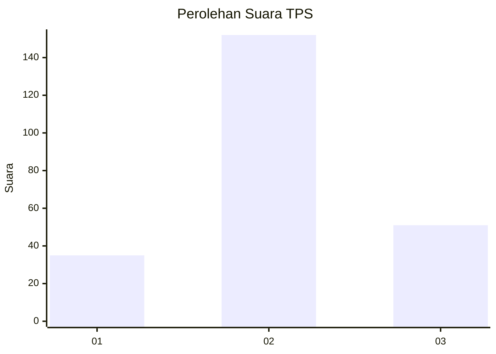
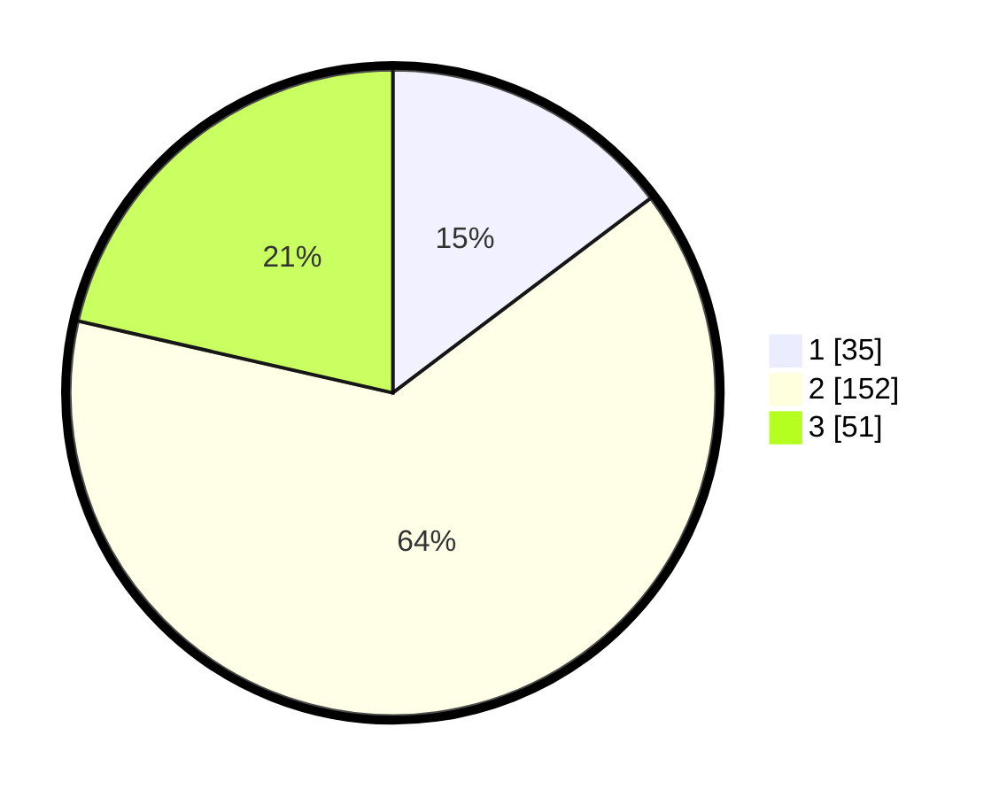

# Hasil

## Grafik

## Tabel

| No. | Nama Paslon    | Suara | Suara (raw) | Persentase |
|:--- |:-------------- | -----:| -----------:| ----------:|
| 1   | ANIES MUHAIMIN | 35    | [35][p-1]   | 14,71      |
| 2   | PRABOWO GIBRAN | 152   | [152][p-2]  | 63,87      |
| 3   | GANJAR MAHFUD  | 51    | [51][p-3]   | 21,43      |

[p-1]: https://github.com/gigit-pemilu/pemilu-2024/blob/main/pilpres/hitung-suara/sub/35-jawa-timur/sub/25-gresik/sub/04-benjeng/sub/2006-kedungrukem/sub/001-tps/sub/paslon-1.txt
[p-2]: https://github.com/gigit-pemilu/pemilu-2024/blob/main/pilpres/hitung-suara/sub/35-jawa-timur/sub/25-gresik/sub/04-benjeng/sub/2006-kedungrukem/sub/001-tps/sub/paslon-2.txt
[p-3]: https://github.com/gigit-pemilu/pemilu-2024/blob/main/pilpres/hitung-suara/sub/35-jawa-timur/sub/25-gresik/sub/04-benjeng/sub/2006-kedungrukem/sub/001-tps/sub/paslon-3.txt

## Foto C Plano

https://sirekap-obj-formc.kpu.go.id/f4f2/pemilu/ppwp/35/25/04/20/06/3525042006001-20240215-023139--1f6c10a5-544d-4ce5-b687-75ae3c71d022.jpg

https://sirekap-obj-formc.kpu.go.id/f4f2/pemilu/ppwp/35/25/04/20/06/3525042006001-20240215-025939--1a5c1186-54ce-4fd9-b004-4ed87533c406.jpg

https://sirekap-obj-formc.kpu.go.id/f4f2/pemilu/ppwp/35/25/04/20/06/3525042006001-20240215-030052--dc0a8b31-27b3-45dc-907c-de88dc5b2dee.jpg

## Metadata

| Key        | Value               |
| ---------- | ------------------- |
| Time Stamp | 2024-02-21 01:00:00 |

