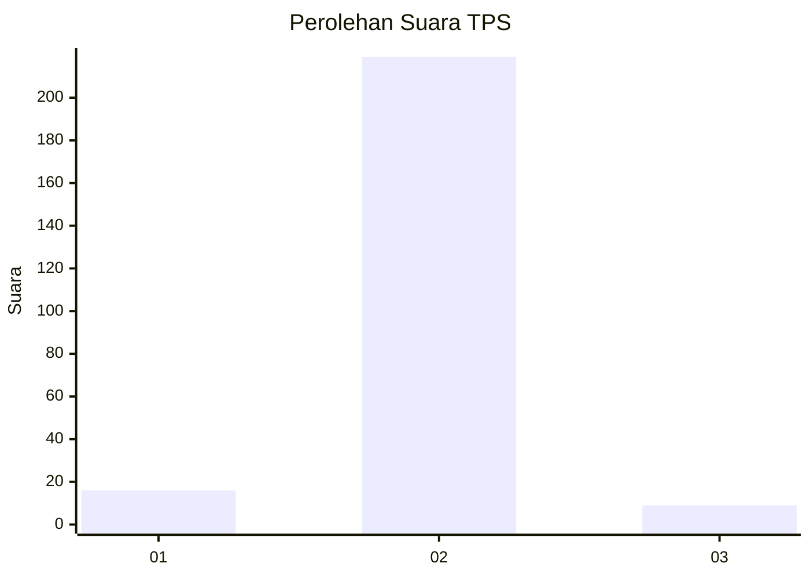
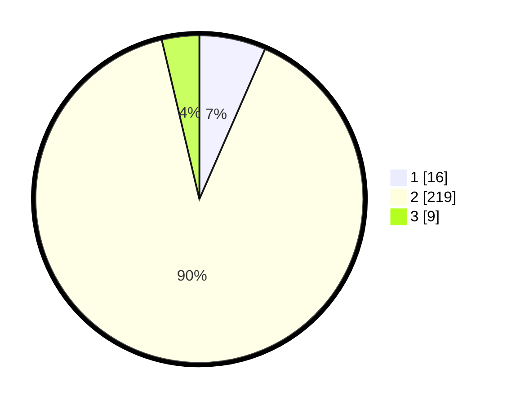

# Hasil

## Grafik

## Tabel

| No. | Nama Paslon    | Suara | Suara (raw) | Persentase |
|:--- |:-------------- | -----:| -----------:| ----------:|
| 1   | ANIES MUHAIMIN | 16    | [16][p-1]   | 6,56       |
| 2   | PRABOWO GIBRAN | 219   | [219][p-2]  | 89,75      |
| 3   | GANJAR MAHFUD  | 9     | [9][p-3]    | 3,69       |

[p-1]: https://github.com/gigit-pemilu/pemilu-2024/blob/main/pilpres/hitung-suara/sub/35-jawa-timur/sub/25-gresik/sub/04-benjeng/sub/2011-banter/sub/004-tps/sub/paslon-1.txt
[p-2]: https://github.com/gigit-pemilu/pemilu-2024/blob/main/pilpres/hitung-suara/sub/35-jawa-timur/sub/25-gresik/sub/04-benjeng/sub/2011-banter/sub/004-tps/sub/paslon-2.txt
[p-3]: https://github.com/gigit-pemilu/pemilu-2024/blob/main/pilpres/hitung-suara/sub/35-jawa-timur/sub/25-gresik/sub/04-benjeng/sub/2011-banter/sub/004-tps/sub/paslon-3.txt

## Foto C Plano

https://sirekap-obj-formc.kpu.go.id/4765/pemilu/ppwp/35/25/04/20/11/3525042011004-20240214-212436--27bdb21c-6b6d-4c0b-8125-fcfb9c60a825.jpg

https://sirekap-obj-formc.kpu.go.id/4765/pemilu/ppwp/35/25/04/20/11/3525042011004-20240214-213614--1e9430e5-3859-4407-bd3b-53c609eef1b9.jpg

https://sirekap-obj-formc.kpu.go.id/4765/pemilu/ppwp/35/25/04/20/11/3525042011004-20240214-213750--d24c3afb-c10d-4739-88f6-59980810f8ea.jpg

## Metadata

| Key        | Value               |
| ---------- | ------------------- |
| Time Stamp | 2024-02-15 15:00:29 |

