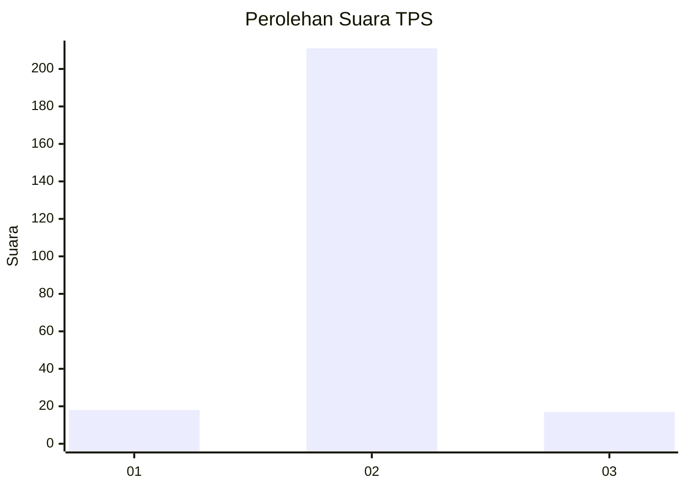
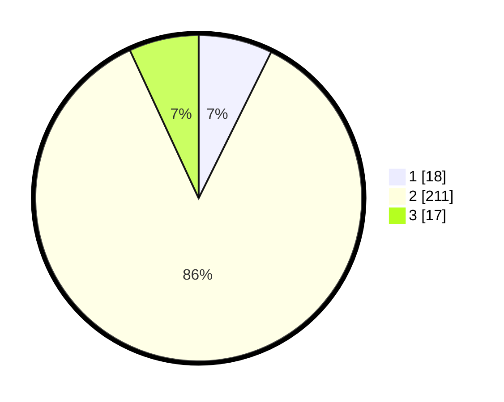

# Hasil

## Grafik

## Tabel

| No. | Nama Paslon    | Suara | Suara (raw) | Persentase |
|:--- |:-------------- | -----:| -----------:| ----------:|
| 1   | ANIES MUHAIMIN | 18    | [18][p-1]   | 7,32       |
| 2   | PRABOWO GIBRAN | 211   | [211][p-2]  | 85,77      |
| 3   | GANJAR MAHFUD  | 17    | [17][p-3]   | 6,91       |

[p-1]: https://github.com/gigit-pemilu/pemilu-2024-35-jawa-timur/blob/main/pilpres/hitung-suara/sub/35-jawa-timur/sub/25-gresik/sub/04-benjeng/sub/2011-banter/sub/005-tps/sub/paslon-1.txt
[p-2]: https://github.com/gigit-pemilu/pemilu-2024-35-jawa-timur/blob/main/pilpres/hitung-suara/sub/35-jawa-timur/sub/25-gresik/sub/04-benjeng/sub/2011-banter/sub/005-tps/sub/paslon-2.txt
[p-3]: https://github.com/gigit-pemilu/pemilu-2024-35-jawa-timur/blob/main/pilpres/hitung-suara/sub/35-jawa-timur/sub/25-gresik/sub/04-benjeng/sub/2011-banter/sub/005-tps/sub/paslon-3.txt

## Foto C Plano

https://sirekap-obj-formc.kpu.go.id/20ec/pemilu/ppwp/35/25/04/20/11/3525042011005-20240214-215725--e6efbc69-0576-48c7-81eb-0d27dedb6082.jpg

https://sirekap-obj-formc.kpu.go.id/20ec/pemilu/ppwp/35/25/04/20/11/3525042011005-20240218-163836--aa4585c7-3341-45d7-8dff-464ece440d96.jpg

https://sirekap-obj-formc.kpu.go.id/20ec/pemilu/ppwp/35/25/04/20/11/3525042011005-20240218-163741--3d6e3ab7-835b-4298-a951-e4e231144670.jpg

## Metadata

| Key        | Value               |
| ---------- | ------------------- |
| Time Stamp | 2024-02-19 18:00:00 |

