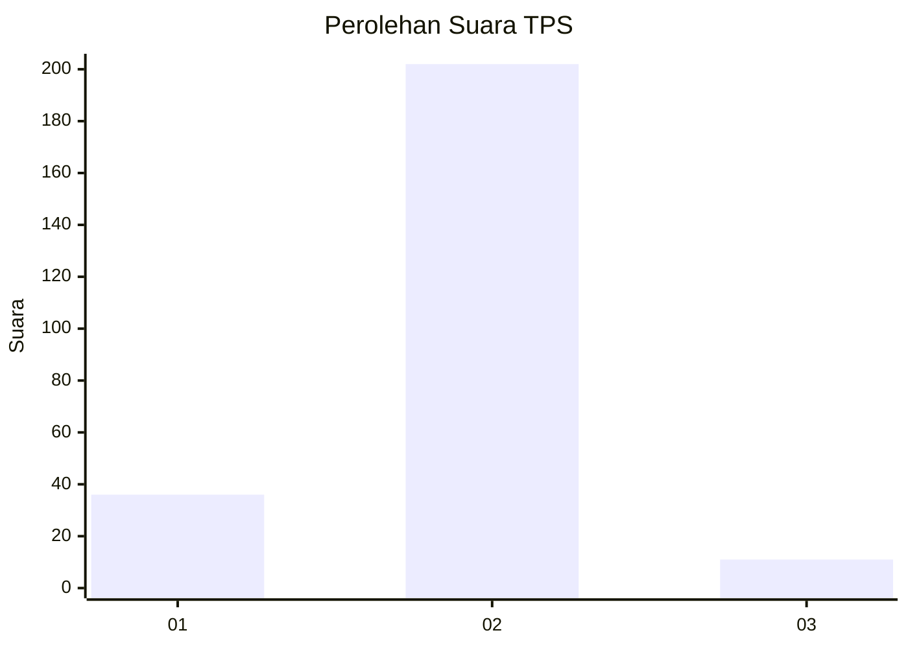
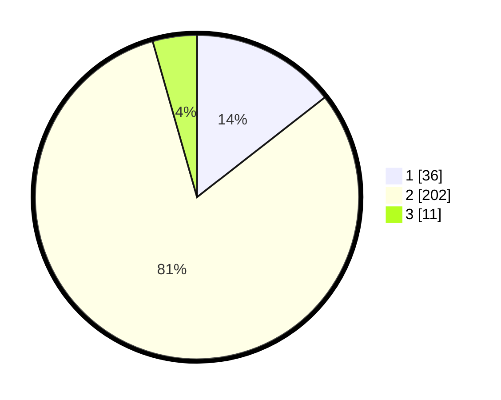

# Hasil

## Grafik

## Tabel

| No. | Nama Paslon    | Suara | Suara (raw) | Persentase |
|:--- |:-------------- | -----:| -----------:| ----------:|
| 1   | ANIES MUHAIMIN | 36    | [36][p-1]   | 14,46      |
| 2   | PRABOWO GIBRAN | 202   | [202][p-2]  | 81,12      |
| 3   | GANJAR MAHFUD  | 11    | [11][p-3]   | 4,42       |

[p-1]: https://github.com/gigit-pemilu/pemilu-2024/blob/main/pilpres/hitung-suara/sub/35-jawa-timur/sub/25-gresik/sub/04-benjeng/sub/2020-jogodalu/sub/006-tps/sub/paslon-1.txt
[p-2]: https://github.com/gigit-pemilu/pemilu-2024/blob/main/pilpres/hitung-suara/sub/35-jawa-timur/sub/25-gresik/sub/04-benjeng/sub/2020-jogodalu/sub/006-tps/sub/paslon-2.txt
[p-3]: https://github.com/gigit-pemilu/pemilu-2024/blob/main/pilpres/hitung-suara/sub/35-jawa-timur/sub/25-gresik/sub/04-benjeng/sub/2020-jogodalu/sub/006-tps/sub/paslon-3.txt

## Foto C Plano

https://sirekap-obj-formc.kpu.go.id/312c/pemilu/ppwp/35/25/04/20/20/3525042020006-20240215-035722--fe60b681-7a2a-4262-9d97-59de8f7439e4.jpg

https://sirekap-obj-formc.kpu.go.id/312c/pemilu/ppwp/35/25/04/20/20/3525042020006-20240215-035827--f57deba1-6bcd-4344-8e47-29c08985bc6a.jpg

https://sirekap-obj-formc.kpu.go.id/312c/pemilu/ppwp/35/25/04/20/20/3525042020006-20240215-035935--a50a15ed-df88-4735-9d99-b65984970e4e.jpg

## Metadata

| Key        | Value               |
| ---------- | ------------------- |
| Time Stamp | 2024-02-21 06:00:00 |

