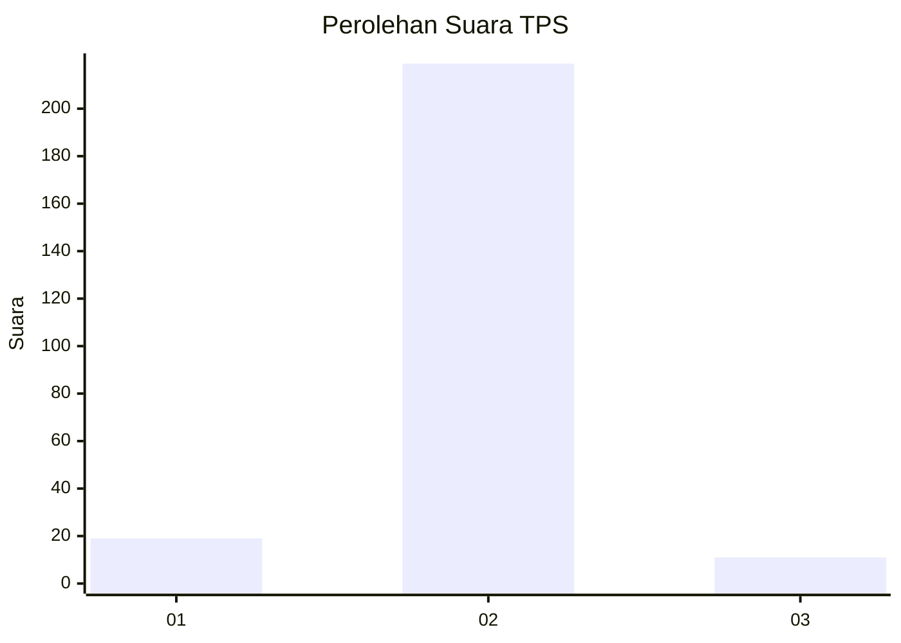
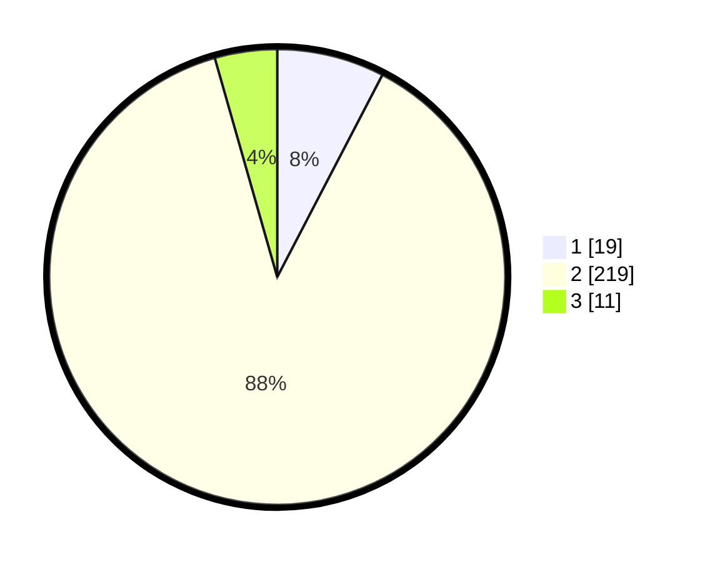

# Hasil

## Grafik

## Tabel

| No. | Nama Paslon    | Suara | Suara (raw) | Persentase |
|:--- |:-------------- | -----:| -----------:| ----------:|
| 1   | ANIES MUHAIMIN | 19    | [19][p-1]   | 7,63       |
| 2   | PRABOWO GIBRAN | 219   | [219][p-2]  | 87,95      |
| 3   | GANJAR MAHFUD  | 11    | [11][p-3]   | 4,42       |

[p-1]: https://github.com/gigit-pemilu/pemilu-2024/blob/main/pilpres/hitung-suara/sub/35-jawa-timur/sub/25-gresik/sub/05-duduksampeyan/sub/2010-sumengko/sub/005-tps/sub/paslon-1.txt
[p-2]: https://github.com/gigit-pemilu/pemilu-2024/blob/main/pilpres/hitung-suara/sub/35-jawa-timur/sub/25-gresik/sub/05-duduksampeyan/sub/2010-sumengko/sub/005-tps/sub/paslon-2.txt
[p-3]: https://github.com/gigit-pemilu/pemilu-2024/blob/main/pilpres/hitung-suara/sub/35-jawa-timur/sub/25-gresik/sub/05-duduksampeyan/sub/2010-sumengko/sub/005-tps/sub/paslon-3.txt

## Foto C Plano

https://sirekap-obj-formc.kpu.go.id/b6c9/pemilu/ppwp/35/25/05/20/10/3525052010005-20240215-021606--8a564357-d73b-4ec6-bd2c-20d0f20f7bd9.jpg

https://sirekap-obj-formc.kpu.go.id/b6c9/pemilu/ppwp/35/25/05/20/10/3525052010005-20240215-022649--80481f87-e028-4599-8fee-7c0b8a6b7f03.jpg

https://sirekap-obj-formc.kpu.go.id/b6c9/pemilu/ppwp/35/25/05/20/10/3525052010005-20240215-022600--9b2b0c40-3185-43f2-a735-0b3ce9377334.jpg

## Metadata

| Key        | Value               |
| ---------- | ------------------- |
| Time Stamp | 2024-02-15 16:30:25 |

