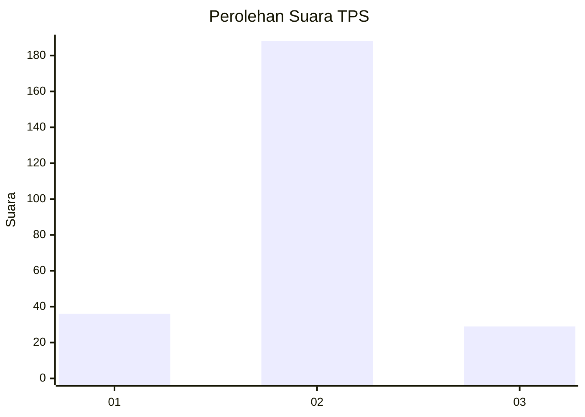
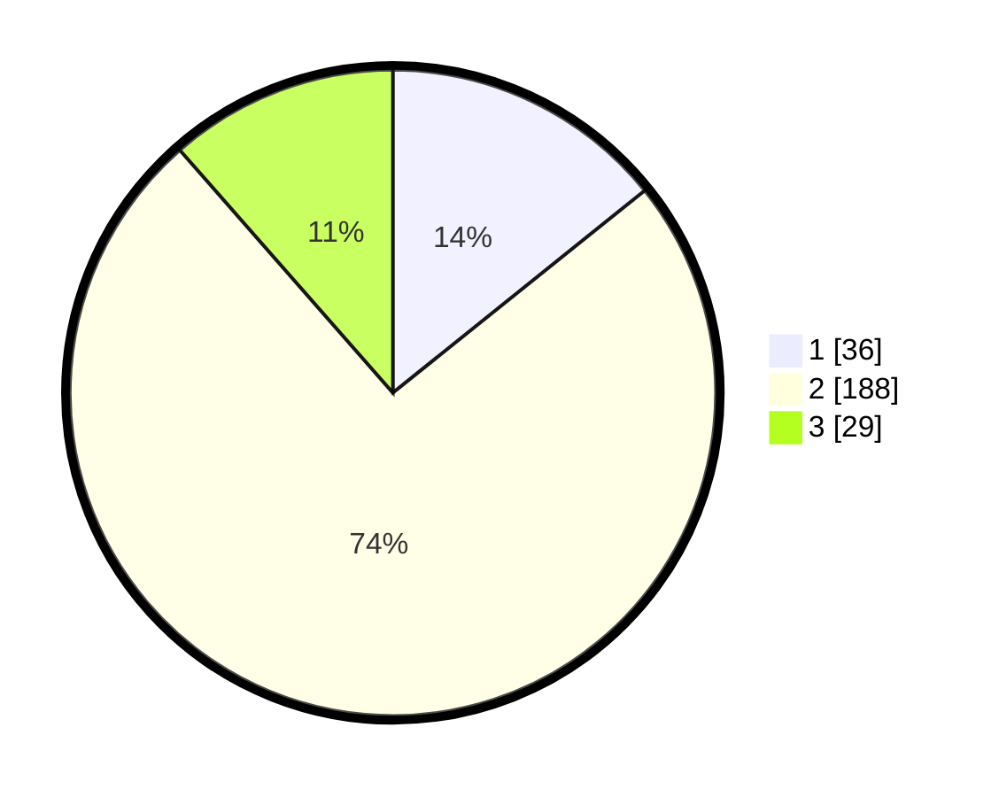

# Hasil

## Grafik

## Tabel

| No. | Nama Paslon    | Suara | Suara (raw) | Persentase |
|:--- |:-------------- | -----:| -----------:| ----------:|
| 1   | ANIES MUHAIMIN | 36    | [36][p-1]   | 14,23      |
| 2   | PRABOWO GIBRAN | 188   | [188][p-2]  | 74,31      |
| 3   | GANJAR MAHFUD  | 29    | [29][p-3]   | 11,46      |

[p-1]: https://github.com/gigit-pemilu/pemilu-2024/blob/main/pilpres/hitung-suara/sub/35-jawa-timur/sub/25-gresik/sub/05-duduksampeyan/sub/2014-duduksampeyan/sub/005-tps/sub/paslon-1.txt
[p-2]: https://github.com/gigit-pemilu/pemilu-2024/blob/main/pilpres/hitung-suara/sub/35-jawa-timur/sub/25-gresik/sub/05-duduksampeyan/sub/2014-duduksampeyan/sub/005-tps/sub/paslon-2.txt
[p-3]: https://github.com/gigit-pemilu/pemilu-2024/blob/main/pilpres/hitung-suara/sub/35-jawa-timur/sub/25-gresik/sub/05-duduksampeyan/sub/2014-duduksampeyan/sub/005-tps/sub/paslon-3.txt

## Foto C Plano

https://sirekap-obj-formc.kpu.go.id/cd62/pemilu/ppwp/35/25/05/20/14/3525052014005-20240215-002026--6e452192-b772-4a08-bc04-2874e4e3dd70.jpg

https://sirekap-obj-formc.kpu.go.id/cd62/pemilu/ppwp/35/25/05/20/14/3525052014005-20240215-002654--b6784a30-0eb6-4adc-8384-baaa98ceac23.jpg

https://sirekap-obj-formc.kpu.go.id/cd62/pemilu/ppwp/35/25/05/20/14/3525052014005-20240215-002031--8d993e1f-5ce9-4ab4-814f-12cb20cfd6e1.jpg

## Metadata

| Key        | Value               |
| ---------- | ------------------- |
| Time Stamp | 2024-02-15 16:30:25 |

