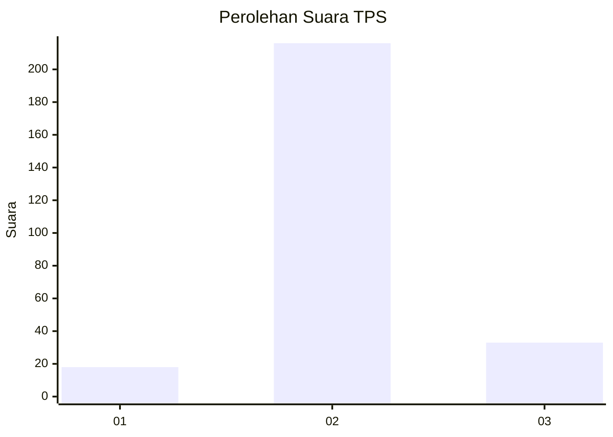
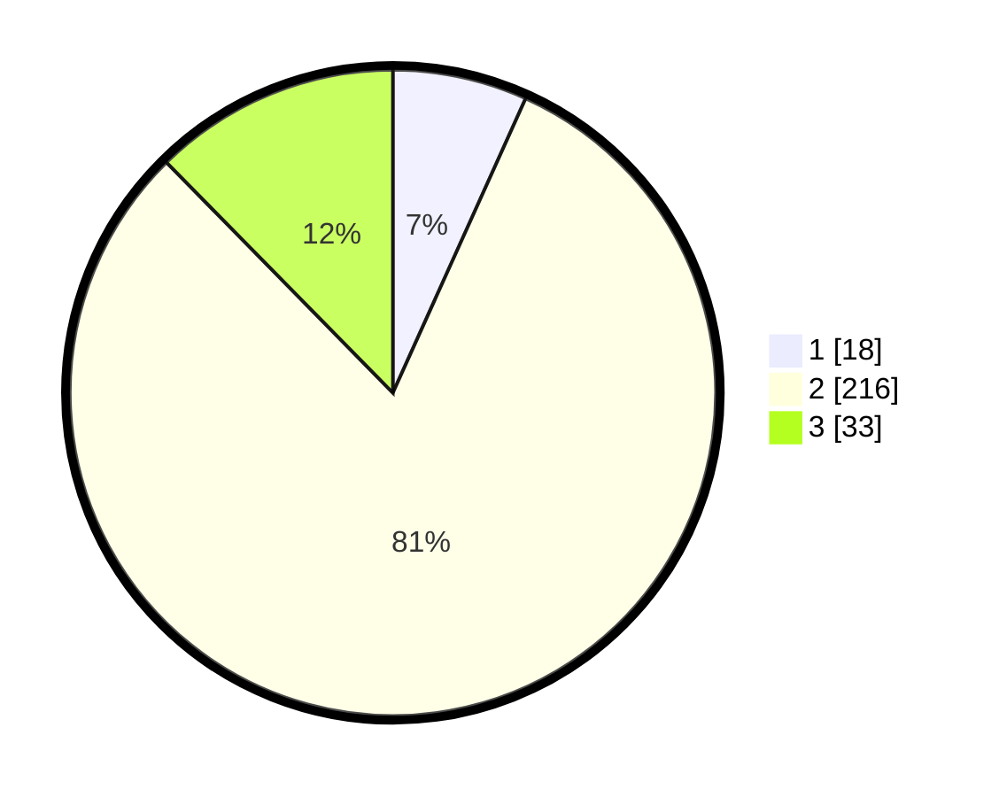

# Hasil

## Grafik

## Tabel

| No. | Nama Paslon    | Suara | Suara (raw) | Persentase |
|:--- |:-------------- | -----:| -----------:| ----------:|
| 1   | ANIES MUHAIMIN | 18    | [18][p-1]   | 6,74       |
| 2   | PRABOWO GIBRAN | 216   | [216][p-2]  | 80,90      |
| 3   | GANJAR MAHFUD  | 33    | [33][p-3]   | 12,36      |

[p-1]: https://github.com/gigit-pemilu/pemilu-2024/blob/main/pilpres/hitung-suara/sub/35-jawa-timur/sub/25-gresik/sub/05-duduksampeyan/sub/2014-duduksampeyan/sub/009-tps/sub/paslon-1.txt
[p-2]: https://github.com/gigit-pemilu/pemilu-2024/blob/main/pilpres/hitung-suara/sub/35-jawa-timur/sub/25-gresik/sub/05-duduksampeyan/sub/2014-duduksampeyan/sub/009-tps/sub/paslon-2.txt
[p-3]: https://github.com/gigit-pemilu/pemilu-2024/blob/main/pilpres/hitung-suara/sub/35-jawa-timur/sub/25-gresik/sub/05-duduksampeyan/sub/2014-duduksampeyan/sub/009-tps/sub/paslon-3.txt

## Foto C Plano

https://sirekap-obj-formc.kpu.go.id/9cdf/pemilu/ppwp/35/25/05/20/14/3525052014009-20240215-092329--d3ebf709-0759-432c-82aa-4764ca550109.jpg

https://sirekap-obj-formc.kpu.go.id/9cdf/pemilu/ppwp/35/25/05/20/14/3525052014009-20240215-092345--5f7fe9b0-1be8-4094-95dd-74075e44c94a.jpg

https://sirekap-obj-formc.kpu.go.id/9cdf/pemilu/ppwp/35/25/05/20/14/3525052014009-20240215-092349--ecf592f1-0eb4-439f-9df6-6ee5bb5193e0.jpg

## Metadata

| Key        | Value               |
| ---------- | ------------------- |
| Time Stamp | 2024-02-16 11:00:29 |

