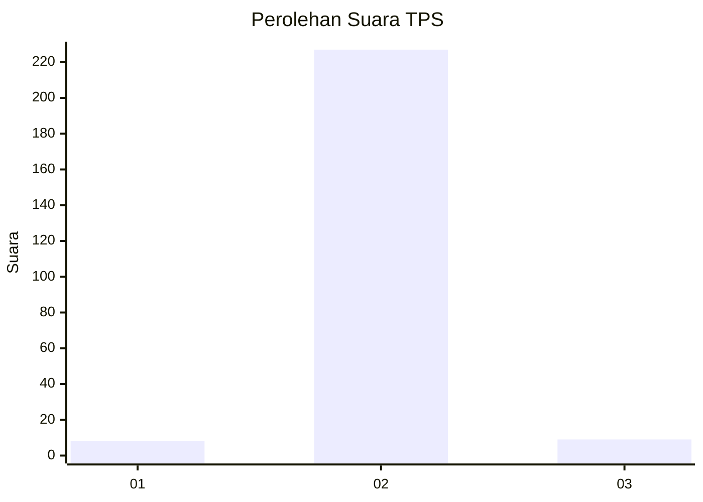
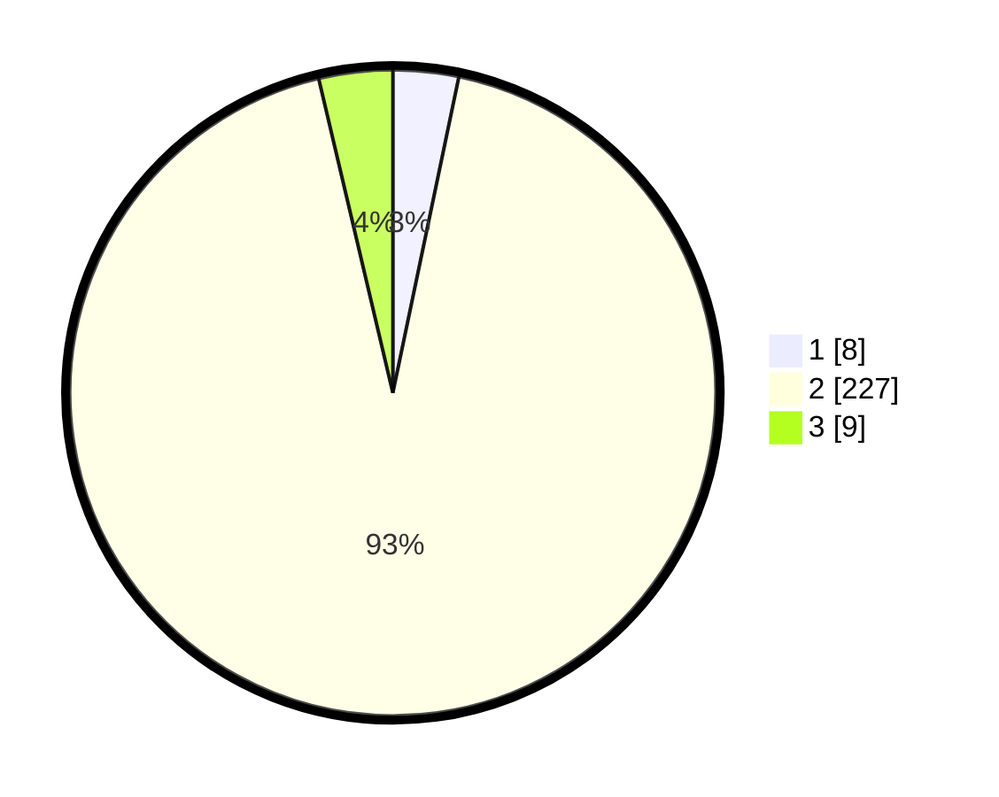

# Hasil

## Grafik

## Tabel

| No. | Nama Paslon    | Suara | Suara (raw) | Persentase |
|:--- |:-------------- | -----:| -----------:| ----------:|
| 1   | ANIES MUHAIMIN | 8     | [8][p-1]    | 3,28       |
| 2   | PRABOWO GIBRAN | 227   | [227][p-2]  | 93,03      |
| 3   | GANJAR MAHFUD  | 9     | [9][p-3]    | 3,69       |

[p-1]: https://github.com/gigit-pemilu/pemilu-2024-35-jawa-timur/blob/main/pilpres/hitung-suara/sub/35-jawa-timur/sub/25-gresik/sub/05-duduksampeyan/sub/2015-gredek/sub/001-tps/sub/paslon-1.txt
[p-2]: https://github.com/gigit-pemilu/pemilu-2024-35-jawa-timur/blob/main/pilpres/hitung-suara/sub/35-jawa-timur/sub/25-gresik/sub/05-duduksampeyan/sub/2015-gredek/sub/001-tps/sub/paslon-2.txt
[p-3]: https://github.com/gigit-pemilu/pemilu-2024-35-jawa-timur/blob/main/pilpres/hitung-suara/sub/35-jawa-timur/sub/25-gresik/sub/05-duduksampeyan/sub/2015-gredek/sub/001-tps/sub/paslon-3.txt

## Foto C Plano

https://sirekap-obj-formc.kpu.go.id/d28c/pemilu/ppwp/35/25/05/20/15/3525052015001-20240215-000723--cd2f220e-39fb-4de2-8557-df4658a44d36.jpg

https://sirekap-obj-formc.kpu.go.id/d28c/pemilu/ppwp/35/25/05/20/15/3525052015001-20240215-000804--7ceae4cb-cbc8-4c15-a0e9-553f244be9ad.jpg

https://sirekap-obj-formc.kpu.go.id/d28c/pemilu/ppwp/35/25/05/20/15/3525052015001-20240215-000923--789e07ac-767e-45ed-8ad4-6ccf298f6204.jpg

## Metadata

| Key        | Value               |
| ---------- | ------------------- |
| Time Stamp | 2024-02-25 16:00:00 |

