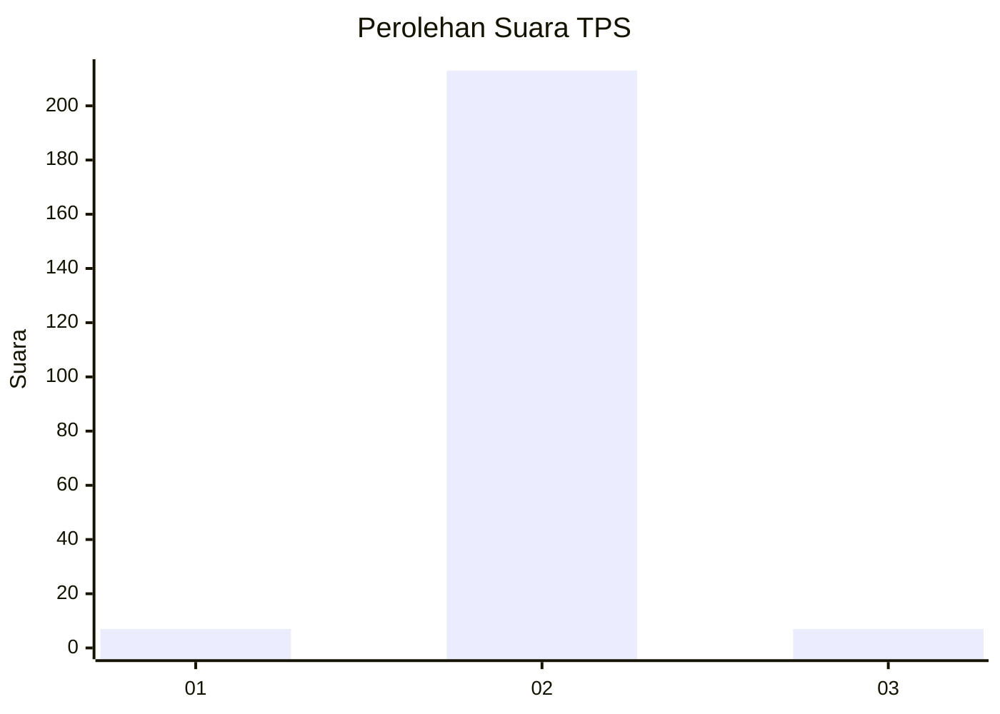
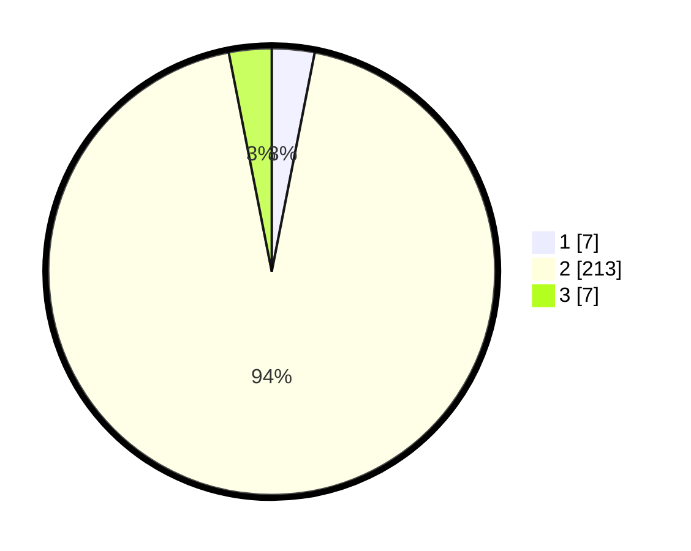

# Hasil

## Grafik

## Tabel

| No. | Nama Paslon    | Suara | Suara (raw) | Persentase |
|:--- |:-------------- | -----:| -----------:| ----------:|
| 1   | ANIES MUHAIMIN | 7     | [7][p-1]    | 3,08       |
| 2   | PRABOWO GIBRAN | 213   | [213][p-2]  | 93,83      |
| 3   | GANJAR MAHFUD  | 7     | [7][p-3]    | 3,08       |

[p-1]: https://github.com/gigit-pemilu/pemilu-2024/blob/main/pilpres/hitung-suara/sub/35-jawa-timur/sub/25-gresik/sub/05-duduksampeyan/sub/2015-gredek/sub/005-tps/sub/paslon-1.txt
[p-2]: https://github.com/gigit-pemilu/pemilu-2024/blob/main/pilpres/hitung-suara/sub/35-jawa-timur/sub/25-gresik/sub/05-duduksampeyan/sub/2015-gredek/sub/005-tps/sub/paslon-2.txt
[p-3]: https://github.com/gigit-pemilu/pemilu-2024/blob/main/pilpres/hitung-suara/sub/35-jawa-timur/sub/25-gresik/sub/05-duduksampeyan/sub/2015-gredek/sub/005-tps/sub/paslon-3.txt

## Foto C Plano

https://sirekap-obj-formc.kpu.go.id/db79/pemilu/ppwp/35/25/05/20/15/3525052015005-20240215-090155--83988226-2ce8-4689-8726-410820b6c491.jpg

https://sirekap-obj-formc.kpu.go.id/db79/pemilu/ppwp/35/25/05/20/15/3525052015005-20240216-205319--8b9f4a84-d683-4149-9bf5-8977b01f648d.jpg

https://sirekap-obj-formc.kpu.go.id/db79/pemilu/ppwp/35/25/05/20/15/3525052015005-20240215-011158--c0b50cf5-a06f-41a4-b736-467456e6a693.jpg

## Metadata

| Key        | Value               |
| ---------- | ------------------- |
| Time Stamp | 2024-02-16 21:01:00 |

