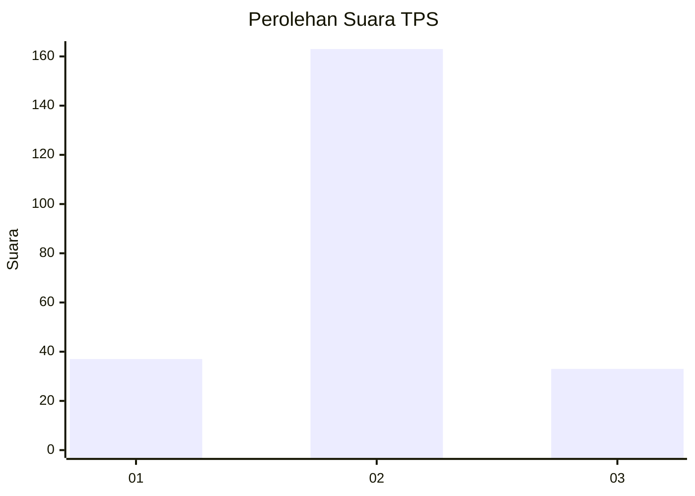

# Hasil

## Grafik

## Tabel

| No. | Nama Paslon    | Suara | Suara (raw) | Persentase |
|:--- |:-------------- | -----:| -----------:| ----------:|
| 1   | ANIES MUHAIMIN | 37    | [37][p-1]   | 15,88      |
| 2   | PRABOWO GIBRAN | 163   | [163][p-2]  | 69,96      |
| 3   | GANJAR MAHFUD  | 33    | [33][p-3]   | 14,16      |

[p-1]: https://github.com/gigit-pemilu/pemilu-2024/blob/main/pilpres/hitung-suara/sub/35-jawa-timur/sub/25-gresik/sub/05-duduksampeyan/sub/2023-ambeng-ambeng-watangrejo/sub/004-tps/sub/paslon-1.txt
[p-2]: https://github.com/gigit-pemilu/pemilu-2024/blob/main/pilpres/hitung-suara/sub/35-jawa-timur/sub/25-gresik/sub/05-duduksampeyan/sub/2023-ambeng-ambeng-watangrejo/sub/004-tps/sub/paslon-2.txt
[p-3]: https://github.com/gigit-pemilu/pemilu-2024/blob/main/pilpres/hitung-suara/sub/35-jawa-timur/sub/25-gresik/sub/05-duduksampeyan/sub/2023-ambeng-ambeng-watangrejo/sub/004-tps/sub/paslon-3.txt

## Foto C Plano

https://sirekap-obj-formc.kpu.go.id/2958/pemilu/ppwp/35/25/05/20/23/3525052023004-20240214-234033--5f4d4893-5bb7-4fa2-bf4d-f2796950bcfb.jpg

https://sirekap-obj-formc.kpu.go.id/2958/pemilu/ppwp/35/25/05/20/23/3525052023004-20240217-201817--2a38d333-40c6-4a86-aab0-f339dfeca58c.jpg

https://sirekap-obj-formc.kpu.go.id/2958/pemilu/ppwp/35/25/05/20/23/3525052023004-20240220-072855--24a91bc7-3dbe-42e1-9dd6-39b8b7983f5a.jpg

## Metadata

| Key        | Value               |
| ---------- | ------------------- |
| Time Stamp | 2024-02-20 08:00:00 |

