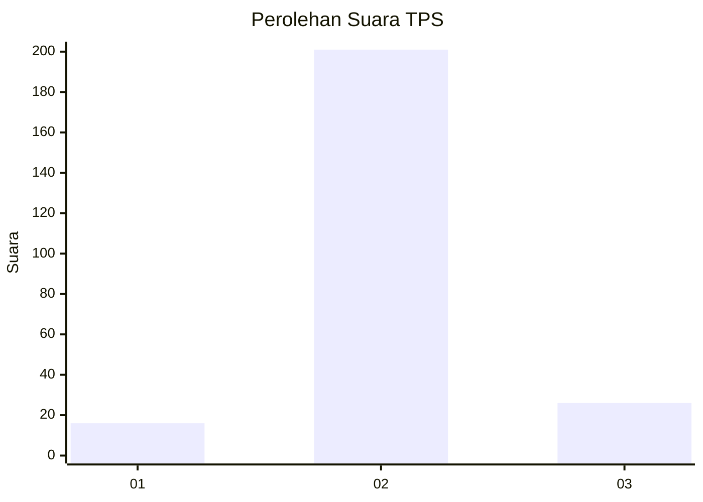
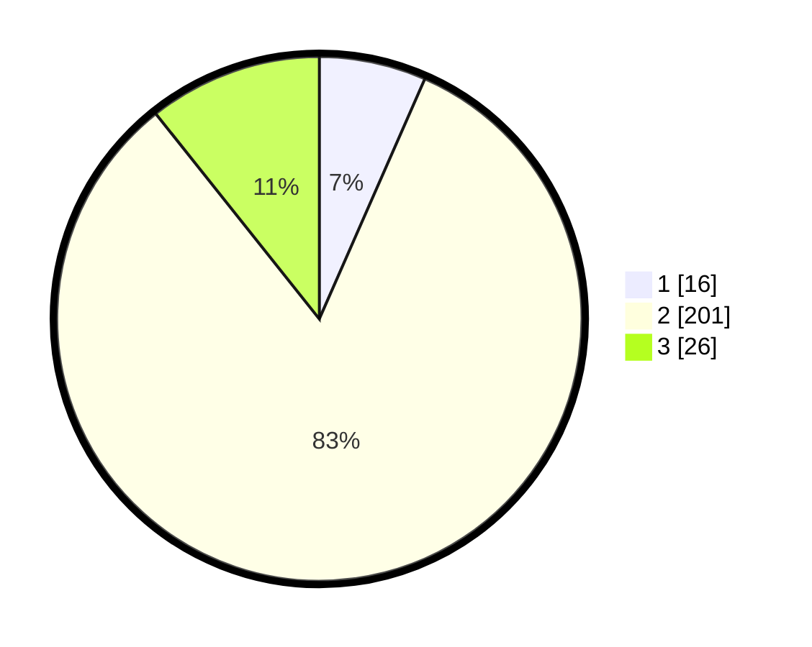

# Hasil

## Grafik

## Tabel

| No. | Nama Paslon    | Suara | Suara (raw) | Persentase |
|:--- |:-------------- | -----:| -----------:| ----------:|
| 1   | ANIES MUHAIMIN | 16    | [16][p-1]   | 6,58       |
| 2   | PRABOWO GIBRAN | 201   | [201][p-2]  | 82,72      |
| 3   | GANJAR MAHFUD  | 26    | [26][p-3]   | 10,70      |

[p-1]: https://github.com/gigit-pemilu/pemilu-2024-35-jawa-timur/blob/main/pilpres/hitung-suara/sub/35-jawa-timur/sub/25-gresik/sub/06-wringinanom/sub/2001-kepuhklagen/sub/004-tps/sub/paslon-1.txt
[p-2]: https://github.com/gigit-pemilu/pemilu-2024-35-jawa-timur/blob/main/pilpres/hitung-suara/sub/35-jawa-timur/sub/25-gresik/sub/06-wringinanom/sub/2001-kepuhklagen/sub/004-tps/sub/paslon-2.txt
[p-3]: https://github.com/gigit-pemilu/pemilu-2024-35-jawa-timur/blob/main/pilpres/hitung-suara/sub/35-jawa-timur/sub/25-gresik/sub/06-wringinanom/sub/2001-kepuhklagen/sub/004-tps/sub/paslon-3.txt

## Foto C Plano

https://sirekap-obj-formc.kpu.go.id/8773/pemilu/ppwp/35/25/06/20/01/3525062001004-20240214-221604--f9410cc3-653b-4e32-93af-1b9329e12fa6.jpg

https://sirekap-obj-formc.kpu.go.id/8773/pemilu/ppwp/35/25/06/20/01/3525062001004-20240214-221802--2d93affc-dca9-43c6-bd09-223812cd632b.jpg

https://sirekap-obj-formc.kpu.go.id/8773/pemilu/ppwp/35/25/06/20/01/3525062001004-20240214-221917--27bc1e13-5ca6-4cd2-886a-0f6ef061c238.jpg

## Metadata

| Key        | Value               |
| ---------- | ------------------- |
| Time Stamp | 2024-02-16 13:30:32 |

