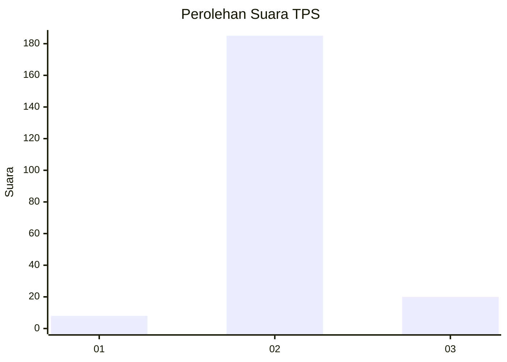
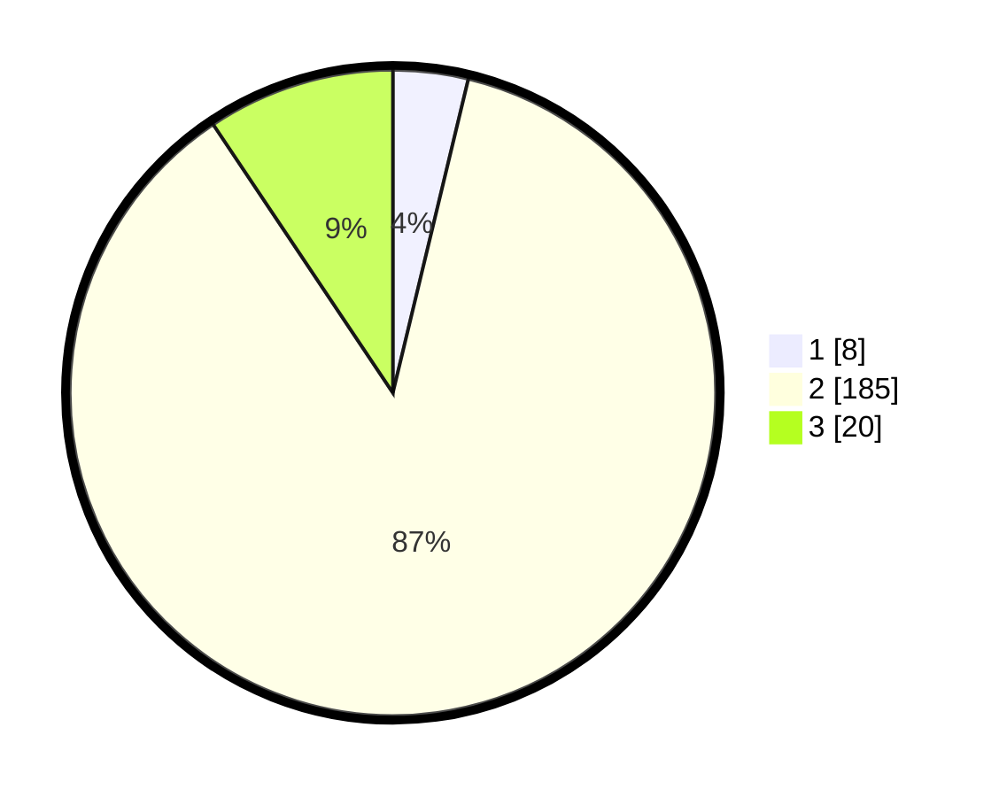

# Hasil

## Grafik

## Tabel

| No. | Nama Paslon    | Suara | Suara (raw) | Persentase |
|:--- |:-------------- | -----:| -----------:| ----------:|
| 1   | ANIES MUHAIMIN | 8     | [8][p-1]    | 3,76       |
| 2   | PRABOWO GIBRAN | 185   | [185][p-2]  | 86,85      |
| 3   | GANJAR MAHFUD  | 20    | [20][p-3]   | 9,39       |

[p-1]: https://github.com/gigit-pemilu/pemilu-2024-35-jawa-timur/blob/main/pilpres/hitung-suara/sub/35-jawa-timur/sub/25-gresik/sub/06-wringinanom/sub/2002-sumbergede/sub/002-tps/sub/paslon-1.txt
[p-2]: https://github.com/gigit-pemilu/pemilu-2024-35-jawa-timur/blob/main/pilpres/hitung-suara/sub/35-jawa-timur/sub/25-gresik/sub/06-wringinanom/sub/2002-sumbergede/sub/002-tps/sub/paslon-2.txt
[p-3]: https://github.com/gigit-pemilu/pemilu-2024-35-jawa-timur/blob/main/pilpres/hitung-suara/sub/35-jawa-timur/sub/25-gresik/sub/06-wringinanom/sub/2002-sumbergede/sub/002-tps/sub/paslon-3.txt

## Foto C Plano

https://sirekap-obj-formc.kpu.go.id/4ee8/pemilu/ppwp/35/25/06/20/02/3525062002002-20240219-214853--c1c0b24d-9045-4dcb-b6a4-53aae092fb97.jpg

https://sirekap-obj-formc.kpu.go.id/4ee8/pemilu/ppwp/35/25/06/20/02/3525062002002-20240219-214751--83596461-ded2-4bd8-94c6-23c5cbc94229.jpg

https://sirekap-obj-formc.kpu.go.id/4ee8/pemilu/ppwp/35/25/06/20/02/3525062002002-20240214-203612--111e49ec-a427-4f2a-aa8d-efb89c6235b2.jpg

## Metadata

| Key        | Value               |
| ---------- | ------------------- |
| Time Stamp | 2024-02-20 11:00:00 |

